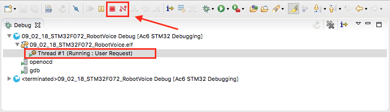

# Eclipse tips

## Shortcuts

Below are some shortcuts we find particularly useful. For MacOs, replace `"Ctrl"` with `"Command"`.

* `"Ctrl +"` click on function/variable for seeing its definition.
* `"Ctrl + Space"` for getting function/variable auto-completion \(also `"Ctrl"` for MacOS since `"Command + Space"` opens the Spotlight application.\)
* `"Ctrl + B"` for building the _active_ project.
* More shortcuts can be found [here](https://dzone.com/articles/effective-eclipse-shortcut-key).

## Debugging

Below are some useful debugging tips:

* At one point you might end up with the error presented below.

Don't worry you just have to stop the previously made "Debug session" as the driver cannot access twice the target board. \(Same error as if the board was disconnected or not well powered\). Press the "Stop" or the "Disconnect" button as shown below.

* If you rename or copy/paste a project \(useful to make a backup of a working project!\) you might need to edit the debug configuration manually. Indeed, the debug config will still have the old binary file's name and thus will use it to program the board. The easiest workaround is to manually delete the binary file and make a new session that will automatically have the new binary file. First, you will need to open the "Debug Configuration" window as shown below.

And then you can proceed to deleting the old file and creating a new session.

Consequently, building the project after renaming the project and performing these steps will result in an ELF file with the new project!

* You can double-click just to the left of a line number to create a breakpoint at a particular line. When running the program in "Debug" mode, the execution will stop at this line and you can resume using one of the buttons on the toolbar.

* If you right-click a variable, you can select to "Add watch expression", which will let you monitor and edit the value of a certain variable. Just note that they will be visible only when the microcontroller is stopped on a breakpoint or with the pause button.

Some shortcuts for debugging with breakpoints:

* `F5` - "Step into"
* `F6` - "Step over"
* `F7` - "Step return"
* `F8` - "Resume"
* `"Ctrl+Shift+B"` - "Toggle breakpoint"

