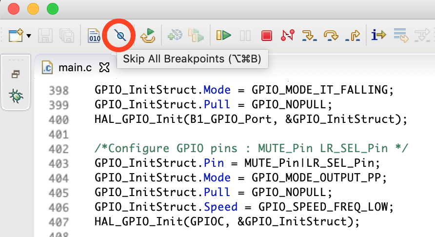
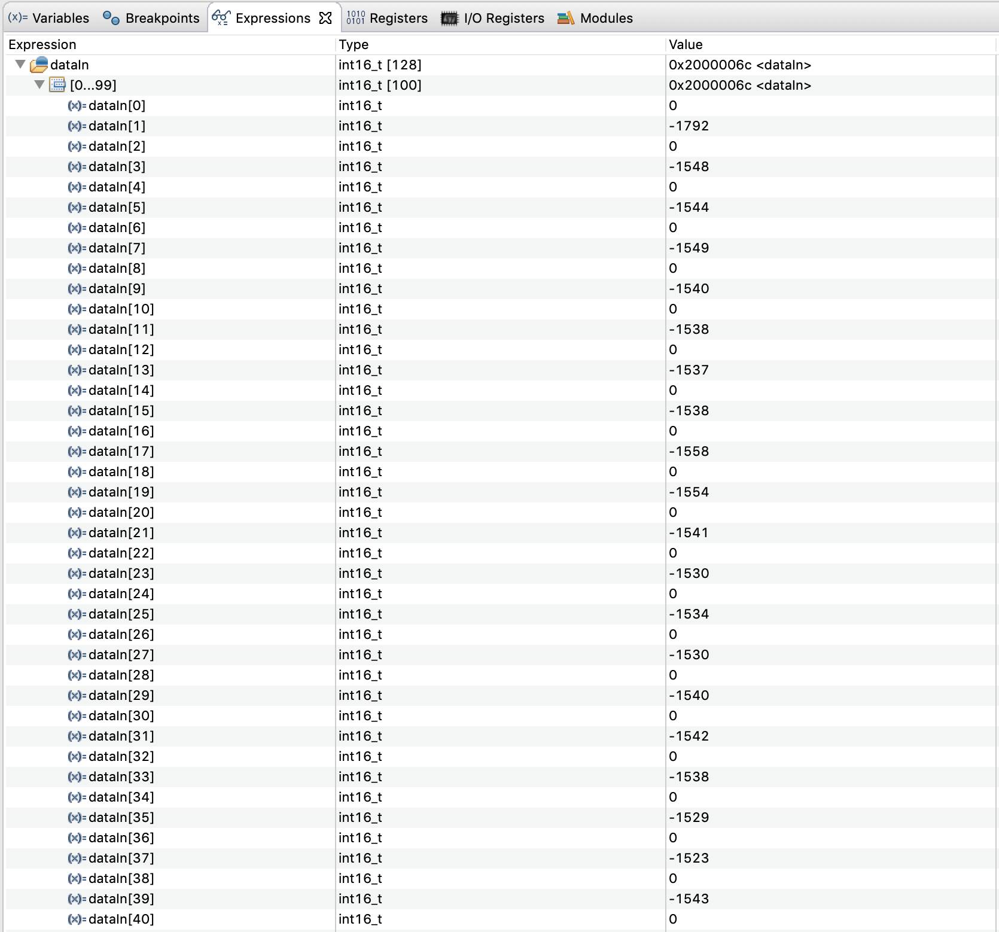

# 3.2 Real-time DSP tips

In this section, we will motivate several real-time DSP tips and tricks that arise when considering a practical implementation, using our simple alien voice effect as an example.

## Lookup table <a id="lookup"></a>

As can be seen in [Chapter 3.1](effect_description.md), our effect is really simple: we only need to multiply the input samples with a sinusoid. However, directly computing the sine/cosine of a given value cannot be done by most computers and microcontrollers. Instead, they use a formula such as the Taylor series to approximate the value of a sine/cosine to a high degree of precision.

However, a quick glance at the Taylor series expansion of $$\sin(x)$$ reveals that this can be an expensive operation, involving several multiplications:

$$
\sin x = x - \dfrac{x^3}{3!} + \dfrac{x^5}{5!} - \dfrac{x^7}{7!} + \mathcal{O}(x^9)
$$

A computationally cheap alternative is to use a [lookup table](https://en.wikipedia.org/wiki/Lookup_table) \(LUT\). This consists of pre-computing the sinusoid for many evenly distributed values. For our application, we can define the spacing between consecutive values by our sampling frequency.

Lookup tables are extremely useful in DSP and can even be used to replace/approximate computationally expensive filters. However, they come with the cost of having to store them in memory so this tradeoff should always be carefully considered!

Below is a Python script, which you can also find [in the repository](https://github.com/LCAV/dsp-labs/blob/master/scripts/alien_voice/compute_sinusoid_lookup.py), to compute a sinusoid lookup table given a particular sampling frequency and modulation frequency. The lookup table is then printed in the console for copy-and-pasting to a C program. The lookup table samples are also plotted.

```python
from __future__ import print_function
import matplotlib.pyplot as plt
import numpy as np

"""
Compute lookup table
"""
data_type = 16    # 16 or 32 signed integer
samp_freq = 32000
f_sine = 400

# periods
samp_per = 1./samp_freq
sine_per = 1./f_sine

# compute time instances
t_vals = np.arange(0, sine_per*1, samp_per)
LOOKUP_SIZE = len(t_vals)
n_vals = np.arange(LOOKUP_SIZE)

# compute the sine table
MAX_SINE = 2**(data_type-1)-1   # [-(2*data_type-1), 2**(data_type-1)]
w_mod = 2*np.pi*(f_sine/samp_freq)
sine_table = np.sin(w_mod*n_vals) * MAX_SINE
if data_type == 16:
    sine_table = sine_table.astype(np.int16)
    print_type = np.uint16
    print_format = '0x%04x'
elif data_type == 32:
    sine_table = sine_table.astype(np.int32)
    print_type = np.uint32
    print_format = '0x%08x'
else:
    raise ValueError("Invalid data type!")

"""
Print C code.
"""
print('#define SINE_TABLE_SIZE', str(LOOKUP_SIZE))
print('#define SIN_MAX', (print_format % MAX_SINE))
if data_type == 16:
    print('const int16_t sine_table[SINE_TABLE_SIZE] = {')
elif data_type == 32:
    print('const int32_t sine_table[SINE_TABLE_SIZE] = {')
print(','.join([print_format % i.astype(print_type) for i in sine_table]))
print('};')

"""
Visualize
"""
plt.figure()
plt.stem(n_vals, sine_table)
plt.grid()
plt.autoscale(enable=True, axis='x', tight=True)
plt.xlabel("Index")
plt.title("Sine table for %d Hz at %d Hz sampling rate" % (f_sine, samp_freq))
plt.show()
```

Below is the plot visualizing the samples from the lookup table for a modulation frequency of 400 Hz and a sampling frequency of 32 kHz.


## State variables <a id="state_var"></a>

One advantage of our simple alien voice effect is that it does not require us to store past input or output values. In other words, the current output $$y[n]$$ only depends on the current input $$x[n]$$.

However, as we explained in the [passthrough chapter](../passthrough/coding.md#constants), we receive \(and process\) the incoming audio in chunks \(called "buffers"\), which consist of multiple "frames". Moreover, each frame consists of _one_ sample per channel. We will refer to the number of frames in each buffer as the "buffer length" and the total number of samples \(as one frame could have multiple samples\) as the "buffer size".

Imagine that we have 128 frames per buffer and two channels: so the "buffer length" is half the size of the "buffer size". For the first buffer we receive, i.e. the first 128 samples, the voice effect computation is straightforward:

$$
y[n] = x[n] \cdot \sin(\omega_{mod} \cdot [n \textrm{ \% LOOKUP_SIZE}]), \quad n \in [0, 127],
$$

where $$\textrm{LOOKUP_SIZE}$$ is the number of entries in our lookup table. However, the second and subsequent buffers require us to know the current time index. We **cannot** simply multiply the input signal with $$\sin(\omega_{mod} \cdot [n \textrm{ \% LOOKUP_SIZE}]), n \in [0, 127]$$ at each buffer as this would result in multiplying our input signal with a _discontinuous_ estimate of our sinusoid. In the figure below, we can observe how our input signal could be multiplied with a discontinuous estimate of a sinusoid if information is not passed between buffers. Such an operation would lead to _glitches_ in the output audio, which have a very noticeable "clicking" sound.


_Figure: Discontinuous sinusoid estimate \(blue, right-side up triangles\) across consecutive buffers. For the new buffer, the discontinuous estimate simply starts at the beginning of the lookup table rather than continuing along the lookup table \(green, upside-down triangles\)._

One solution would be to keep track of the number of buffers processed thus far so that we could multiply with the appropriate time index as such:

$$
y[128 \cdot B + n] = x[128 \cdot B + n] \cdot \sin(\omega_{mod} \cdot [(128 \cdot B + n) \textrm{ % LOOKUP_SIZE}]), \quad n \in [0, 127],
$$

where $$B$$ is the number of buffers processed so far. Below is the corresponding _pseudocode_ \(do not copy this to Eclipse!\):

```python
B = 0
for k in range(n_buffers):
    for n in range(n_frames):
        y[n] = x[n] * sine_table[(n_frames*B+n)%LOOKUP_SIZE]
    B += 1
```

This works but the range of values $$B$$ could assume is technically unbounded if we never stop processing buffers! It would be more feasible to consider a value that has a limited range of possible values.

A better solution would be to keep track of our current "location", i.e. index, in the sinusoid lookup table. This way, in between buffers we know which is the last index in the lookup table we used so that we can use the appropriate offset in the processing of the new buffer. Below is the corresponding _pseudocode_ for this approach \(do not copy this to Eclipse!\):

```python
sine_pointer = 0
while(True):    # can go "forever" without worrying about the value of our state variable as it will wrap around!
    for n in range(n_frames):
        y[n] = x[n] * sine_table[sine_pointer]
        sine_pointer += 1
        sine_pointer %= LOOKUP_SIZE     # limited to the range [0, LOOKUP_SIZE-1]
```

These values that we keep track of in between buffers, such as a pointer to the lookup table, are commonly referred to as _state variables_. For our applications in C, we recommend using [static variables](https://stackoverflow.com/questions/572547/what-does-static-mean-in-c) for state variables inside the `process` function, as static variables keep their values between consecutive invocations inside a function.

## Float vs. Int <a id="float"></a>

Operations with `float` variables can take significantly more time than the same operations with `int` variables. For our application, we noticed that an implementation with `float` variables can take up to $$35$$% more processing time! Therefore, we recommend avoiding `float` variable whenever possible!

When using integer values though it is not possible, for example, to code a lookup table that goes from $$0$$ to $$1$$ with $$0.1$$ increments or to use filter coefficients with values within $$0$$ and $$1$$. Therefore, to maximize our precision and to minimize the computation cost, we will try to use the full range of our integer variables. For example $$65'535$$ in the case of `unsigned int 16`. This scaling factor will need to be incorporated whenever using the, e.g. lookup table or filter coefficients. With an intelligent use of operation priority \(for example multiply before dividing in order to perform integer arithmetic without losing precision\), it will not impact our precision and processing time.

More about this tradeoff can be read [here](https://www.embedded.com/design/debug-and-optimization/4440365/Floating-point-data-in-embedded-software) and [here](https://en.wikibooks.org/wiki/Embedded_Systems/Floating_Point_Unit).

## Removing DC noise <a id="removing_dc"></a>

Up until now, we assumed that the signal from the microphone is centered around zero, i.e. that no signal corresponds to an amplitude of zero. However, this is not always the case! During audio capture, the internal circuitry in the microphone may add an offset, and sometimes different microphones \(of the same manufacturer\) will have different offsets. We typically call this shift in the waveform a [DC offset/noise/bias](https://en.wikipedia.org/wiki/DC_bias).

For our alien voice effect, a DC offset would result in a constant sinusoid \(at our modulation frequency\) present in the output signal. This is easy to see by adding the DC offset to the signal we saw [before](effect_description.md#effect_eq):

$$
(x[n] + n_{DC}) \cdot \sin(\omega_{mod} \cdot n) = y[n] + n_{DC} \cdot \sin(\omega_{mod} \cdot n),
$$

where $$y[n]$$ are the samples of our desired alien voice effect and $$n_{DC}$$ is the level of the DC noise.


TASK 1: From your passthrough implementation, determine the value of the offset. Is it significant compared to the range of the microphone?

_Hint: put a breakpoint in the process function; then with the debug tool, check the content of the input buffer._


To remove the DC noise, we could simply subtract the average offset of the microphone from every sample. This is a fast solution however, it assumes that the offset is always the same. This may be the case for a single microphone, but imagine calibrating hundreds, thousands, or even millions of microphones! This solution would certainly not scale well.

To avoid calibration we will implement a simple high pass filter. This filter will remove any DC component of the signal, i.e. bin number 0 of the Discrete Fourier Transform \(DFT\). We propose to use a cheap high pass filter of the following form:

$$
y[n] = x[n] - x[n-1].
$$

This type of filter is typically called a [comb filter](https://en.wikipedia.org/wiki/Comb_filter). Equations like above are often referred to as _difference equations_ in DSP. In order to understand the "quality" of a filter, it is often useful to analyze the frequency response of a difference equation by taking its _Z-transform_:

$$
Y(z) = X(z) + X(z) \cdot z^{-1},
$$

from which we can obtain the _transfer function_:

$$
H(z) = \frac{Y(z)}{X(z)} = 1 - z^{-1}.
$$

From such an expression, we can create the standard [pole-zero plot](https://en.wikipedia.org/wiki/Pole–zero_plot) as seen below. With such a plot, we can extract a lot of useful information, such as stability and causality.


_Figure: Pole-zero plot of our simple high pass filter. Thanks to_ [this software](https://www.dsprelated.com/showcode/244.php) _for the visualization function._

For certain system, we can also compute the Fourier Transform, which may be more intuitive to understand. For our simple high pass filter, the frequency response is shown below.


_Figure: Frequency response of our simple high pass filter._

In addition to its simplicity, another good property of this filter is that it has [linear phase](https://en.wikipedia.org/wiki/Linear_phase), which means that each frequency will be delayed by the same amount of time.

It is actually more common to plot the frequency response with the x-axis \(frequency\) in log scale, as shown below.


_Figure: Frequency response of our simple high pass filter \(log scale\)._

With this perspective, we get a better idea of the [filter slope/roll-off](https://en.wikipedia.org/wiki/Roll-off). In this case we have a roll-off of 18 dB/decade, where a decade is 10x increase in frequency. In audio, it is sometime preferred to specify the roll-off in dB/octave, where an octave is 2x increase in frequency. Our simple high pass filter has a roll-off of 5.4 db/octave. See [here](http://www.audiomasterclass.com/newsletter/should-the-slope-of-your-filter-be-6-12-18-or-24-db-per-octave) for a discussion on audio roll-off values.

From the frequency response in the figures above, we can observe how applying this high pass filter will significantly _attenuate_ the DC offset. However, due to the simplicity of our chosen filter we will also attenuate frequencies in our range of interest; the human voice is roughly within the range of 300 Hz to 3400 Hz, see [here](https://en.wikipedia.org/wiki/Voice_frequency). A much _sharper_ filter is certainly more desirable but for the purpose \(and simplicity\) of our exercise this filter will suffice.

Now that we are subtracting the previous sample from the current sample, we will need to introduce another state variable for when we are at the beginning of the buffer. The resulting code is shown below:

```c
// x_1 is the state variable containing the previous sample
for (uint16_t i = 0; i < FRAME_PER_BUFFER; i++) {
    y[i] = x[i] - x_1;
}
```

## Benchmarking implementation <a id="benchmarking"></a>

It is nice to say that we do real-time processing, but is it really the case?

To assess this important question we will add a tool to our system, which will measure how long it takes to process one buffer with our application. In this way, we will know if we are processing too slow according to the chosen $$32$$ kHz sampling frequency and the selected buffer length.

The `HAL` library includes a function `uint32_t HAL_GetTick(void);` which will return the number of ticks since the start of the microcontroller in milliseconds. Sadly, we cannot use this tool because the resolution of one millisecond is too large for our selected sampling frequency \($$1/32$$ MHz $$= 31.25 \mu\textrm{s}$$\).

In order to have a finer timebase, we will use a [timer](https://www.embedded.com/electronics-blogs/beginner-s-corner/4024440/Introduction-to-Counter-Timers) \(a more in-depth explanation of the STM timer can be found [here](http://www.st.com/content/ccc/resource/technical/document/application_note/group0/91/01/84/3f/7c/67/41/3f/DM00236305/files/DM00236305.pdf/jcr:content/translations/en.DM00236305.pdf)\). It is an internal peripheral of the microcontroller and it can be used for a lot of applications \(PWM generation, count of internal or external events, etc.\).

Timers always have an input clock with one of the timebases of the microcontroller internal clocks \(a quartz for example\). This timebase can be either taken directly or reduced by a factor called a [prescaler](https://en.wikipedia.org/wiki/Prescaler). It is important to chose an appropriate prescaler value as it will define how fast the timer counts. Other important parameters include the length of the timer's counting register and at what value it will be reset. For our application, we will use a timer with a large counting capacity \(32 bits\) and we will set it to increment itself every microsecond.

## Gain <a id="gain"></a>

One thing that you might have noticed from the passthrough example is that the output signal is not very loud. To correct this, we will add a small gain to the `process`function by just multiplying the signal with a constant. In order to take advantage of the architecture of the microcontroller's internal multiplier, it is recommended to use factors that are a multiple of 2 as it is faster to compute. In fact a multiplication by 2 is simply a shift to the left in the "binary world"; similar to how a multiplication by 10 in the "decimal world" is simply adding a 0 at the end.

## Tasks solutions



Are you sure you are ready to see the solution? ;\)



When the code is running, you can double click on any line number to add a breakpoint.

We suggest you to ad a breakpoint at line 430:


If the micro-controller is connected and a debug session is ongoing, you will see a change in the software and the following list:


It is the hierarchy of the function executed by the micro-controller, indeed main\(\) is the root. Please note that the button _Skip All Breakpoints_ should not be activated for the micro-controller to stop at the given line.



It is then possible to right-click in the editor and press _Add Watch Expression_ you can now enter the name of the variable you want to explore and it will show up in the _Expression_ viewer panel. Unfold the array and you should see something close to this:



Notice that even if the values are fluctuating, the average is around -1540. This is the offset that we where looking for. It is introduced by the microphone and can be variable from one sample to an other.



