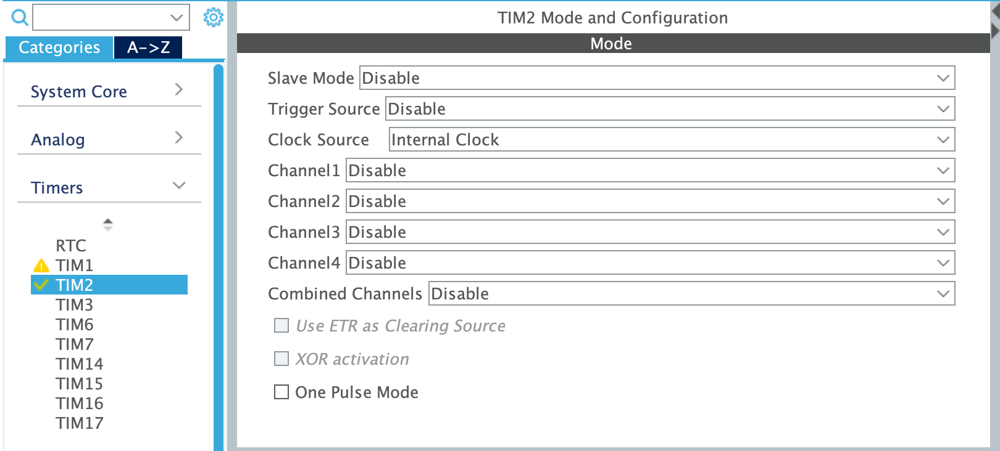
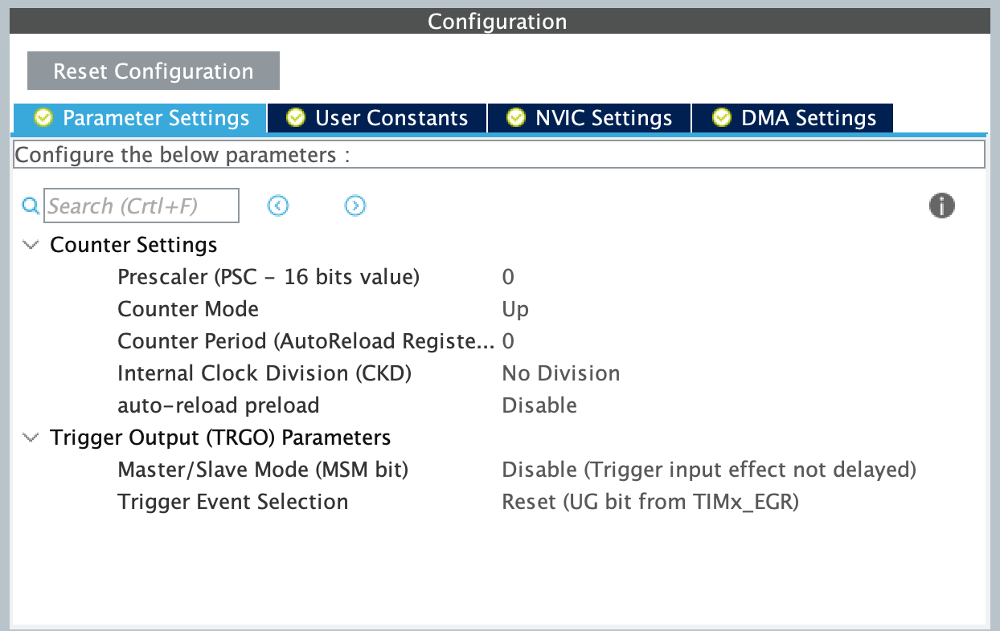
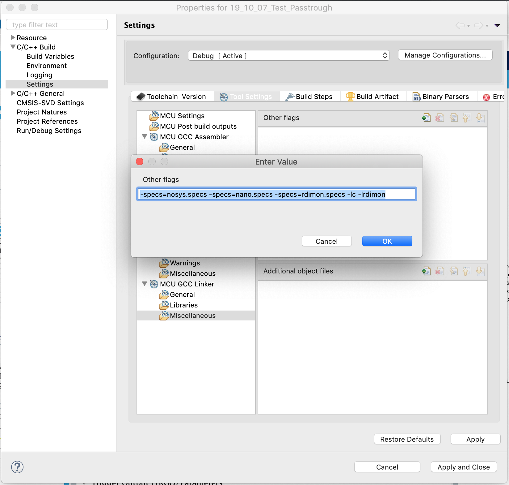

# 3.4 C implementation

Assuming you have successfully implemented a passthrough in the previous guide, we can simply copy and paste this project from within the STM32CubeIDE software. After pasting it, a pop-up will ask to give a name to the copied project. We recommend choosing a name with the current date and `"alien_voice"` in it. Remember to delete the binary \(ELF\) file of the original project inside the copied project.

## Setting up timer for benchmarking <a id="timer"></a>

Open the CubeMX file by double clicking the .ioc file of the copied project it in the IDE project explorer in order to update the initialization code.

For this exercise, we will only need to add the configuration of a _timer_ \(to benchmark our implementation\) as the rest of the system is already up and running. In order to activate a timer, you need to set a "Clock Source". Open _TIM2_ in the Timers menu and activate it's clock:



_Figure: Set the "Clock Source" to "Internal Clock" in order to enable "TIM2"._

Next, we need to configure the timer.




TASK 4: We ask you to set the "Prescaler" value \(in the figure above\) in order to achieve a $$1\,[\mu s]$$ period for "TIM2", i.e. we want our timer to have a $$1\,[\mu s]$$ resolution.

_Hint: Go to the "Clock Configuration" tab \(from the main window pane\) to see what is the frequency of the input clock to "TIM2". From this calculate the prescaler value to increase the timer's period to_ $$1\,[\mu s]$$_._


You can leave the rest of the parameters as is for "TIM2". Finally, you can update the initialization code by saving the file.

In order to use the timer we configured, we will need to define a variable to keep track of the time and a macro to reset the timer. Between the `USER CODE BEGIN PV` and `USER CODE END PV` comments, add the following lines in the `main.c` file.

```c
/* USER CODE BEGIN PV */
volatile int32_t current_time_us;
#define RESET_TIMER ({\
        current_time_us = __HAL_TIM_GET_COUNTER(&htim2);\
        HAL_TIM_Base_Stop(&htim2);\
        HAL_TIM_Base_Init(&htim2);\
        HAL_TIM_Base_Start(&htim2);\
    })
```

To use this macro, just call it in your code, then the variable `current_time_us` will be updated and the timer will be reset.

We want to assess if the processing time is longer or shorter than what our chosen buffer length and sampling frequency allows us. To do this, we will define some additional variables and constants \(also between the `USER CODE BEGIN PV` and `USER CODE END PV` comments\).


TASK 5: In the passthrough example, we set the buffer length \(the macro called `FRAME_PER_BUFFER`\) to just 32. Increase it to 512 and use this value and `FS` to calculate the maximum processing time allowed in microseconds. Replace the variable `USING_FRAME_PER_BUFFER_AND_FS` in the code snippet below with this expression for the maximum processing time.

_Note: keep in mind the points made about using_ `float` _or_ `int` _variables \(see_ [_here_](dsp_tips.md#float)_\)._


```c
/* USER CODE BEGIN PV */
volatile int16_t processing_load;
#define FS     hi2s1.Init.AudioFreq
#define MAX_PROCESS_TIME_ALLOWED_us   USING_FRAME_PER_BUFFER_AND_FS
```

In between the `USER CODE BEGIN 2` and `USER CODE END 2` comments, we propose adding the following lines to read the timer and print the result of the benchmarking tool to the console.

```c
/* USER CODE BEGIN 2 */

// Mute codec
MUTE
HAL_Delay(500);

// begin DMA to fill the buffer with values
HAL_I2S_Transmit_DMA(&hi2s1, (uint16_t *) dataOut, DOUBLE_BUFFER_I2S);
HAL_I2S_Receive_DMA(&hi2s2, (uint16_t *) dataIn, DOUBLE_BUFFER_I2S);

// Wait that the buffers are full
HAL_Delay(1000);

// Stop DMAs to get a precise process timing
HAL_I2S_DMAPause(&hi2s1);
HAL_I2S_DMAPause(&hi2s2);

// Measure Processing time
RESET_TIMER;
process(dataIn, dataOut, BUFFER_SIZE);
RESET_TIMER;

// Display the results
printf("-- Processing time assert -- fs = %ld[Hz]\n", FS);

// load in percent
processing_load = USING_CURRENT_TIME_US_AND_MAX_PROCESS_TIME_ALLOWED_US;

if (current_time_us < MAX_PROCESS_TIME_ALLOWED_us) {
    printf("Processing time shorter than allowed time: t_proc = %ld [us], t_buf = %ld [us] (%i%%) \n", current_time_us, MAX_PROCESS_TIME_ALLOWED_us, processing_load);
} else {
    printf("Processing time longer than allowed time: t_proc = %ld [us], t_buf = %ld [us] (%i%%) \n", current_time_us, MAX_PROCESS_TIME_ALLOWED_us, processing_load);
}

// Reactivate the DMAs
HAL_I2S_DMAResume(&hi2s1);
HAL_I2S_DMAResume(&hi2s2);

UNMUTE
SET_MIC_LEFT
```


TASK 6: Using the `current_time_us` and `MAX_PROCESS_TIME_ALLOWED_us`, compute the value of `processing_load` as a percentage in the code snippet above, i.e. replace `USING_CURRENT_TIME_US_AND_MAX_PROCESS_TIME_ALLOWED_US` with the appropriate expression.

_Note: keep in mind the points made about using_ `float` _or_ `int` _variables \(see_ [_here_](dsp_tips.md#float)_\)._


You will notice that we used a `printf` function in order to output text on the debug console. To enable this function you need to make the following changes to your project:

* In the Project Properties \("right-click" project &gt; Properties\), navigate to "C/C++ Build &gt; Settings" on the left-hand side \(see the figure below\). Under "Tools Settings -&gt; MCU GCC Linker -&gt; Miscellaneous", add "Linker flags" field by pressing the "+" button. The necessary flags are the following:

  ```text
  -specs=nosys.specs -specs=nano.specs -specs=rdimon.specs -lc -lrdimon
  ```



* Add the following function prototype above the `main` function \(e.g. between the `USER CODE BEGIN PFP` and `USER CODE END PFP` comments\):

  ```c
  extern void initialise_monitor_handles(void);
  ```

* Add the following function call in the body of the `main` function \(before any `printf`\):

  ```c
  initialise_monitor_handles();
  ```

* In Debug Configurations \(dropdown from the _bug_ icon\) add the following option under the "Startup" tab:

  ```text
  monitor arm semihosting enable
  ```

After this setup, the `printf` output will be shown in the debug console of Eclipse \(precisely in the `open ocd` console\). _**Be careful, the modification made in the Debug Configuration will not stay if you copy and paste your project to make a new version!**_

## Alien voice effect <a id="effect"></a>

We will now add our robot voice effect! As mentioned [previously](dsp_tips.md#removing-dc-noise), we will also implement a simple high pass filter and add a gain to make the output more audible. Below is the final `process` function we propose you to use. Insert it between the `USER CODE BEGIN 4` and `USER CODE END 4` comments.

```c
/* USER CODE BEGIN 4 */

void inline process(int16_t *bufferInStereo, int16_t *bufferOutStereo,
        uint16_t size) {

    int16_t static x_1 = 0;
    int16_t x[FRAME_PER_BUFFER];
    int16_t y[FRAME_PER_BUFFER];

    #define GAIN 8      // We lose 1us processing time if we use a value that is not a power of 2

    static uint16_t pointer_sine = 0;

    // Take signal from left side
    for (uint16_t i = 0; i < size; i += 2) {
        x[i / 2] = bufferInStereo[i];
    }

    for (uint16_t i = 0; i < FRAME_PER_BUFFER; i++) {

        // High pass filter
        y[i] = x[i] - x_1;

        // Apply alien voice effect and gain
        y[i] =

        // Update state variables
        pointer_sine = 
        x_1 =

    }

    // Interleaved left and right
    for (uint16_t i = 0; i < size; i += 2) {
        bufferOutStereo[i] = (int16_t) y[i / 2];
        bufferOutStereo[i + 1] = 0;
    }
```


TASK 7: Modify the code within the second `for` loop in order to compute the alien voice output and update the state variables.

_Note: normalize the sinusoid using the constant_ `SINE_MAX`_!_


Copy the sinusoid lookup table below and place it between the `USER CODE BEGIN PV` and `USER CODE END PV` comments.

```c
#define SINE_TABLE_SIZE 80
#define SIN_MAX 0x7fff
const int16_t sine_table[SINE_TABLE_SIZE] = {
0x0000,0x0a0a,0x1405,0x1de1,0x278d,0x30fb,0x3a1b,0x42e0,
0x4b3b,0x5320,0x5a81,0x6154,0x678d,0x6d22,0x720b,0x7640,
0x79bb,0x7c75,0x7e6b,0x7f99,0x7fff,0x7f99,0x7e6b,0x7c75,
0x79bb,0x7640,0x720b,0x6d22,0x678d,0x6154,0x5a81,0x5320,
0x4b3b,0x42e0,0x3a1b,0x30fb,0x278d,0x1de1,0x1405,0x0a0a,
0x0000,0xf5f6,0xebfb,0xe21f,0xd873,0xcf05,0xc5e5,0xbd20,
0xb4c5,0xace0,0xa57f,0x9eac,0x9873,0x92de,0x8df5,0x89c0,
0x8645,0x838b,0x8195,0x8067,0x8001,0x8067,0x8195,0x838b,
0x8645,0x89c0,0x8df5,0x92de,0x9873,0x9eac,0xa57f,0xace0,
0xb4c5,0xbd20,0xc5e5,0xcf05,0xd873,0xe21f,0xebfb,0xf5f6
};
```

## Extra features <a id="extra"></a>

If you have some extra time, we propose to make a few improvements to the system!

First extra feature: will now program one of the on-board buttons - the blue button called "B1" - to toggle the alien voice effect. Copy the following code between the `USER CODE BEGIN PV` and `USER CODE END PV` comments.

```c
/* USER CODE BEGIN PV */
// Enumeration for a clean FX ON/OFF toggle
enum {
    FX_OFF, FX_ON
} FX_STATE;

// State variable for the FX
uint8_t FX = FX_OFF;

/* USER CODE BEGIN 0 */
void HAL_GPIO_EXTI_Callback(uint16_t GPIO_Pin) {

    if (GPIO_Pin == B1_Pin) {
        FX = !FX;
        LED_TOGGLE
    }
}
```

In the above code snippet, you will find the state variable we propose for the FX \(effects\) state and the callback that is needed to react to the button. **To activate the callback, you need to go into CubeMX and enable "EXTI line 4 to 15" from the Configuration tab under "System &gt; NVIC".**


TASK 8: Modify your `process` function using a condition as proposed in the code snippet below.

_Hint: This will not be enough if you used the optimised version of the process function proposed in task 7, if it is the case, you will also have to test the FX value in the signal initialisation._


```c
for (uint16_t i = 1; i < FRAME_PER_BUFFER; i++) {

    // High pass filter
    y[i] = x[i] - x_1;

    // Apply robot voice modulation and gain
    if (FX == FX_ON) {

    } else {

    }

    // Update state variables
    pointer_sine = 
    x_1 =
}
```

Finally, you can try changing the modulation frequency and creating your lookup tables by running [this Python script](https://github.com/LCAV/dsp-labs/blob/master/scripts/alien_voice/compute_sinusoid_lookup.py) for modified values of `f_sine`.

**Congrats on implementing your \(perhaps\) first voice effect! In the** [**next chapter**](../filter-design/)**, we will implement a more sophisticated high-pass filter than the one used here. To this end, we will come across fundamental theory and practical skills in digital filter design.**

## Tasks solutions



Are you sure you are ready to see the solution? ;\)



As proposed in the hint, if you go to the tab _Clock Configuration_ of CubeMX, you will see the following graph:


Note the last block on the right column _APB1 Timer clocks \(MHz\):_ 48. It means that your timer are "run" with a base tick frequency of 48MHz. in order to reduce this to $$1[\mu s]$$or in other word $$1[MHz]$$, you will have to divide it by 48. This number is thus your prescaller. This lead to the following timer configuration:


Note the _Counter Period_, it is the value at where the interrupt is triggered, here the maximum value.



The maximum processing time allowed it an important information for us to know how far we are from our micro-controller's ressource limits.

We know that the maximum time the micro-controller can take to process the data is the time between two consecutive buffers. The calculation is then just dividing the number of sample in a buffer by the sampling frequency. We add a factor in order to get a int. This will fasten the calculation.

```c
#define MAX_PROCESS_TIME_ALLOWED_us     (int32_t)(BUFFER_SIZE*1000000.0/FS)
```



Here we will use the value calculated in the previous task in order to get a real number reflecting the processing load.

The result is trivial, you just have to care about variable types.

```c
// Display the results
printf("-- Processing time assert -- fs = %ld[Hz]\n", FS);

processing_load = (int8_t) ((float) current_time_us * 100.0    / (float) MAX_PROCESS_TIME_ALLOWED_us );

if (current_time_us < MAX_PROCESS_TIME_ALLOWED_us) {
    printf("Processing time shorter than sampling limit: t = %ld [us], BUFFER_SIZE/fs = %ld [us] (%i%%) \n", current_time_us, MAX_PROCESS_TIME_ALLOWED_us, processing_load);
} else {
    printf("Processing time longer than sampling limit: t = %ld [us], BUFFER_SIZE/fs = %ld [us] (%i%%) \n", current_time_us, MAX_PROCESS_TIME_ALLOWED_us, processing_load);
}
```



Here comes the moment when you can rely on your former python implementation in order to code the C version of the alien voice. Indeed as we already coded the python version in a block version and very close to C programming, it is just a matter of porting the code.

```c
/* USER CODE BEGIN 4 */

void inline process(int16_t *bufferInStereo, int16_t *bufferOutStereo,
        uint16_t size) {

    int16_t static x_1 = 0;
    int16_t x[FRAME_PER_BUFFER];
    int16_t y[FRAME_PER_BUFFER];

#define GAIN 8      // We lose 1us processing time if we use a value that is not a power of 2

    static uint16_t pointer_sine = 0;

    // Take signal from left side
    for (uint16_t i = 0; i < size; i += 2) {
        x[i / 2] = bufferInStereo[i];
    }

    for (uint16_t i = 0; i < FRAME_PER_BUFFER; i++) {

        // High pass filter
        y[i] = x[i] - x_1;

        // Apply alien voice effect and gain
        y[i] = (y[i] * sine_table[pointer_sine++]) * GAIN / SIN_MAX;

        // Update state variables
        pointer_sine %= SINE_TABLE_SIZE; 
        x_1 = x[FRAME_PER_BUFFER - 1];
    }

    // Interleaved left and right
    for (uint16_t i = 0; i < size; i += 2) {
        bufferOutStereo[i] = (int16_t) y[i / 2];
        bufferOutStereo[i + 1] = 0;
    }
```

Note that an optimisation could be done. The line _x\_1 = x\[FRAME\_PER\_BUFFER - 1\];_ is executed on every single passage through the _for_ loop. In fact we only need to backup x\_1 \(as a static variable\) during the transition from one buffer to the next. With some modification we can arrive to the following function that will use slightly less of CPU usage:

```c
void inline process(int16_t *bufferInStereo, int16_t *bufferOutStereo,
        uint16_t size) {

    int16_t static x_1 = 0;
    int16_t x[FRAME_PER_BUFFER];
    int16_t y[FRAME_PER_BUFFER];

    static uint16_t pointer_sine = 0;

    #define GAIN 8      // We lose 1us processing time if we use a value that is not a power of 2

    // Take signal from left side
    for (uint16_t i = 0; i < size; i += 2) {
        x[i / 2] = bufferInStereo[i];
    }

    // High pass filtering initialization
    y[0] = x[0] - x_1; // deal with the first value, backuped from previous buffer
    // Signal initialization
    y[0] = (y[0] * sine_table[pointer_sine++]) * GAIN / SIN_MAX;
    pointer_sine %= SINE_TABLE_SIZE;

    for (uint16_t i = 1; i < FRAME_PER_BUFFER; i++) {
        // High pass filtering
        y[i] = x[i] - x[i - 1];

        // Robot voice modulation and gain
        y[i] = (y[i] * sine_table[pointer_sine++]) * GAIN / SIN_MAX;
        pointer_sine %= SINE_TABLE_SIZE;
    }

    // Backup last sample for next buffer -> ONLY ONCE per buffer, otherwise we use x[i-1] that is available "locally"
    x_1 = x[FRAME_PER_BUFFER - 1];

    // Interleaved left and right
    for (uint16_t i = 0; i < size; i += 2) {
        bufferOutStereo[i] = (int16_t) y[i / 2];
        // Put signal on both side
        bufferOutStereo[i + 1] = (int16_t) y[i / 2];
    }
}
```



The final process function in its optimised form will look like this:

```c
void inline process(int16_t *bufferInStereo, int16_t *bufferOutStereo,
        uint16_t size) {

    int16_t static x_1 = 0;
    int16_t x[FRAME_PER_BUFFER];
    int16_t y[FRAME_PER_BUFFER];

#define GAIN 8         // We loose 1us if we use 10 in stead of 8

    static uint16_t pointer_sine = 0;

    // Take signal from left side
    for (uint16_t i = 0; i < size; i += 2) {
        x[i / 2] = bufferInStereo[i];
    }

    // High pass filtering initialization
    y[0] = x[0] - x_1; // deal with the first value, backuped from previous buffer

    // Signal initialization
    if (FX == FX_ON) {
        y[0] = (y[0] * sine_table[pointer_sine++]) * GAIN / SIN_MAX;
        pointer_sine %= SINE_TABLE_SIZE;
    } else {
        // Gain
        y[0] *= GAIN;
    }

    for (uint16_t i = 1; i < FRAME_PER_BUFFER; i++) {

        // High pass filtering
        y[i] = x[i] - x[i - 1];
        if (FX == FX_ON) {
            // Robot voice modulation and gain
            y[i] = (y[i] * sine_table[pointer_sine++]) * GAIN / SIN_MAX;
            pointer_sine %= SINE_TABLE_SIZE;
        } else {
            // Gain
            y[i] *= GAIN;
        }
    }

    // Backup last sample for next buffer
    x_1 = x[FRAME_PER_BUFFER - 1];

    // Interleaved left and right
    for (uint16_t i = 0; i < size; i += 2) {
        bufferOutStereo[i] = (int16_t) y[i / 2];
        // Put signal on both side
        bufferOutStereo[i + 1] = (int16_t) y[i / 2];
    }
}
```



