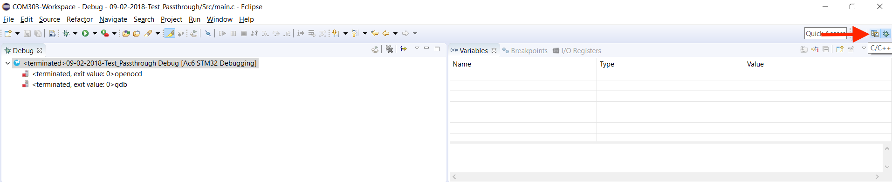

# 3.1 First project: blinking LED

_Note: the following instructions and images were produced on February 9, 2018 using Windows 10, STM32CubeMX Version 4.24.0, and SW4STM32 Version 2.4._

## <a id="init_code"></a>Code generation with CubeMX

 Open STM32CubeMX; we will be using this graphical software to generate the initialization code for our board and its peripherals. Select "New Project" This may prompt a download as the software packages for certain boards may have available updates.    
<div style="text-align:center"></div>
<center><i>CubeMX opening page.</i></center>
<br/>

### Board selection

When all necessary downloads are completed, you should eventually see something similar to below. Click on the "Board Selector" tab in the top toolbar to the left.    
<div style="text-align:center"></div>
<br/>

Filter by board on the left column; enter "NUCLEO-F072RB". Double-click the board in the search results. A pop-up may appear asking if you would like to initialize all peripherals with their default mode. Press "Yes".    
<div style="text-align:center"></div>
<br/>

When the board has loaded, you should see something similar to below.    
<div style="text-align:center"></div>
<br/>

### Generate initialization code

When a Nucleo template is selected, the blue button and the "LD2" LED are already configured. This is sufficient for our first project!

We are now ready to generate the initialization code! Save your project and then press the gear-looking button in the top left (see above).

You should see a window similar to below pop up. Give your project a meaningful name and decide where to save it. We recommend _putting the date_ as part of the project name. **It is very important to set "Toolchain / IDE" to "SW4STM32".** Press "Ok" to generate the code. If prompted to download any firmware code, do so. Unfortunately, if you do not have an Internet connection, you will not be able to create the project.     
<div style="text-align:center"></div>
<br/>

When the code has been successfully generated, you should see a pop-up similar to below. Simply press "Close" as we will open the project in a different manner.     
<div style="text-align:center"></div>
<br/>

## <a id="deploy"></a>Project development with SW4STM32

### Import project created by CubeMX

Open the SW4STM32 software using the workspace created during the installation phase. If you did not make a workspace, we recommend creating one called "COM303-Workspace".

From the toolbar, select "File > Import". A pop-up similar to below should appear.      
<div style="text-align:center"></div>
<br/>

Under "General", select "Existing Projects into Workspace" and click "Next" (see below).     
<div style="text-align:center"></div>
<br/>

A view similar to below should appear. Browse for the project we created with CubeMX. **Most importantly, check the box "Copy projects into workspace"!** Press "Finish".      
<div style="text-align:center"></div>
<br/>

The project should then appear in the left-hand column of the workspace under "Project Explorer" If you still see the "Welcome Page" as seen below, you go to the workbench by pressing the "Workbench" in the top-right corner. If you would like to skip the "Welcome Page" whenever you start up SW4STM32, you can uncheck the box in the bottom-left corner.      
<div style="text-align:center"></div>
<br/>

From the "Project Explorer", open the file `"Src/main.c"`  (see below). Throughout the file, you should see comments that read `USER CODE BEGIN` and `USER CODE END`; _it is only between these comments that you should write your code!_ All other lines of code have been created by CubeMX according to the configuration we specified before. If you decide to adjust any configuration through CubeMX by editing the IOC file within the _copied_ project inside your workspace, it may modify anything outside of `USER CODE BEGIN` and `USER CODE END`, which is why all your code should be between these two lines.      
<div style="text-align:center"></div>
<br/>

### Blinking LED

We will now program the board with a simple example - a blinking LED! Inside the infinite-while loop between the comments `USER CODE BEGIN WHILE` and `USER CODE END WHILE`, add the following lines:
```C
/* Infinite loop */
/* USER CODE BEGIN WHILE */
while (1) {
    HAL_GPIO_TogglePin(LD2_GPIO_Port, LD2_Pin);
    HAL_Delay(1000);  // in ms
/* USER CODE END WHILE */

/* USER CODE BEGIN 3 */

}
/* USER CODE END 3 */
```
`HAL_GPIO_TogglePin` and `HAL_Delay` are commands provided by ST for toggling a pin and delaying respectively. You can see a function/variable definition by pressing "Ctrl +"" clicking the function/variable ("Command" on MacOS).

The first command toggles the value of the pin corresponding to the LED at pin "LD2"; it turns the LED _on_ for one iteration of the while loop, _off_ for the next iteration, etc. In order to actually observe the LED blinking with the "naked" eye, we must set a delay between each toggle operation. This is what the second command does by placing a delay of 1 second, as the function `HAL_Delay` accepts delays in milliseconds.

"HAL" is short for "Hardware Abstraction Layer" and it is a library provided by ST to help developers produce _portable_ code, i.e. code that can be used across the whole family of STM32 boards. For more information on HAL, check out [this document](https://www.st.com/content/ccc/resource/technical/document/user_manual/2f/77/25/0f/5c/38/48/80/DM00122015.pdf/files/DM00122015.pdf/jcr:content/translations/en.DM00122015.pdf).

Before plugging in the board, let's try building the project. This can be done by pressing the _hammer_ icon on the top toolbar, or by using the shortcut "Ctrl + B" ("Command + B" on MacOS). Make sure you are building for "Debug" and for the correct project.

In the figure below, we can see two signs of a successful build:
* A "Binaries" folder was created as can be seen in the "Project Explorer" and it contains an ELF file corresponding to our project. It should have the same name as your project. If this does not appear, it may be necessary to refresh the project by right-clicking the project directory and selecting "Refresh" (or using the shortcut F5).
* There are no errors in the "Console" pane.
<br/>      
<div style="text-align:center"></div>
<br/>

Now we can program the board! Plug the board to your computer using the USB Type-A to Mini-B cable. A couple LEDs of the board should light up as it is being powered by your computer. 

Click on the arrow next to the _bug_ icon from the toolbar and select "Debug As > Ac6 STM32 C/C++ Application" (see below).      
<div style="text-align:center"></div>
<br/>

If this is your first time debugging in this workspace, you should see a pop-up similar to below appear. Click "Yes" as this perspective will be very useful, and you can check the box for "Remember my decision" so that this pop-up does not appear again.      
<div style="text-align:center"></div>
<br/>

If something similar to the following error appear:
    
    "Unplugged target or STLink already in use or STLink USB driver not installed."
    
make sure the board is properly plugged in and/or try another port. We noticed such an error when using USB 3.0 ports.

A view similar to below should then appear. This is the typical "Debug perspective" of Eclipse.       
<div style="text-align:center"></div>
<br/>

Your program should be momentarily paused as is the case in the figure above at Line 90. You can continue the program by pressing the _Resume_ button as pointed out above.

You should now observe the "LD2" LED (see below) blinking!       
<div style="text-align:center"></div>
<center><i>Top view of a NUCLEO-XXXXRX board. Red arrow pointing out approximate location of "LD2" LED. <a href="https://www.st.com/content/ccc/resource/technical/document/data_brief/c8/3c/30/f7/d6/08/4a/26/DM00105918.pdf/files/DM00105918.pdf/jcr:content/translations/en.DM00105918.pdf" target="_blank">Picture source</a>.</i></center>
<br/>


### Terminating program

In order to properly stop the program, it is also necessary to disconnect from the board. Both can be done by pressing the _Disconnect_ button on the top toolbar (see below).       
<div style="text-align:center"></div>
<br/>

Finally, you can switch back to the "normal" perspective by pressing the button to the left of the _bug_ icon in the top-right corner (see below).       
<div style="text-align:center"></div>
<br/>

**That's it for this introductory chapter! In the next chapter, we will dive into audio DSP by putting together a [_passthrough_](../../../../2/passthrough/_intro.md), the "hello world" equivalent of audio.**
