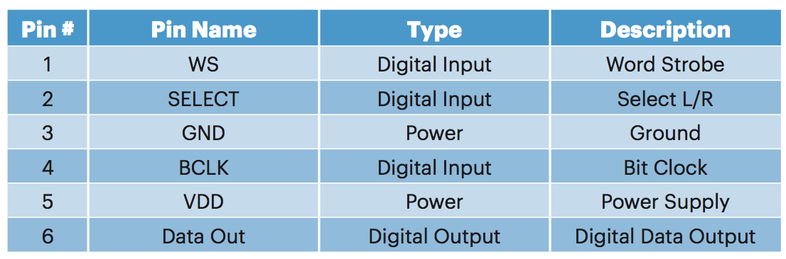

# Adafruit I2S MEMS Microphone Breakout

The microphone part we will be using is the [I2S MEMS Microphone Breakout](https://learn.adafruit.com/adafruit-i2s-mems-microphone-breakout/overview) by Adafruit. In the following subsections, we will explain the important inputs/outputs of a MEMS microphone, the I2S input protocol for the microphone we will be using, and what is meant by "breakout"!

## Overview of MEMS microphone pins

For portable devices, digital MEMS microphone are the popular choice for audio capture. They are small, cheap, and easy to integrate into one's desired application. MEMS microphone usually have the following inputs:
*  **VDD**: (usually) 3.3V to power the device.
*  **GND**: ground.
*  **CLK**: "clock" signal which is directly related to the sampling
    frequency. Typically the sampling frequency $$f_s = f_{CLK}/64$$, or
    in other words the input clock is $$64 \times$$ the desired audio
    sampling frequency.
*  **SEL**: "select" signal to specify whether the microphone data
    should be responsible for the *left* or *right* channel data. For
    this reason, **SEL** can also be called **LR** on datasheets.
    Typically, **SEL**=0 for the left channel and **SEL**=1 for the
    right channel.

A MEMS microphone typically returns a PDM (Pulse-Density Modulation)
signal. This is essentially a 1-bit oversampled (usually $$64 \times$$
normal audio sampling frequencies) signal that requires downsampling and
filtering in order to obtain a multi-bit PCM (Pulse-Code Modulation)
signal. PCM is the format typically used for storing and processing
audio and the format we will want to use in our applications. You can read more about PDM and PCM [here](http://users.ece.utexas.edu/~bevans/courses/rtdsp/lectures/10_Data_Conversion/AP_Understanding_PDM_Digital_Audio.pdf) and [here](https://en.wikipedia.org/wiki/Pulse-density_modulation).

Luckily, we do not need to perform this conversion if we use a MEMS microphone that outputs an I2S signal. These microphones contain a decimator and a low-pass filter in its circuitry and output the multi-bit audio in a serial manner via the [I2S format](https://www.sparkfun.com/datasheets/BreakoutBoards/I2SBUS.pdf). However, this convenience requires us to provide at least one additional input to an I2S MEMS microphone:
* **WS**: "word select" signal for specifying whether we expect the left
(**WS**=0) or right channel (**WS**=1) data. Typically, the frequency of
**WS** $$f_{WS} = f_{CLK}/64$$ and the two signals (**WS** and **CLK**)
must be synchonized.

As I2S microphones perform the downsampling and low-pass filtering internally to produce the multi-bit audio, we need a "smart" way of transmitting this audio rather than having multiple output lines for each bit. A separate line for each bit would require up to 24 output lines! The **WS** input is our solution as it denotes:
-   which channel's data we are expecting (left or right);
-   the start of a particular channel's transfer, typically on the next
    rising edge of the **CLK** signal after **WS** has changed values
    (which is why it is important that **CLK** and **WS** are properly
    synchronized).

With one input signal, we replace the need for several output lines! Both the PDM and the I2S MEMS microphones output a 1-bit signal, often
called **DOUT** or **DATA** on datasheets. Moreover, it is common for
left and right channel microphones to share the same **DATA** line to
further reduce the number of connections.

<i>Adafruit I2S MEMS microphone pins, p. 9 of <a href="https://cdn-shop.adafruit.com/product-files/3421/i2S+Datasheet.PDF" target="_blank">datasheet</a>.</i>

## I2S timing diagram example

Let's look at an example timing diagram from the IS2 microphone we will
be using. 

<i>I2S MEMS microphone output timing diagram, p. 7 of <a href="https://cdn-shop.adafruit.com/product-files/3421/i2S+Datasheet.PDF" target="_blank">datasheet</a>. The output data format is I2S, 24 bit, 2's compliment, MSB first.</i>

 
From the figure above, we can make several interesting observations:
1.  After **WS** switches to LOW/0 for the left channel, we receive the
    first bit of information on the **DATA** line from the microphone
    whose **SEL**=0. The same is true for when **WS** switches to HIGH/1
    for the right channel and the microphone whose **SEL**=1.
2.  Each new bit is received at a *rising* edge and held for an *entire*
    period of **CLK**.
3.  *For this microphone*: the first 18 bits after a rising or falling
    edge of the **WS** signal corresponds to actual audio data, starting
    with the Most-Significant Bit (MSB) and finishing with the
    Least-Significant Bit (LSB).
4.  *For this microphone*: bits 19-24 are set to 0 so our data precision
    is essentially 18 bits. Nonetheless, this zero-padding is required
    as the output format chosen by the manufacturer is: I2S, 24 bit, 2's
    compliment, MSB first (p. 7 of [datasheet](https://cdn-shop.adafruit.com/product-files/3421/i2S+Datasheet.PDF)).
5.  *For this microphone*: bits 25-32 are set to *tri-state*, which is a
    high impedance mode that essentially removes an output port from the
    circuit in order to avoid a *short circuit*.[^1]

[^1]: As we may share the **DATA** line between the left and right channel, this is desired when one microphone is done transmitting data and while the other microphone is transmitting. See [here](https://en.wikipedia.org/wiki/Three-state_logic) for more information on tri-state.

## I2S wiring example

Now that we are familiar with the various inputs and output of a MEMS microphone, let's see how we would wire up an I2S MEMS microphone, in particular the one we will be using.

<i>I2S MEMS microphone wiring for stereo use, p. 7 of <a href="https://cdn-shop.adafruit.com/product-files/3421/i2S+Datasheet.PDF" target="_blank">datasheet</a>. <b>Note: in our exercises we will be using a mono, i.e. one channel, setup.</b></i>

 

From the figure above, we can observe how _two_ I2S microphones would be connected for stereo use. Some important observations that can be made:
-   The component called "IS2 Master" would be our microcontroller. The
    terms "master" and "slave" are quite common in electronics to
    describe the device which acts as the controller and the devices(s)
    that are being controlled. See [here](https://www.techopedia.com/definition/2235/masterslave) for more information on the terminology.
-   The **DATA** lines for the two microphones are connected to each
    other and are supplied as a single input to the I2S Master.
-   The **SEL** input for each microphone is set differently:
    **SEL**=**VDD** for the top microphone and **SEL**=**GND** for the
    bottom microphone. This is absolutely essential if two microphones
    will be sharing the same **DATA** line!
-   The two microphones use the same **BCLK** (aka **CLK**) and **WS**
    signal. This is also necessary for microphones using the same
    **DATA** line for synchronization purposes.

## Adafruit breakout

From the figure above, we can observe that a MEMS microphone requires several additional components (capacitors and resistors) in addition to the multiple inter-connecting wires. We could use a [breadboard](https://en.wikipedia.org/wiki/Breadboard) to wire up all the necessary components, but this is far from convenient when we start to incorporate more parts.

To simplify this task of wiring, it is common to use _breakout_ boards. With a breakout board, we can bundle all the necessary components and simply provide connections for the signals/ports that need to interact with our microcontroller. In the case of our microphone, all the components (microphone, resistors, capacitors) can be soldered on a compact board and convenient access can be given to the following signals:
1.  **VDD** and **GND**: provided by the microcontroller to power the
    microphone.
2.  **WS** and **BCLK**: generated by the microcontroller for the I2S
    transfer.
3.  **SEL**: wired by the user to either **VDD** or **GND** to configure
    the microphone appropriately.
4.  **DIN**: input to the microcontroller from the microphone(s).

It is possible to design your own breakout boards using CAD tools for PCBs (Printed Circuit Boards). But for popular components like microphones, it is possible to find breakout boards that have already been designed! [Adafruit](https://www.adafruit.com/category/42) is a great place to find such boards and other cool electronics for personal projects, along with very well explained user guides. We will be using the Adafruit's [I2S MEMS Microphone Breakout](https://learn.adafruit.com/adafruit-i2s-mems-microphone-breakout/overview) in our exercises.

