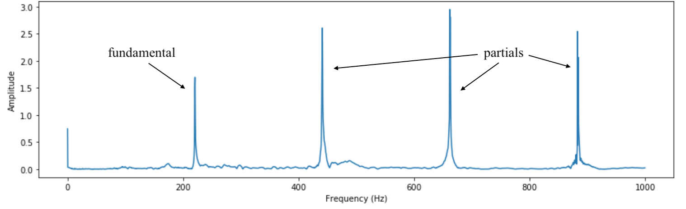
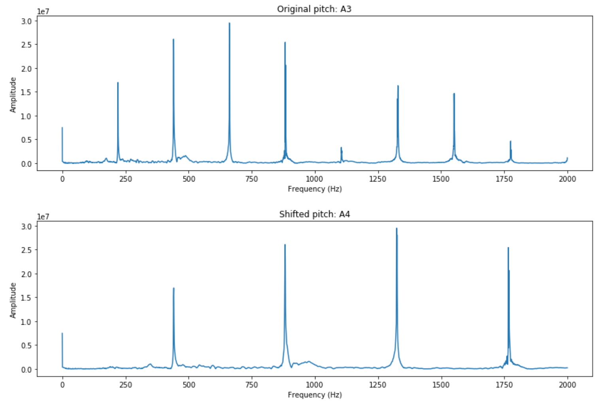
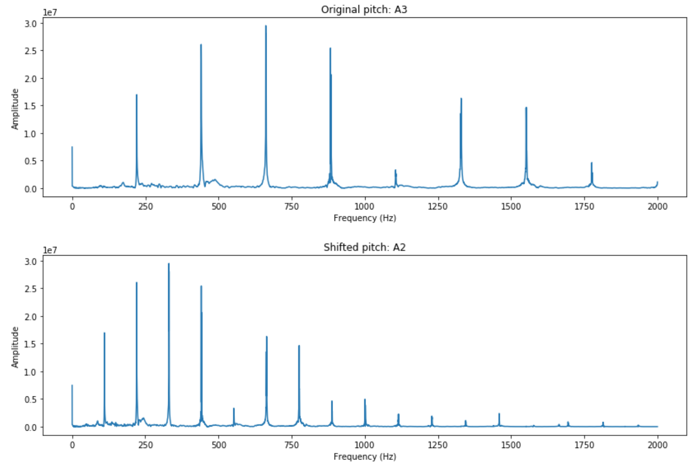

# Pitch shifting using DFT

In this tutorial, we will implement a pitch shifting using DFT in real-time.

The relation between pitch and frequency is not straightforward: while the frequency is an objective value that can be measured, the pitch is a subjective perception of sound. However, a *definite* pitch, i.e. a pitch that can be easily discerned, has a harmonic frequency spectra: all present frequencies are multiples of the first one, which is called *fundamental* frequency. What we hear is the fundamental frequency; its multiples are called *partials*, and serve to color the tone. Here is an example of an A3 played on a synthesized piano:


_Figure: Fourier Transform of A3 on a synthesized piano._

The fundamental frequency is 220 Hz which corresponds indeed to A3 (recall that A4 corresponds to 440 Hz, and one octave higher means doubling the frequency). Note that the actual first "frequency" is 0 and represents the energy of the signal; thus it can't be fundamental.

$$ 
X(\omega = 0) = \sum_{n = -∞}^∞ x[n]e^{-i\omega n} \biggr\rvert_{\omega = 0} = \sum_{n = -∞}^∞ x[n]
$$

Luckily, we’re only interested in shifting the definite pitches of an input signal, as they are the only ones we can perceive. In a speech signal, definite pitches are vowels and voiced consonants, so ideally we would like to shift their pitches and nothing else. However, it would be too complicated to extract them from the input signal; it is easier to shift the pitch of every phonetic one by one, as shifting the pitch of an unvoiced consonant wouldn’t change much. Instead of parsing the input speech to phonetics, we simply separate the signal into intervals small enough: this way, every processed part of signal contains no more than one consonant or vowel.

To keep the definite pitch characteristics, the shifted pitch should still have a fundamental frequency and its partials. It means that we can’t simply shift all frequencies of the pitch, but we should stretch or compress them, so that the partials are still multiples of the fundamental frequency. This is done in the frequency domain: we first chose the pitch we want to shift to, and then place the signal samples to all multiples of its fundamental frequency. We then go back to the time domain.

Piano A3 shifted to A4             |  Piano A3 shifted to A2
:-------------------------:|:-------------------------:
  |  

_Figure: Shifting A3 in the frequency domain: to A4 (on the left) and to A2 (on the right). Partial frequencies remain multiples of the fundamental one._

## Implementation

In the [IPython notebook](http://nbviewer.jupyter.org/github/prandoni/COM303/blob/master/voice_transformer/voicetrans.ipynb) section 4, we already have the code that implements pitch shifting, but not in real time:

```python
def DFT_rescale(x, f):
    X = np.fft.fft(x)
    # separate even and odd lengths
    parity = (len(X) % 2 == 0)
    N = len(X) / 2 + 1 if parity else (len(X) + 1) / 2
    Y = np.zeros(N, dtype=np.complex)
    # work only in the first half of the DFT vector since input is real
    for n in xrange(0, N):
        # accumulate original frequency bins into rescaled bins
        ix = int(n * f)
        if ix < N:
            Y[ix] += X[n]
    # now rebuild a Hermitian-symmetric DFT
    Y = np.r_[Y, np.conj(Y[-2:0:-1])] if parity else np.r_[Y, np.conj(Y[-1:0:-1])]
    return np.real(np.fft.ifft(Y))
```

```python
def DFT_pshift(x, f, G, overlap=0):
    N = len(x)
    y = np.zeros(N)
    win, stride = win_taper(G, overlap)
    for n in xrange(0, len(x) - G, stride):
        w = DFT_rescale(x[n:n+G] * win, f)
        y[n:n+G] += w * win
    return y
```

The challenge here is to process the signal in real time. The technique is similar to the granular synthesis: we process the signal with a delay corresponding to the analysis window size. 

First, create a new directory for the DFT pitch shifting, and copy there the `utils.py` file you've completed in the [previous chapter](https://lcav.gitbook.io/dsp-labs/granular-synthesis/). 


TASK 1: At the end of the file, add a new function `DFT_rescale`. You can copy it from the [IPython notebook](http://nbviewer.jupyter.org/github/prandoni/COM303/blob/master/voice_transformer/voicetrans.ipynb) above (don't forget to replace `xrange` with `range`). 


Now you can create a new .py file and implement the real-time DFT pitch shifting, using the function above.


TASK 2: Complete the Python code below.

_Note: make sure that this file is saved in the same directory as_ `utils.py` _and_ `speech.wav`_._


```python
import numpy as np
from scipy.io import wavfile
from utils import ms2smp, compute_stride, win_taper, dft_rescale

"""
Pitch shifting with granular synthesis for shift factors <=1.0
"""

""" User selected parameters """
input_wav = "speech.wav"
grain_len = 20      # in milliseconds
grain_over = 0.99   # grain overlap (0,1)
shift_factor = 0.7

# open WAV file
samp_freq, signal = wavfile.read(input_wav)
signal = signal[:,]  # get first channel
data_type = signal.dtype
MAX_VAL = np.iinfo(data_type).max

# derived parameters
GRAIN_LEN_SAMP = ms2smp(grain_len, samp_freq)
STRIDE = compute_stride(GRAIN_LEN_SAMP, grain_over)
OVERLAP_LEN = GRAIN_LEN_SAMP-STRIDE

# allocate input and output buffers
input_buffer = np.zeros(STRIDE, dtype=data_type)
output_buffer = np.zeros(STRIDE, dtype=data_type)

# state variables and constants
def init():

    # lookup table for tapering window
    global WIN
    WIN = win_taper(GRAIN_LEN_SAMP, grain_over, data_type)

    # lookup table for linear interpolation
    global SAMP_VALS
    global AMP_VALS
    #SAMP_VALS, AMP_VALS = build_linear_interp_table(GRAIN_LEN_SAMP, shift_factor, data_type)

    # create arrays to pass between buffers (state variables)
    global ...

    # create arrays for intermediate values
    global ...

# the process function!
def process(input_buffer, output_buffer, buffer_len):

    # need to specify those global variables changing in this function (state variables and intermediate values)
    global ...

    # append samples from previous buffer, construction of the grain
    for n in range(int(GRAIN_LEN_SAMP)):
        ...

    # rescale
    #for n in range(int(GRAIN_LEN_SAMP)):
        ...

    # apply window
    for n in range(int(GRAIN_LEN_SAMP)):
        ...

    # write to output
    for n in range(int(GRAIN_LEN_SAMP)):
        # overlapping part
        if n < OVERLAP_LEN:
            ...
        # non-overlapping part
        elif n < STRIDE:
            ...
        # update state variables
        else:
            ...


"""
Nothing to touch after this!
"""
init()
# simulate block based processing
n_buffers = len(signal)//STRIDE
signal_proc = np.zeros(n_buffers*STRIDE, dtype=data_type)
for k in range(n_buffers):

    # sample indices
    start_idx = k*STRIDE
    end_idx = (k+1)*STRIDE

    # index the appropriate samples
    input_buffer = signal[start_idx:end_idx]
    process(input_buffer, output_buffer, STRIDE)
    signal_proc[start_idx:end_idx] = output_buffer

# write to WAV
file_name = "output_pitch_synth_low.wav"
print("Result written to: %s" % file_name)
wavfile.write(file_name, samp_freq, signal_proc)
```

**Congrats on implementing granular synthesis pitch shifting!**
