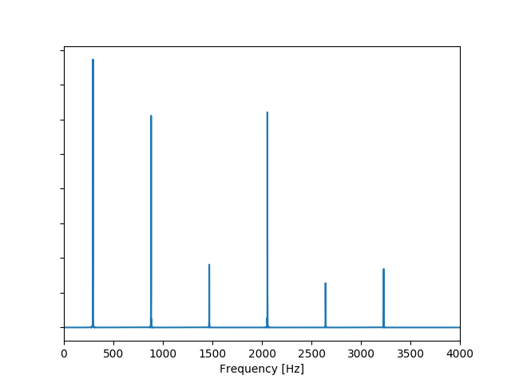

# 7.1 How it works

The next pitch shifting technique that we will explore moves us to the frequency domain.

To set the stage, let's initially consider a simple pitched sound, _i.e._ a signal that appears, to the human ear, to have a discernible pitch. This could be a vowel sound in a speech signal or a note played by a musical instrument.

Spectrally, a pitched sound possesses a _**harmonic**_ structure, that is, as we scan the spectrum from left to right, we encounter a first clear spectral line \(called the _**fundamental**_\) followed by other peaks \(called the _**partials**_\) at exact multiples of the fundamental. The frequency of the fundamental is the perceived pitch of the sound and the regular pattern of spectral lines at precise multiples of the fundamental serve to "color" the tone. They allow us to distinguish the same note played by, _e.g._ a piano and a clarinet.

Below is the spectrum of a \(synthesized\) clarinet playing the note D4 \($$293.6$$ Hz\). The spectrum shows the typical pattern of woodwinds, where only the even-numbered partials have significant energy.

_Figure: Spectrum of D4 played by a \(synthesized\) clarinet. You can find the WAV file_ [_here_](https://github.com/LCAV/dsp-labs/tree/master/scripts/dft/clarinet_D4.wav)_._

If we now want to change the frequency content of a sound without altering its duration, we could take a Fourier transform, move the frequencies around, and perform the inverse Fourier transform to return to the time domain. As long as the conjugate symmetry of the modified spectrum is preserved, we would obtain a real-valued time-domain signal.

If we simply shift the spectrum up and down, we can move the position of the fundamental, but we will lose the harmonicity relation between the partials. In other words, the partials will no longer fall at multiples of the fundamental; this is why the "alien voice" sounds unnatural.

The proper way to change the pitch while keeping a natural sound is to instead _**stretch \(or compress\)**_ the frequency axis with a scaling factor. This operation will preserve the proportionality relationship between the fundamental and partials.

In the figure below, we stretch our D4 note from above in order to double its frequency, _i.e._ shift it by an octave to D5.

_Figure: Spectrum of D4 played by a \(synthesized\) clarinet and its shifted version \(to D5\) by stretching the frequency axis. You can find the WAV file of the shifted note_ [_here_](https://github.com/LCAV/dsp-labs/tree/master/scripts/dft/clarinet_D5.wav) _and the script_ [_here_](https://github.com/LCAV/dsp-labs/tree/master/scripts/dft/dft_shift_example.py)_._

However, if we want to apply the same approach to speech, we run into the problem that speech is a nonstationary signal where pitched sounds \(the vowels\) alternate with non-pitched sounds \(the consonants\). The ideal solution would be to segment the speech signal into portions that isolate individual sounds and then apply spectral shifting to the vowels. In practice, we can simply segment the incoming signal into small pieces and apply spectral shifting to each piece independently. Applying pitch shifting to the unvoiced portions doesn't affect their nature that much.

The length of the segments over which we compute \(and shift\) the DFT should be short enough to encompass a single pitched event but long enough to allow for a good resolution in the DFT. Usually, a window between $$40$$ and $$100$$ milliseconds is sufficient. Again, we will use a tapering window to minimize border effects in the result.

**In the** [**next section**](implementation.md)**, we guide you through implementing DFT-based pitch shifting in a real-time,** _**i.e.**_ **buffer-based, fashion with Python. The chosen segment/buffer/grain length dictates the latency of our voice effect.**

