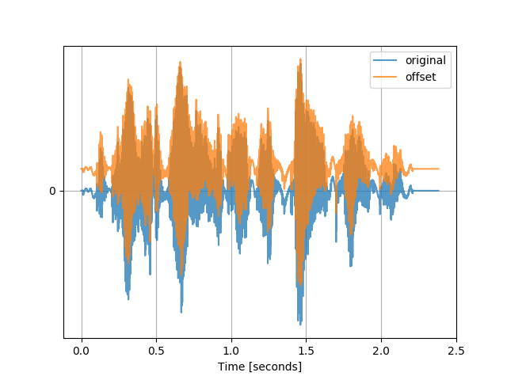
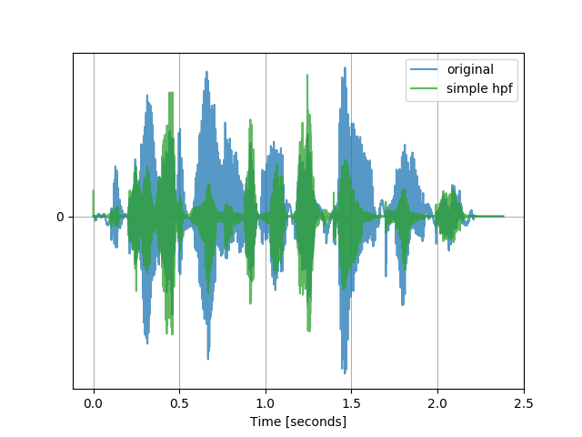
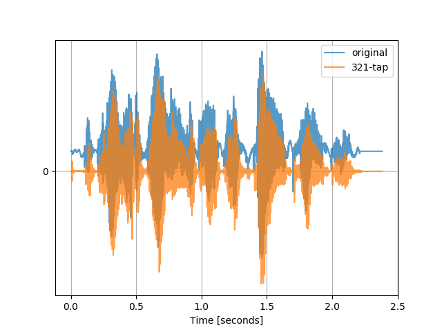
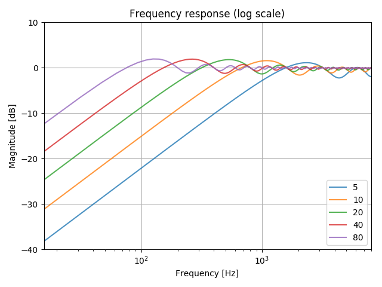
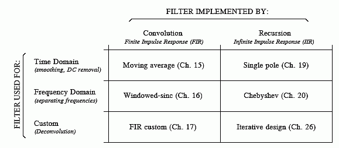
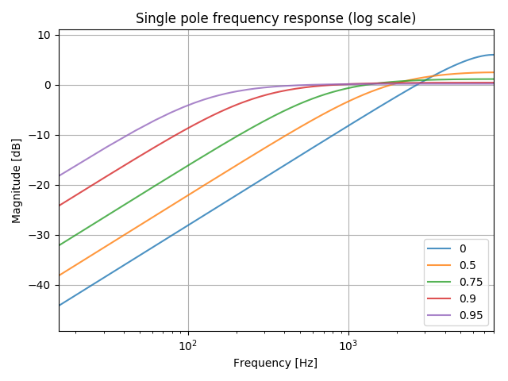
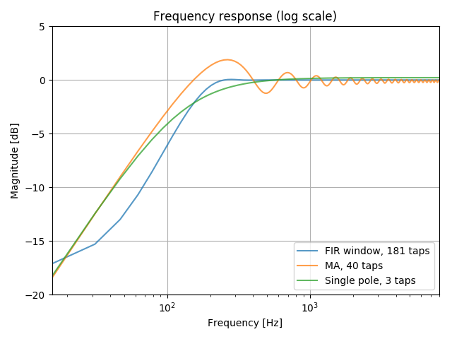

# 4.1 Design approaches

As before, we will first understand the problem and design \(various\) solutions in Python. We will then implement a real-time version in Python so that implementing it on the microcontroller will be primarily that of porting Python to C. Let's get started!

In the following analysis, we assume a sampling frequency of $$16 \text{ kHz}$$, as this is the sampling rate of our test recording. This parameter can be changed in the referenced scripts.


TASK 1: You are strongly encouraged to play around with the scripts mentioned below!


## Analysis of our current \(simple\) filter

In the previous chapter, we implemented a very simple high pass filter by subtraction the previous sample from the current one, namely:

$$
y[n] = x[n] - x[n-1].
$$

From this _difference equation_, we could perform an analysis of its frequency response by taking the _Z-transform_:

$$
Y(z) = X(z) + X(z) \cdot z^{-1},
$$

from which we obtain the _transfer function_:

$$
H(z) = \frac{Y(z)}{X(z)} = 1 - z^{-1}.
$$

From such an expression, we can create the standard [pole-zero plot](https://en.wikipedia.org/wiki/Pole–zero_plot) as seen below. With such a plot, we can extract a lot of useful information, such as stability and causality.

_Figure: Pole-zero plot of our simple HPF. Thanks to_ [this software](https://www.dsprelated.com/showcode/244.php) _for the visualization function._

For certain system, we can also compute the Fourier Transform, which may be more intuitive to understand as we can "read-off" the attenuation at various frequencies. For our simple HPF, the frequency response is shown below.

_Figure: Frequency response of our simple HPF \(log scale\)._

As noted in the last chapter, this filter _**does not**_ have a sharp cutoff, which means frequencies of interest within the voice spectrum will be attenuated.

We can observe this with a simple example: we will take a zero-mean audio signal and add an artificial offset to it; we will then apply our simple HPF and compare the filtered signal with the zero-mean one.

You can run [this script](https://github.com/LCAV/dsp-labs/blob/master/scripts/filter_design/show_simple_filter_flaw.py) to generate the plots below and to listen to the filtered signal.

_Figure: Original zero-mean signal \(blue\) and signal with artificial offset \(orange\)._

_Figure: Signal with artificial offset \(blue\) and HPF'ed signal \(orange\)._

_Figure: Original zero-mean signal \(blue\) and HPF'ed signal \(orange\)._

If you would be just looking at the resulting plots, you would think the high pass filtered \(HPF'ed\) signal is completely different from the original! However, if you listen to the output, you will hear the same sentence but with the lower frequencies severely attenuated.

Nonetheless, looking at this plot and hearing the output, we can conclude that this simple filter will simply not cut it.

## FIR filters

Our simple filter from before is a special case of a causal discrete-time Finite Impulse Response \(FIR\) filter. Causal means that only current and previous samples are used, while FIR implies only current and past **input** samples are used. For such a filter of order $$N$$, we can write the output as:

$$
y[n] = b_0 x[n] + b_1 x[n-1] + \cdots + b_N x[n-N] = \sum_{i=0}^N b_i \cdot x[n-i],
$$

where $$b_i$$ are often called the filter coefficients. A common way to visualize such filters is with a block diagram as seen below.

_Figure: Causal discrete-time FIR filter of order_ $$N$$_. The top part is an_ $$N$$_-stage delay line with_ $$N + 1$$ _taps. Each unit delay is a_ $$z^{-1}$$ _operator in Z-transform notation._ [Source](https://en.wikipedia.org/wiki/Finite_impulse_response#/media/File:FIR_Filter.svg).

For our simple HPF, we had $$N=1$$ with $$b_0= -b_1 = 1$$.

With more coefficients, filters with sharper roll-offs can be achieved, but at the cost of more computation \(and memory to store the coefficients and previous sample values\). For selecting the values of the coefficients, there are different design criteria. A common approach is the [window method](https://ccrma.stanford.edu/~jos/sasp/Window_Method_FIR_Filter.html), which we will consider here for different orders $$N$$.

_Figure: Comparing FIR filters of different order with our simple HPF filter from before._

The above figure can be generated with [this script](https://github.com/LCAV/dsp-labs/blob/master/scripts/filter_design/fir_comparison.py), which uses the function [`firwin`](https://docs.scipy.org/doc/scipy-0.14.0/reference/generated/scipy.signal.firwin.html) from the `scipy.signal` library in order to compute the coefficients with the window method.

Although our simple HPF from before attenuates DC more than most of the FIR filters considered above, the other filters would preserve important signal in the voice spectrum , i.e. $$0 \text{ dB}$$ \(unit gain / passband\) above $$100 \text{ Hz}$$. However, using $$41$$ taps barely attenuates the DC component while $$321$$ taps demands a large amount of memory.

Let's take a look at the resulting output when we pass the artificial DC-biased signal from before.

_Figure: Signal with artificial offset filtered by_ $$41$$_-tap FIR filter._

_Figure: Signal with artificial offset filtered by_ $$321$$_-tap FIR filter._

The above figure can be generated with [this script](https://github.com/LCAV/dsp-labs/blob/master/scripts/filter_design/fir_comparison_example.py), which again uses `firwin` to design the filter and [`lfilter`](https://docs.scipy.org/doc/scipy/reference/generated/scipy.signal.lfilter.html) to apply the filter.

As expected from the frequency response curves we saw earlier, the $$41$$-tap filter is unable to attenuate the DC offset, while the $$321$$-tap filter is able to do so \(but at the cost of more memory and computation\). Nonetheless, both filters preserve the original signal much better than what we saw with the simple $$2$$-tap HPF we were using earlier. The resulting filtered signals should sound nearly identical to the original \(zero-mean\) file. The $$41$$-tap output, on the other hand, will begin with a small click due to the DC offset.

### Moving average filter

Recalling our original motivation of the HPF, we discussed a simple solution for removing the DC offset by subtracting the average/mean of the signal. This can be done with a single line of Python when we have a recording, but is not possible when we are streaming an input, as we do not have access to future values!

We can however perform a [_moving average_](https://en.wikipedia.org/wiki/Moving_average) that is estimate the mean from the past $$N$$ samples and subtract this from the current sample value. The moving average can be written as the following FIR operation:

$$
m[n] = \dfrac{x[n] + x[n-1] + \cdots + x[N-1]}{N}.
$$

The average at time index $$n$$ can also be computed using the previous average at index $$n-1$$ in order to reduce the number of computations, particularly if $$N$$ is large.

$$
m[n] = m[n-1] + \dfrac{x[n]}{N} - \dfrac{x[n-N]}{N}.
$$

The above form falls under the category of _infinite impulse response_ \(IIR\) filters, which will be discussed shortly, as the output depends on past **output** value\(s\).

With this estimate of the average, we can remove it from the current sample towards the goal of removing the DC offset:

$$
y[n] = x[n] - m[n].
$$

The figure below, generated by [this script](https://github.com/LCAV/dsp-labs/blob/master/scripts/filter_design/moving_average_approach.py), demonstrates the performance of the above filter for varying values of $$N$$.

We can observe a tradeoff between a large number of coefficients and a desirable \(low\) cutoff frequency _versus_ a small number of coefficients with a better attenuation at DC but an undesirable \(high\) cutoff frequency. Nonetheless, we can obtain desirable performance without using as many coefficients as we saw earlier with the window method.

A more efficient and better performing DC removal moving average filter is discussed [here](https://www.dsprelated.com/showarticle/58.php). As we will not adopt this approach in our implementation, we leave this resource for the interested reader.

## IIR filters

So are we stuck with using FIR filters with lots of coefficients? Fortunately not!

With recursion, we can compute filters that theoretically have an _infinite_ impulse response \(IIR\). The filters we saw earlier have a _finite_ impulse response since they rely on a finite number of past _input_ samples. With IIR filters, we also use past **output** values, and this recursion is what creates an infinite impulse response. The difference equation of an IIR filter is typically written as such:

$$
y[n] = \sum_{i=0}^N b_i \cdot x[n-i] + 
\sum_{j=1}^{M} a_i \cdot y[n-i].
$$

Notice that $$a_i$$ starts with $$i=1$$; in literature you might see an $$a_0$$ coefficient but this will be typically set to $$a_0=1$$. In total, we have $$N+M+1$$ coefficients, meaning this many multiplies for the output.

As with FIR filter design, there are various design approaches and criteria. The table below from the very useful online [DSP guide](http://www.dspguide.com/) provides a nice summary of the different design approaches for a variety of applications.

_Figure: Filters can be divided by their use, and how they are implemented._ [Source](http://www.dspguide.com/ch14/6.htm).

Looking at the "Time Domain" row, as we are interested in DC removal, we can observe two approaches of interest:

1. Moving average \(which as we saw earlier could be implemented more efficiently as an IIR filter\).
2. Single pole IIR filter.

We will now look into this second approach, as we will be implementing this filter for DC removal.

Another name for this filter is a [DC blocker](https://ccrma.stanford.edu/~jos/fp/DC_Blocker.html), and it can be expressed with the following difference equation:

$$
y[n] = x[n] - x[n-1] + Ry[n-1],
$$

where $$R$$ specifies the location of the pole. By taking the Z-transform:

$$
Y(z) = X(z) + X(z) \cdot z^{-1} + RY(z) \cdot z^{-1},
$$

we can obtain the following transfer function:

$$
H(z) = \frac{Y(z)}{X(z)} = \frac{1 - z^{-1}}{1 - Rz^{-1}}.
$$

A larger $$R$$ results in a more selective filter \(not suppressing desired lower frequencies\), but at the expense of an impulse response with a longer tail. More on this tradeoff can be read [here](https://ccrma.stanford.edu/~jos/fp/DC_Blocker_Frequency_Response.html).

In the above figure, generated by [this script](https://github.com/LCAV/dsp-labs/blob/master/scripts/filter_design/varying_single_pole.py), we vary the value of $$R$$ to demonstrate the resulting response. As $$R$$ approaches $$1$$, we obtain a narrower _notch_ at DC, that is the attenuation "begins" at a lower frequency. The value $$R=0$$ corresponds precisely to the simple two-tap filter we saw earlier.

Although $$R=0.95$$ produces a filter with a more desirable cutoff frequency, the roll-off is still the same, as we can observe roughly parallel lines with a decay of roughly $$18 \text{ dB/decade}$$. We can produce a sharper filter by _cascading_ multiple single pole filters. A cascade of $$N$$ _stages_ corresponds to raising the frequency response to the power of $$N$$, namely:

$$
\left(H(z)\right)^N = \frac{(1 - z^{-1})^N}{(1 - Rz^{-1})^N}.
$$

As $$N$$ increases, more coefficients \(and samples\) will be needed to compute the output, which means more computations and memory needed to store the coefficients and past samples. An $$N$$-stage filter would require $$(2N+1)$$ coefficients, $$(N+1)$$ past input samples, and $$N$$ past output samples.

For example, for $$N=2$$:

$$
(H(z))^2 = \frac{(1 - z^{-1})^2}{(1 - Rz^{-1})^2} = \frac{1 - 2z^{-1} + z^{-2}}{1 - 2Rz^{-1} + R^2z^{-2}},
$$

from which we can read off the coefficients $$\mathbf{b} = [1, -2, 1]$$ and $$\mathbf{a} = [1, -2R, R^2]$$.

For $$N=3$$, we could use the filter from $$N=2$$ to compute the coefficients:

$$
(H(z))^3 = (H(z))^2 \cdot \frac{1 - z^{-1}}{1 - Rz^{-1}} = \frac{1 - 3z^{-1} + 3z^{-2} - z^{-3}}{1 - 3Rz^{-1} + 3R^2z^{-2} - R^3z^{-3}},
$$

yielding the coefficients $$\mathbf{b} = [1, -3, 3, -1]$$ and $$\mathbf{a} = [1, -3R, 3R^2, -R^3]$$.

For a general $$N$$, the transfer function \(and thus coefficients\) can be computed in this recursive fashion:

$$
(H(z))^N = (H(z))^{N-1} \cdot \frac{1 - z^{-1}}{1 - Rz^{-1}}.
$$

But let's see what the frequency response looks like! The figure below is generated with [this script](https://github.com/LCAV/dsp-labs/blob/master/scripts/filter_design/iir_comparison.py).

We can observe this sharper decay for higher values of $$N$$. Quantitavely, it is around $$18N \text{ dB/decade}$$ for $$N$$ stages. Moreover, comparing to our FIR analysis from before, we need much less coefficients in order to obtain a filter with a desirable performance!

The figure below, generated with [this script](https://github.com/LCAV/dsp-labs/blob/master/scripts/filter_design/hpf_comparison.py), shows that even the single stage \($$N=1$$\) does a sufficient job in removing the DC offset for the \(artificially generated\) signal with a DC offset. This filter is implemented with just $$3$$ coefficients, whereas the FIR filter needed $$181$$ taps with the window method and $$40$$ taps with the moving average approach for comparable performance.

In the next section, we will see how we can implement the second order IIR filter, also known as a [_biquad filter_](https://en.wikipedia.org/wiki/Digital_biquad_filter), in real-time with Python.

