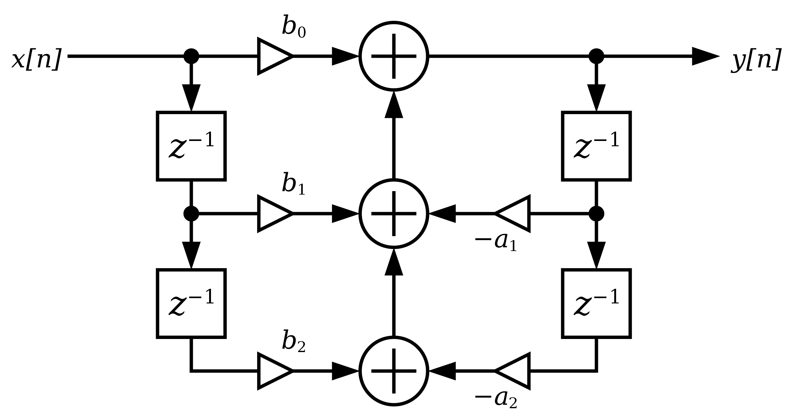
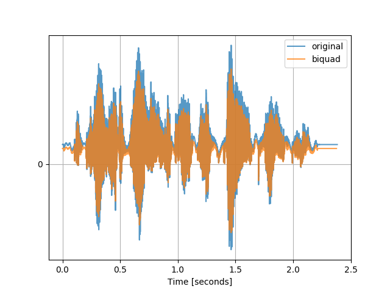
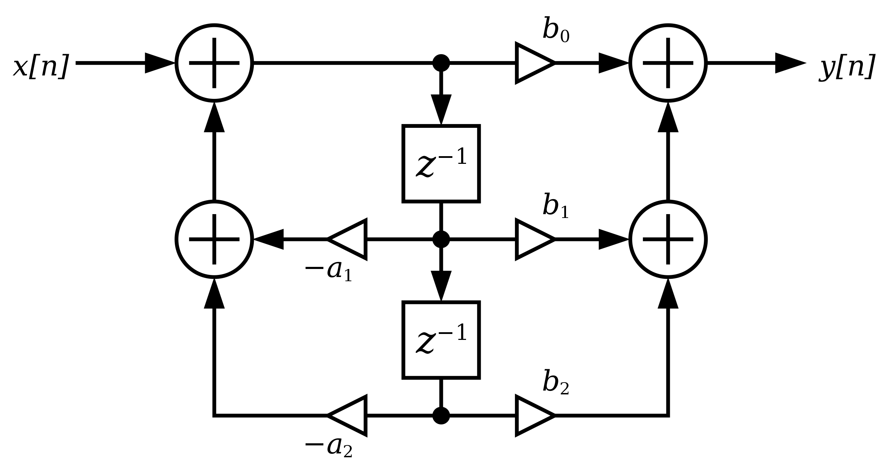
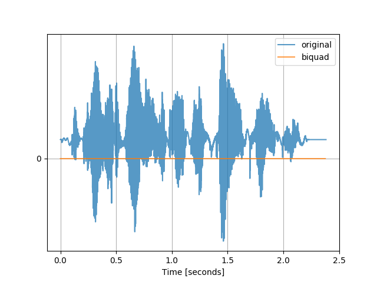
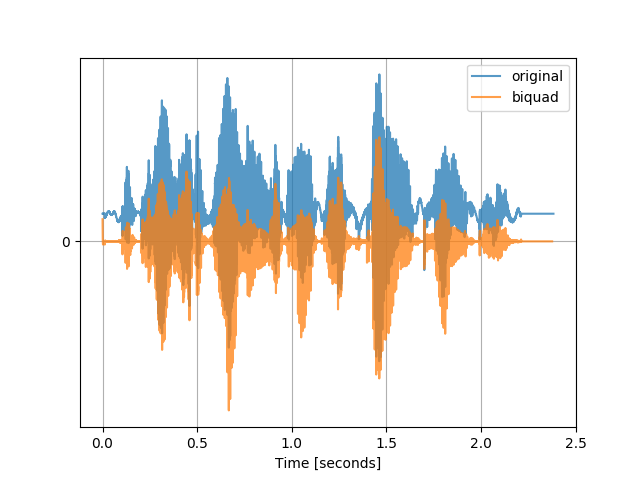

# 4.2 Real-time implementation


As we saw [earlier](./approaches.md), the single pole IIR yields a HPF with desirable performance.
We will therefore replace the simple HPF we implemented for the alien voice effect with such a filter.
Moreover, we will implement a [_biquad filter_](https://en.wikipedia.org/wiki/Digital_biquad_filter), which is a second
order (two pole and two zeros) IIR filter; the biquad is one of the most-used filters.

The above Wikipedia article provides a great overview of the different ways a biquad filter can be implemented,
_without code however_. We will guide you through the Python implementation of two approaches: Direct Form 1 and
Direct Form 2. With these implementations in hand, it should be straightforward to port the code to C. As we did with the
alien voice effect, we will implement the HPF in Python as close as possible as would be done in C.

## Direct Form 1

This is considered the more straightforward implementation, as it follows the standard formulation of the difference equation:

$$
y[n] = b_0 x[n] + b_1 x[n-1] + b_2 x[n-2] - a_1 y[n-1] - a_2 y[n-2].
$$

The corresponding block diagram is shown below.



_Figure: Block diagram of biquad, Direct Form 1._ [Source](https://en.wikipedia.org/wiki/Digital_biquad_filter#/media/File:Biquad_filter_DF-I.svg).

From the block diagram, we can essentially "read-off" the operations that need to be performed in our code.
Below, we show the ***incomplete*** `process` function, which is provided to you in [this script](https://github.com/LCAV/dsp-labs/blob/master/scripts/filter_design/biquad_direct_form_1_incomplete.py)
in the repo. The complete `init` function, which sets the filter coefficients and allocates memory for the state variables,
is provided to you.

```python
def process(input_buffer, output_buffer, buffer_len):

    # specify global variables modified here
    global y, x

    # process one sample at a time
    for n in range(buffer_len):

        # apply input gain
        x[0] = int(GAIN * input_buffer[n])

        # compute filter output
        output_buffer[n] = int(b_coef[0] * x[0] / HALF_MAX_VAL)
        for i in range(1, N_COEF):
            # TODO: add prev input and output according to block diagram
            output_buffer[n] += 0
            
        # update state variables
        y[0] = output_buffer[n]
        for i in reversed(range(1, N_COEF)):
            # TODO: shift prev values
            x[i] = 0
            y[i] = 0
```

Note the variable `HALF_MAX_VAL` in order to use the full range of the signal's data type.

The line:
```python
output_buffer[n] = int(b_coef[0] * x[0] / HALF_MAX_VAL)
```
computes the contribution of the top branch (in the above block diagram) towards the output $$y[n]$$. 


TASK 2: In the `for` loop that immediately follows, determine the code in order to add the contribution from the remaining branches.
This should include a previous input _and_ a previous output sample weighted by the appropriate coefficients.

_Hint: remember to use `HALF_MAX_VAL` and to cast to `int`._


Note that we write a `for` in order to accommodate filters with more than two poles/zeros. However, due to stability issues
it may be better to cascade multiple biquads instead of creating a filter with more than two poles/zeros.


TASK 3: In the final `for` loop, update the state variables, that is the previous input and output sample values.


Running the incomplete script will yield the following plot, in which only a gain (less than one) is applied to the
input signal.



If you successfully complete the `process` function, you should obtain the following plot.


## Direct Form 2

The second implementation we will consider is known as Direct Form 2. It uses less memory for state variables by
placing the feedback portion first. [This article](http://www.earlevel.com/main/2003/02/28/biquads/) provides a nice
visual of how to get from Direct Form 1 to Direct Form 2.

The difference equation for Direct Form 2 is given by:
$$
y[n] = b_0 w[n] + b_1 w[n-1] + b_2 w[n-2],
$$
where:
$$
w[n] = x[n] - a_1 w[n-1] - a_2 w[n-2].
$$
The corresponding block diagram is shown below.



_Figure: Block diagram of biquad, Direct Form 2._ [Source](https://en.wikipedia.org/wiki/Digital_biquad_filter#/media/File:Biquad_filter_DF-II.svg).


As before, we provide an ***incomplete*** `process` function, which can be found in [this script](https://github.com/LCAV/dsp-labs/blob/master/scripts/filter_design/biquad_direct_form_2_incomplete.py)
in the repo. The complete `init` function, which sets the filter coefficients and allocates memory for the state variables,
is provided to you.

```python
def process(input_buffer, output_buffer, buffer_len):

    # specify global variables modified here
    global w

    # process one sample at a time
    for n in range(buffer_len):

        # apply input gain
        w[0] = int(GAIN * input_buffer[n])

        # compute contribution from state variables
        for i in range(1, N_COEF):
            # TODO: accumulate signal at top-left adder using prev `w` (middle column)
            w[0] -= 0

        # compute output
        output_buffer[n] = 0
        for i in range(N_COEF):
            # TODO: accumulate signal at top-right adder using `w`
            output_buffer[n] += 0

        # update state variables
        for i in reversed(range(1, N_COEF)):
            # TODO: shift prev values
            w[i] = 0
```

The first step is to compute:

$$
w[n] = x[n] - a_1 w[n-1] - a_2 w[n-2].
$$


TASK 4: Complete the first (inner) `for` loop in order to update the value of `w[0]` (which corresponds to w[n] in 
the above difference equation). You should use the previous values `w[1:]` (w[n-1], w[n-2], ...) and `a_coeff`.

_Hint: remember to use `HALF_MAX_VAL` and to cast to `int`._


Then we can compute the output:

$$
y[n] = b_0 w[n] + b_1 w[n-1] + b_2 w[n-2].
$$ 


TASK 5: Complete the next (inner) `for` loop in order to set the output sample of `output_buffer[n]`, using `w` and `b_coeff`.

_Hint: remember to use `HALF_MAX_VAL` and to cast to `int`._


Finally, we need to update the state variables for computing the next sample.


TASK 6: Complete the final `for` loop in order to update the values of `w`.


Running the incomplete script will yield the following plot, where the output is all-zeros.



If you successfully complete the `process` function, you should obtain the following plot.




## C implementation

With the above implementation(s) working in the simulated environments with a fixed WAV file, you
can now try your implementation in a real-time scenario.


TASK 7: Try your biquad filter implementation with the [`sounddevice` template](https://github.com/LCAV/dsp-labs/blob/master/scripts/_templates/rt_sounddevice.py)
and then implement it in C on the microcontroller!

_Hint: for the C implementation, start off with the passthrough example._


**Congrats on implementing the biquad filter! This is a fundamental tool in the arsenal of a DSP engineer.
In the** [**next chapter**](../granular-synthesis/)**, we will build a more sophisticated voice effect that can alter
the pitch so that you sound like a chipmunk or Darth Vader.**
