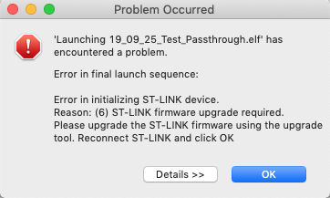
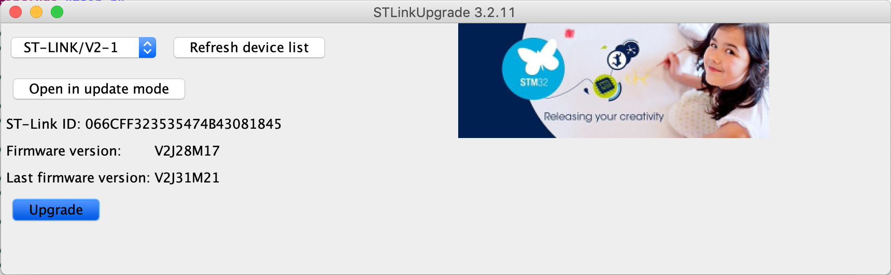

# 1.3 First project!

## Open STM32CubeIDE and select a workspace <a id="init_code"></a>

1\) Open STM32CubeIDE that you just installed in the previous step.

2\) Select a workspace, it is the folder where all project are going to be stored. You can create multiple workspace, for example if you work on different projects.


3\) Once you selected a valid folder you can Launch STM32CubeIDE.


## Create a new project <a id="init_code"></a>

The first time you open the software, you will be prompted with the following screen

A pop-up may appear asking if you would like to initialise all peripherals with their default mode. Press _Yes_.


Press the _Start new STM32 project_ button in order to launch CubeMX and start initialising the project.

If you have a workspace that already contains project, the _new project button_ is in the top left corner.

## Code generation with CubeMX <a id="init_code"></a>

We will be using this graphical software to generate the initialization code for our board and its peripherals. 

### Board selection

When all necessary downloads are completed, you should eventually see something similar to below. Click on the _Board Selector_ tab in the top toolbar to the left.


Filter by board on the left column; enter "NUCLEO-F072RB". Double-click the board in the search results. 


Chose an appropriated name for the project, including the date, project goal etc, and leave the options as default.


When clicking next, You will see a pop-up asking if you want to initialise all peripheral with their default mode. This is linked with what has been added on the Nucleo bord in addition to the micro-controller. In this case there is an LED and a button. Press _Yes_ as we will use those peripheral lated.


When the board has loaded, you should see something similar to below.


Extend the central pane if it was hidden, you will later need to do configuration in this pane.


### Generate initialisation code

When a Nucleo template is selected and all peripheral initialised with default values, the blue button _B1_ and the LED _LD2_ are already configured. This is sufficient for our first project!

We are now ready to generate the initialisation code! Save your project by _Command + S_ or _ctrl + S_, depending on your OS. The project will be automatically generated if a modification was made. At this stage, _CubeMX_ will write down in _C_, using _HAL_ libraries everything that was selected through it's GUI. 

_HAL_ is short for _Hardware Abstraction Layer_ and it is a library provided by ST to help developers produce _portable_ code, i.e. code that can be used across the whole family of STM32 boards. For more information on HAL, check out [this document](https://www.st.com/content/ccc/resource/technical/document/user_manual/2f/77/25/0f/5c/38/48/80/DM00122015.pdf/files/DM00122015.pdf/jcr:content/translations/en.DM00122015.pdf).


## Project development with SW4STM32 <a id="deploy"></a>

From the "Project Explorer", open the file `"Src/main.c"` \(see below\). Throughout the file, you should see comments that read `USER CODE BEGIN` and `USER CODE END`; _**it is only between these comments that you should write your code!**_ ****All other lines of code have been created by _CubeMX_ according to the configuration we specified before. If you decide to adjust any configuration through _CubeMX_ by editing the IOC file within the _copied_ project inside your workspace, it may modify anything outside of `USER CODE BEGIN` and `USER CODE END`, which is why all your code should be between these two lines.


### Blinking LED

We will now program the board with a simple example - a blinking LED! Inside the infinite-while loop between the comments `USER CODE BEGIN WHILE` and `USER CODE END WHILE`, add the following lines:

```c
/* Infinite loop */
/* USER CODE BEGIN WHILE */
while (1) {
    HAL_GPIO_TogglePin(LD2_GPIO_Port, LD2_Pin);
    HAL_Delay(1000);  // in ms
/* USER CODE END WHILE */

/* USER CODE BEGIN 3 */

}
/* USER CODE END 3 */
```

`HAL_GPIO_TogglePin` and `HAL_Delay` are commands provided by _ST_ for toggling a pin and delaying respectively. You can see a function/variable definition by pressing _Ctrl +_ clicking the function/variable \(_Command_ on MacOS\).

The first command toggles the value of the pin corresponding to the LED at pin _LD2_; it turns the LED _on_ for one iteration of the while loop, _off_ for the next iteration, etc. In order to actually observe the LED blinking with the "naked" eye, we must set a delay between each toggle operation. This is what the second command does by placing a delay of 1 second, as the function `HAL_Delay` accepts delays in milliseconds.

### Building the project

Before plugging in the board, let's try building the project. This can be done by pressing the _hammer_ icon on the top toolbar, or by using the shortcut "Ctrl + B" \("Command + B" on MacOS\). Make sure you are building for _Debug_ and for the correct project.

In the figure below, we can see two signs of a successful build:

* A "Binaries" folder was created as can be seen in the "Project Explorer" and it contains an ELF file corresponding to our project. It should have the same name as your project. If this does not appear, it may be necessary to refresh the project by right-clicking the project directory and selecting _Refresh_ \(or using the shortcut F5\).
* There are no errors in the "Console" pane.


Now we can program the board! Plug the board to your computer using the USB Type-A to Mini-B cable. A couple LEDs of the board should light up as it is being powered by your computer.

### Debugging the code

Click on the _bug_ icon from the toolbar and select _Debug As &gt; STM32_  MCU _C/C++ Application_ \(see below\).


If this is your first time debugging in this workspace, you should see a pop-up similar to below appear. Click "Yes" as this perspective will be very useful, and you can check the box for "Remember my decision" so that this pop-up does not appear again.


If something similar to the following error appear:

```text
"Unplugged target or STLink already in use or STLink USB driver not installed."
```

make sure the board is properly plugged in and/or try another port.

If the Nucleo's firmware is outdated, you might be requested to update it with the following message:



Just press _OK_ and then _Yes._


First press _Open in update mode,_ and then _Upgrade_ the firmware of your Nucleo.




After the upgrade, you can press again on the bug button to resume debbuging.

A view similar to below should then appear. This is the typical "Debug perspective" of Eclipse.


Your program should be momentarily paused as is the case in the figure above at Line 90. You can continue the program by pressing the _Resume_ button as pointed out above.

You should now observe the "LD2" LED \(see below\) blinking!


_Figure: Top view of a NUCLEO-XXXXRX board. Red arrow pointing out the location of "LD2" LED._ [Picture source](https://www.st.com/content/ccc/resource/technical/document/data_brief/c8/3c/30/f7/d6/08/4a/26/DM00105918.pdf/files/DM00105918.pdf/jcr:content/translations/en.DM00105918.pdf).

### Terminating program

In order to properly stop the program, it is also necessary to disconnect from the board. Both can be done by pressing the _Disconnect_ button on the top toolbar \(see below\).


Finally, you can switch back to the _normal_ perspective by pressing the button to the left of the _bug_ icon in the top-right corner \(see below\).


**That's it for this introductory chapter! In the next chapter, we will dive into audio DSP by putting together a** [_**passthrough**_](../passthrough/)**, the "hello world" equivalent of audio.**

