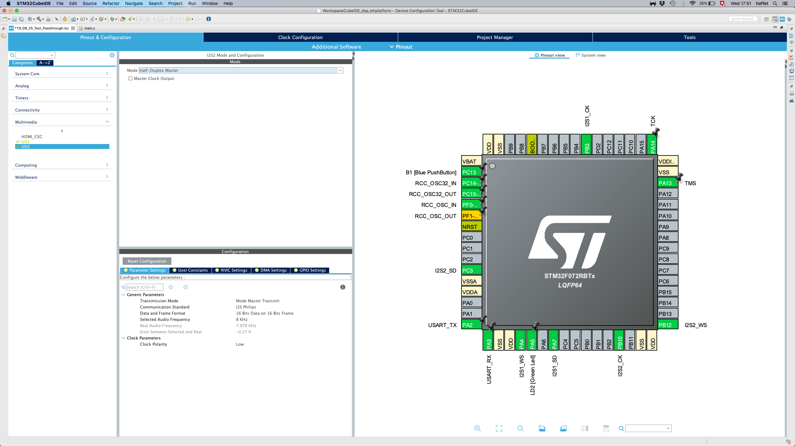

# 1.2 Software

UPDATED BY AH

We will now walk through the installation of the two software tools that will be essential in our workflow:

* [**STM32CubeIDE**](https://www.st.com/en/development-tools/stm32cubeide.html): an Eclipse-based IDE for programming STM32 microcontrollers. See [here](sw4stm32.md) for installation instructions.

_Figure: Screenshot of CubeMX._

\_\_

In the following sections, we walkthrough the installation of this IDE.

