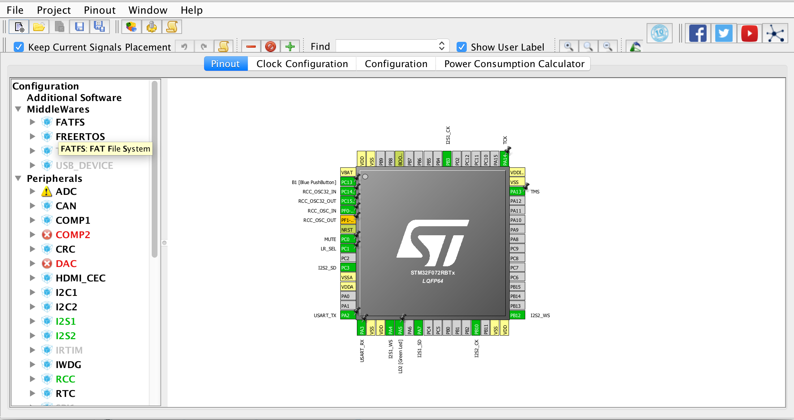
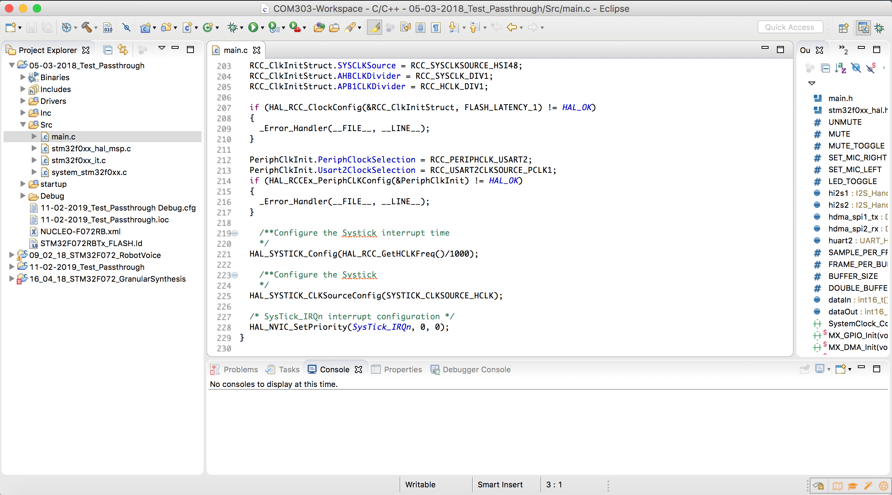

# 1.2 Software

In the following sections, we walkthrough the installation of the two software tools that will be essential in our workflow:

* [**CubeMX**](https://www.st.com/en/development-tools/stm32cubemx.html): a graphical software configuration tool that simplifies the process of generating the C initialization code for STM32 microcontrollers. See [here](cubemx.md) for installation instructions.

_Figure: Screenshot of CubeMX._   

* [**System Workbench for STM32 \(SW4STM32\)**](https://www.st.com/en/development-tools/sw4stm32.html): an Eclipse-based IDE for programming STM32 microcontrollers. See [here](sw4stm32.md) for installation instructions.

_Figure: Screenshot of SW4STM32._

