# CubeMX

## Download instructions

_Note: these instruction and images were produced on February 6, 2018 and last verified on July 23, 2018._

The following steps are the same for Windows, Linux, and MacOS as they simply consist of downloading the installation files. For the actual installation, please refer to the corresponding subsection **after these instructions**.

1\) Navigate to the ST [site for the STM32CubeMX software](https://www.st.com/en/development-tools/stm32cubemx.html).

2\) At the bottom of the page, you should find a link to download the software. Press the button "Get Software".


3\) A License Agreement should pop up. In order to download the software, it is required to accept the agreement.

4\) If you have an ST account and are logged in, the software should download automatically. Otherwise, a pop-up will appear asking for you to make an account. You can make an account by pressing the "Login/Register" button. However, this process will take you to another page and ask you to provide additional details such as "Function", "Company", "Industry", "Country", and "Zip/Postcode". _Alternatively_, you can just enter "First name", "Last name", and "Email" in the pop-up \(see below\). Accept the "Sales Terms & Conditions", "Privacy Policy" and "Terms of Use" and press the "Download" button.


5\) You should then receive an email \(see below\) with a link to both validate your email address and start the download. The download should be a ZIP file with a title similar to `"en.stm32cubemx.zip"`. Place the file in a desired location and unzip it.


6\) Open the file called `"Readme.html"`. It should list all supported operating systems \(OS\) and architectures, software requirements, and brief installation instructions, which we will complement with screenshots! You can now proceed to the appropriate subsection for your OS:

* [Windows](cubemx.md#windows)
* [Linux](cubemx.md#linux)
* [MacOS](cubemx.md#macos)

## Windows

_Note: the following instructions were tested using Windows 10 Pro Insider Preview, Version 1607, with a 64-bit operating system on February 7, 2018._

1\) Make sure you have administrator rights and run the `"SetupSTM32CubeMX-X.X.X.exe"` file as administrator.

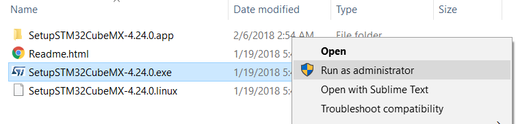

2\) The installation wizard should pop up. You will be guided through a set of instruction to agree to a license agreement, set the installation path, and define any shortcuts.

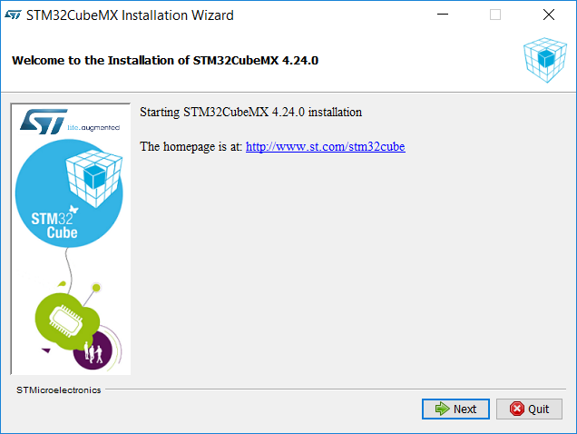

3\) After the configuration phase, the installation will automatically begin. When it is done, the progress bars will appear as seen below. Click "Next" to finish the installation procedure and to proceed to the final pane of the installation wizard. Press "Done" and the installation is complete!

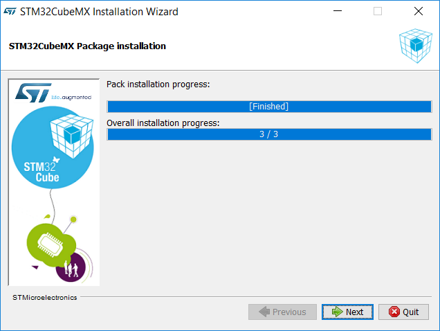

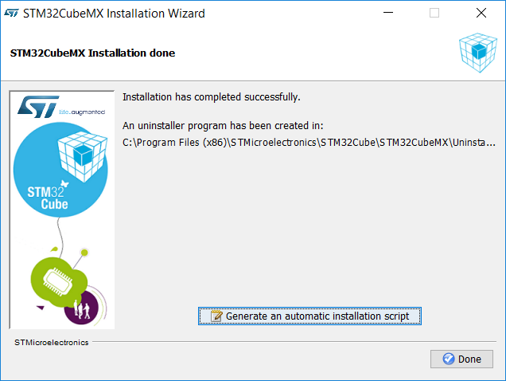

4\) You can run the software by navigating to the directory where STM32CubeMX was installed and double-clicking the file called `"STM32CubeMX"`. You can also use the Start-menu and/or Desktop shortcut \(you may have\) defined during the installation process.

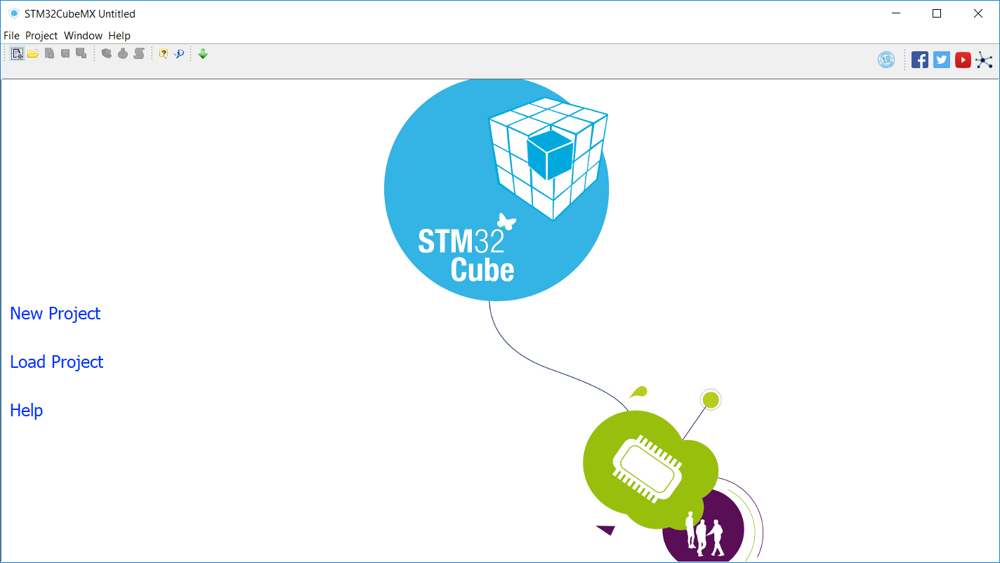

_Figure: Opening page of CubeMX on Windows._

5\) You can now proceed to downloading and installing the next software - [SW4STM32](sw4stm32.md).

## Linux

_Note: the following instructions were tested using Ubuntu 16.04.1 LTS, x86\_64 architecture on a Lenovo Thinkpad X230 on February 7, 2018._

1\) Navigate to the folder that contains the unzipped content of `"en.stm32cubemx.zip"`. Run the Linux installer `"SetupSTM32CubeMX-X.X.X.linux"` either by double-clicking from a file explorer or running the following command from a Terminal \(use `sudo` if you would like to install on shared directories\):

```bash
$ ./SetupSTM32CubeMX-X.X.X.linux
```

2\) The installation wizard should then pop up \(see below\). You will have to agree to a license agreement and specify where the software should be installed. _**Take note of the installation location**_ as you will need to navigate to this location in order to run CubeMX.

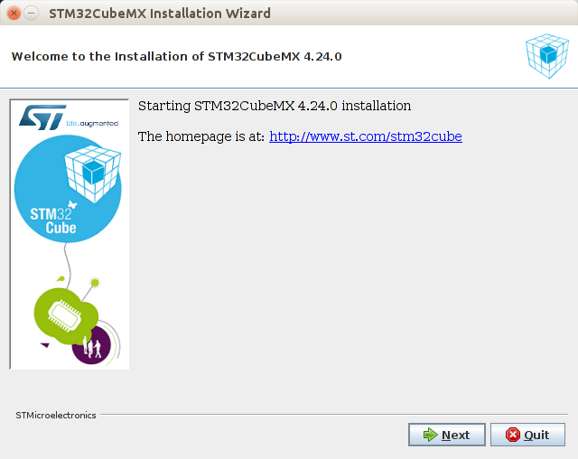

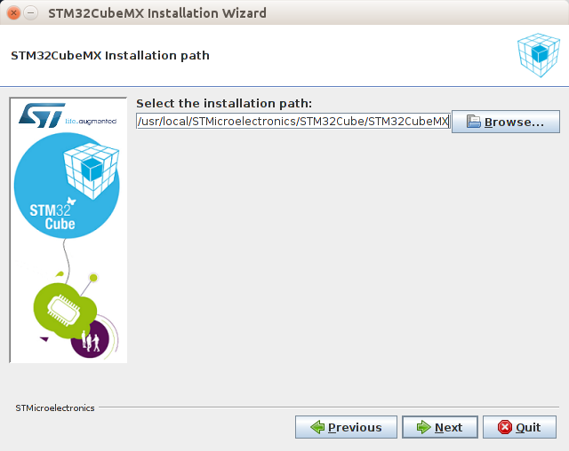

3\) After specifying the path, the installation will automatically begin. When it is done, the progress bars will appear as below. Click "Next" to finish the installation procedure and to proceed to the final pane of the installation wizard. Press "Done" and the installation is complete!

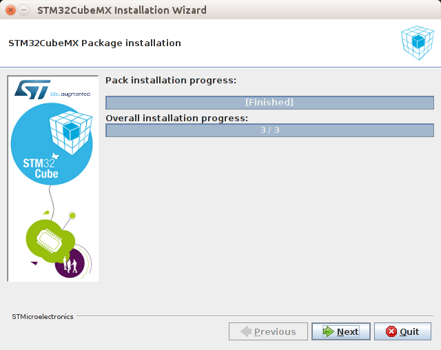

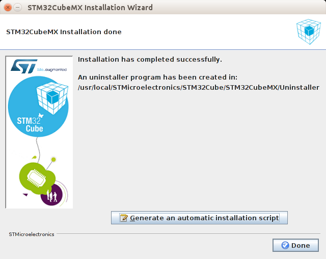

4\) You can run the software by navigating to the directory where CubeMX was installed and \(from a file explorer\) double-clicking the file called `"STM32CubeMX"` or \(from a Terminal\) running:

```bash
$ ./STM32CubeMX
```

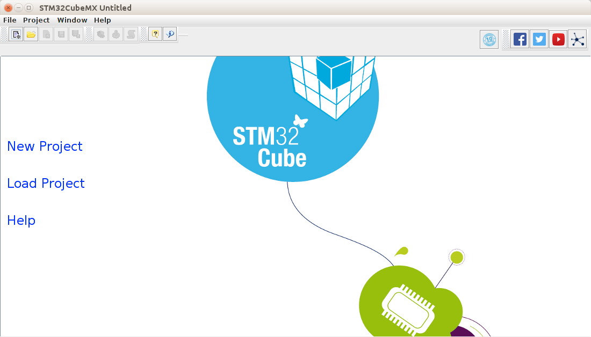

_Figure: Opening page of CubeMX on Linux._

5\) You can now proceed to downloading and installing the next software - [SW4STM32](sw4stm32.md).

## MacOS

_Note: the instructions were tested using MacOS Sierra, Version 10.12.6 on February 7, 2018._

1\) Make sure you have access rights to the directory in which the software would be installed. Double-click \(or launch from a Terminal\) the `"SetupSTM32CubeMX-X.X.X"` Application.


_Note: with MacOS Sierra, you may have to dig a bit deeper. See extra steps below._

* Right-click the Application file and open up the package contents.

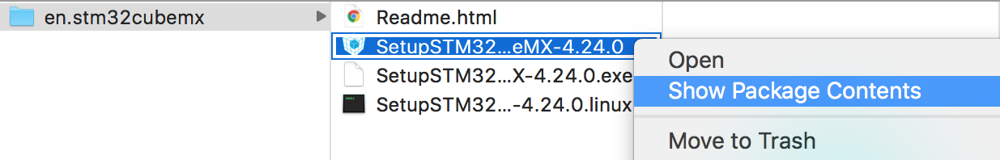

* Inside the `"MacOs"` folder, there is a file called `"SetupSTM32CubeMX-X_X_X_macos"`. Double-click this to start the installation.

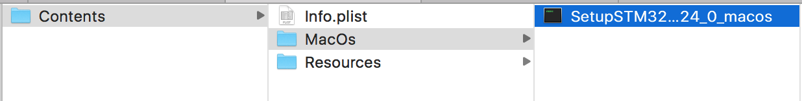

2\) The installation wizard should then pop up \(see below\). You will have to agree to a license agreement and specify where the software should be installed.


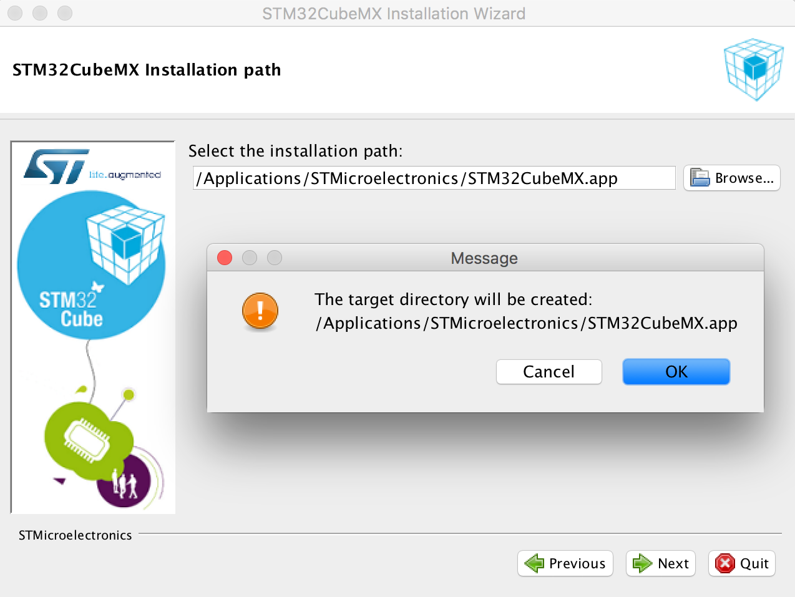

3\) After specifying the path, the installation will automatically begin. When it is done, the progress bars will appear as below. Click "Next" to finish the installation procedure and to proceed to the final pane of the installation wizard. Press "Done" and the installation is complete!

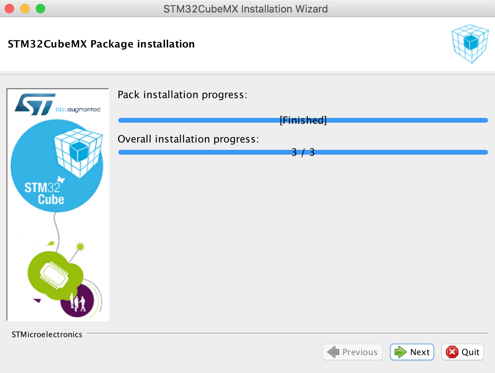

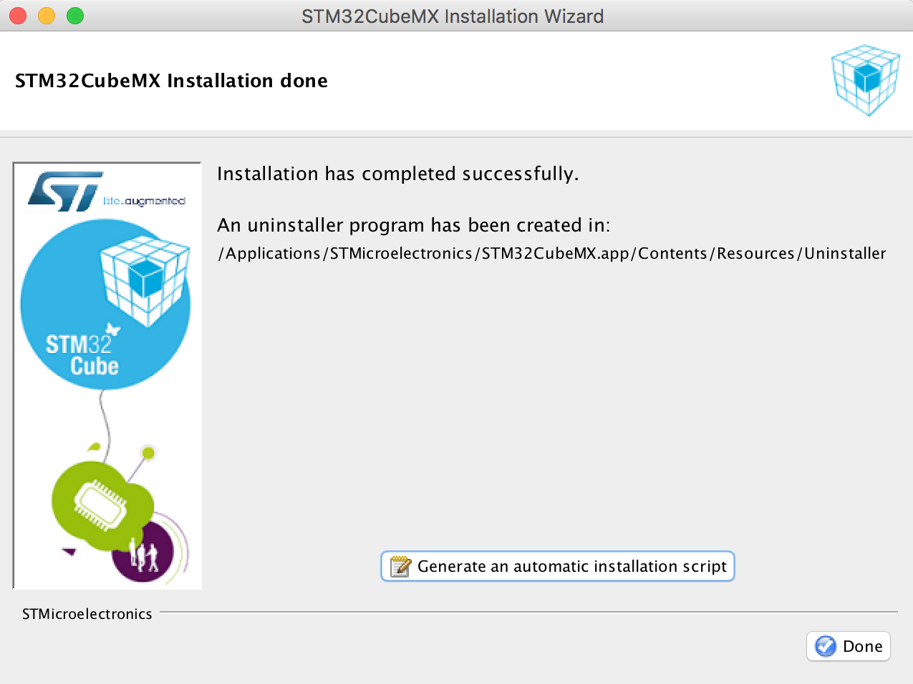

4\) You can run the software by navigating to the directory where CubeMX was installed and double-clicking the Application file called `"STM32CubeMX"`.

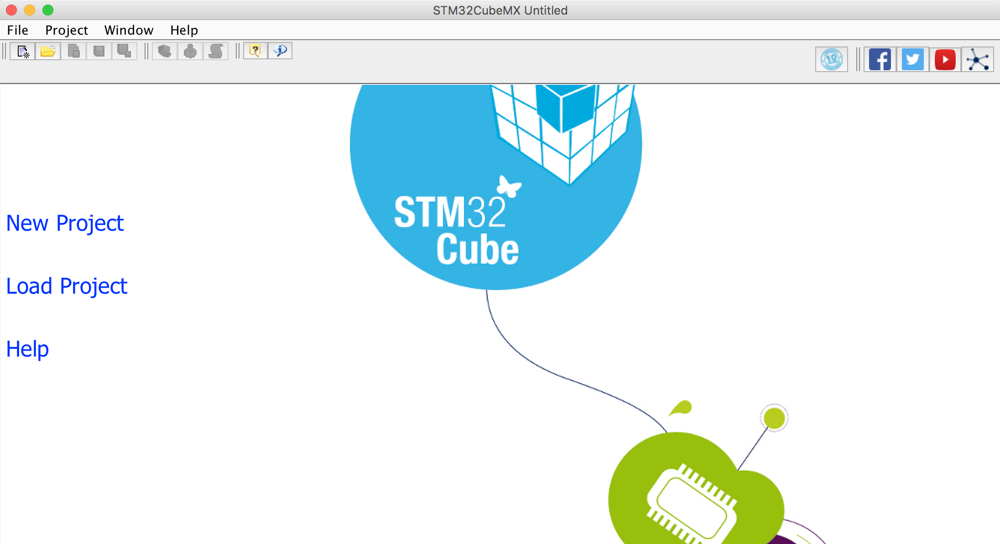

_Figure: Opening page of CubeMX on MacOS._

5\) You can now proceed to downloading and installing the next software - [SW4STM32](sw4stm32.md).

