# SW4STM32

## Download instructions

_Note: these instruction and images were produced on February 6, 2018 and last verified on July 23, 2018._

The following steps are the same for Windows, Linux, and MacOS as they simply consist of downloading the installation files. For the actual installation, please refer to the corresponding subsection after the following instructions.

1\) Navigate to the ST [site for the SW4STM32 software](https://www.st.com/en/development-tools/sw4stm32.html).

2\) At the bottom of the page, you should find a link to navigate to a third-party website to download the software; [AC6](http://www.ac6.fr/) develops the software SW4STM32. Press the button "GO TO SITE".

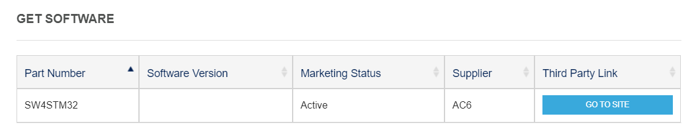

3\) You should be redirected to [this site](http://www.openstm32.org/HomePage). In order to download the software, you will have to make an account. We recommend doing so as it this will give you access to the documentation and to posting in the forum. You can use [this link](http://www.openstm32.org/tiki-register.php) to make an account. You should receive an email to confirm your account.

4\) After making an account, you should be able to access the installation instructions and download links. There are two ways you can install SW4STM32: from Eclipse \(as the tool is Eclipse-based\) or with the GUI installer. We recommend using the installer as it is a much cleaner process. The following instructions will assume this option; navigate to [this link](http://www.openstm32.org/Downloading%2Bthe%2BSystem%2BWorkbench%2Bfor%2BSTM32%2Binstaller) for downloading the appropriate GUI installer for your OS \(you need to be logged in to see these instructions\). _Note: it is also recommended to download the MD5 or SHA256 checksum to validate the integrity of your download. We selected the MD5 checksum._

If you would like to install SW4STM32 from Eclipse, please refer to [this link](http://www.openstm32.org/Installing%2BSystem%2BWorkbench%2Bfor%2BSTM32) \(you need to be logged in to see these instructions\).

5\) Go to [this link](http://www.openstm32.org/Installing%2BSystem%2BWorkbench%2Bfor%2BSTM32%2Bwith%2Binstaller) for system requirements and detailed download/installation instructions for each OS \(you need to be logged in to see these instructions\). The instructions at the above link are quite detailed but we will complement this with some screenshots of the process:

* [Windows](sw4stm32.md#windows)
* [Linux](sw4stm32.md#linux)
* [MacOS](sw4stm32.md#macos)

[Here](eclipse_tips.md), we provide some useful shortcuts tips when working with Eclipse-based tools like SW4STM32.

## Windows

_Note: the instructions were tested using Windows 10 Pro Insider Preview, Version 1607, with a 64-bit operating system on February 11, 2018._

1\) Double-click the EXE file to launch the installation wizard.

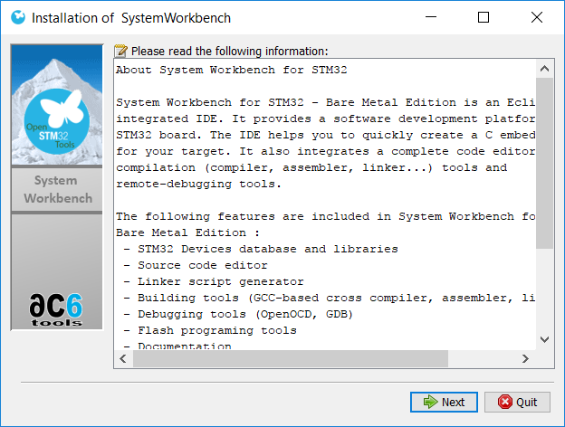

2\) You will have to accept two license agreements to proceed with the installation, after which you will be asked to specify the installation path \(see below\). If the path does not exist, you will be asked to create the directory.

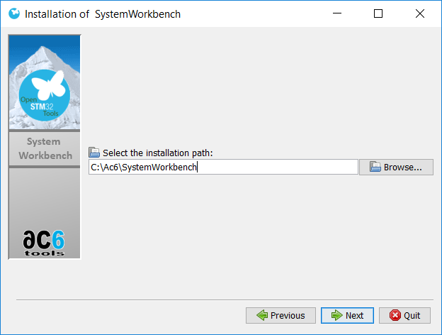

3\) Next, you can select which packs to install; leave as is. You can then decide to create a Start Menu/Desktop shortcut. You will then be asked to confirm your installation path and packs to install. Pressing "Next" will start the installation \(see below\).

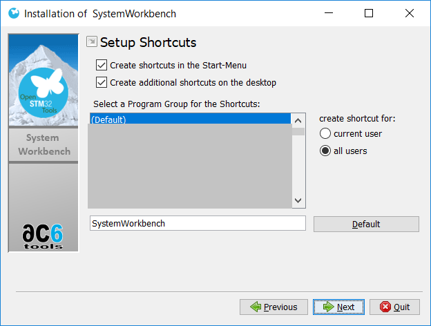

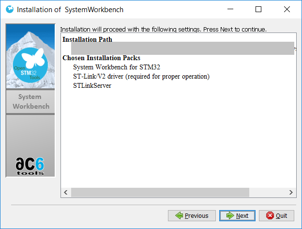

4\) During the installation, a separate wizard will also pop-up to install necessary ST drivers \(see below\). Proceed with the installation by pressing "Next".

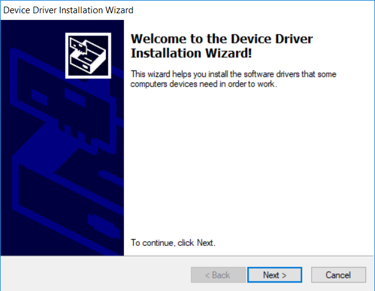

5\) When the driver installation has been successfully completed, you should see something similar to the window pane below.

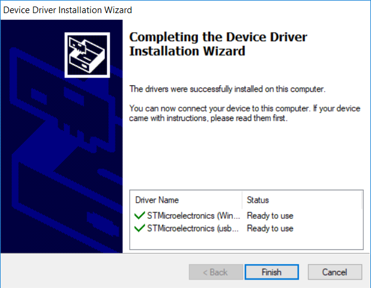

6\) You can then proceed to the final pane of the installation by pressing "Next" in the original Installation Wizard \(see below\). Finally, press "Done" to finish the installation!

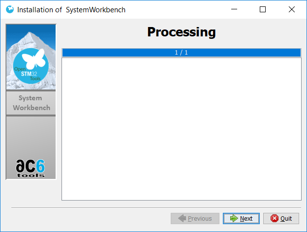

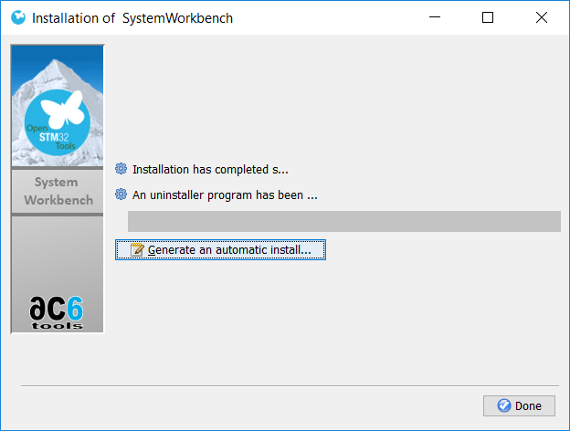

7\) You can launch the software by using one of the shortcuts created before. You will be prompted to select a workspace \(see below\); we recommend creating a workspace called `"COM303-Workspace"` for the exercises we will be doing.

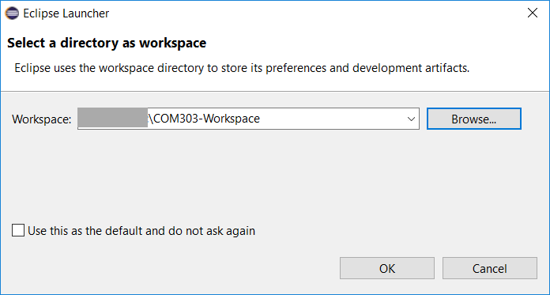

8\) After setting the workspace, you should see something like the figure below.

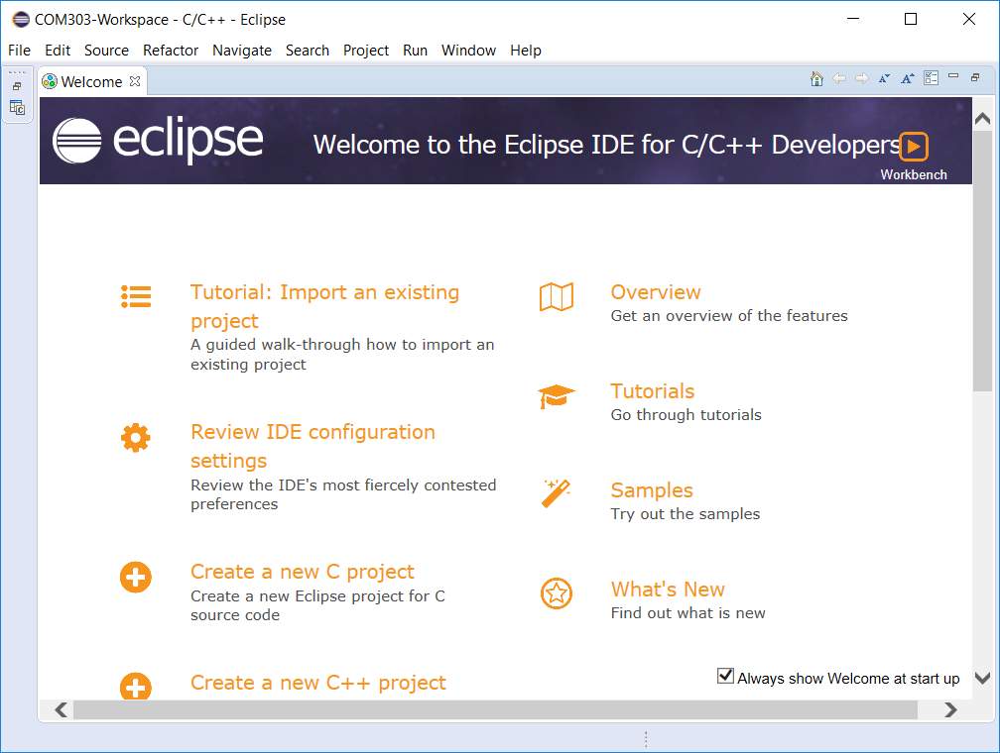

You can now proceed to creating [your first project](../instructions.md)!

## Linux

_Note: the following instructions were tested using Ubuntu 16.04.1 LTS, x86\_64 architecture on a Lenovo Thinkpad X230 on February 9, 2018._

1\) From a terminal, navigate to the directory where the downloaded RUN and checksum files are located. Check the permissions with the following command:

```bash
$ ls -l
```

If you do not see an `x` in the permissions for the RUN file:

```bash
>> -rw-rw-r-- ... install_sw4stm32_linux_64bits-vX.X.run
```

You will have to give execution rights to the file as such:

```bash
$ chmod a+x install_sw4stm32_linux_64bits-vX.X.run
```

The `ls -l` command should then show something like:

```bash
>> -rwxrwxr-x install_sw4stm32_linux_64bits-vX.X.run
```

2\) Before running the installation file, please read the warnings for Linux at the bottom of [this page](http://www.openstm32.org/Downloading%2Bthe%2BSystem%2BWorkbench%2Bfor%2BSTM32%2Binstaller#Linux) \(you need to be logged in\). You may have to install a few libraries; we installed `gksudo`, `libc6:i386`, and `lib32ncurses5` and used Java 1.8.0\_151 during our installation.

3\) You can then run the installation file as so:

```bash
$ ./install_sw4stm32_linux_64bits-vX.X.run
```

The checksum file will be used to check the download integrity which may take some time. Eventually, a window pane similar to below should pop up.

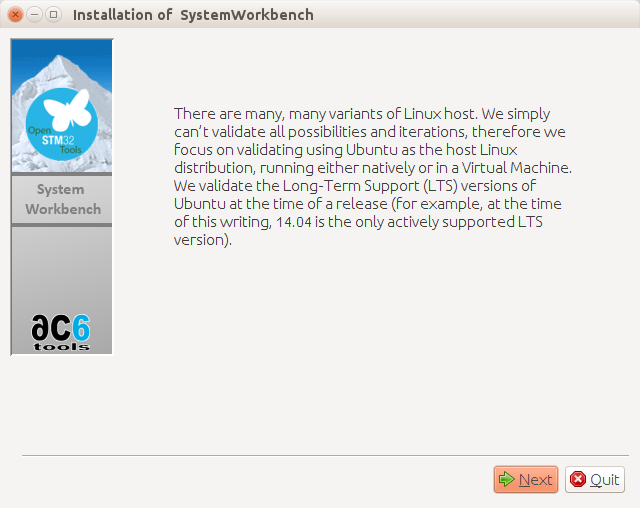

4\) You will have to accept two license agreements to proceed with the installation, after which you will be asked to specify the installation path. If the path does not exist, you will be asked to create the directory. Take note of this directory because you will have to navigate here to run the software!

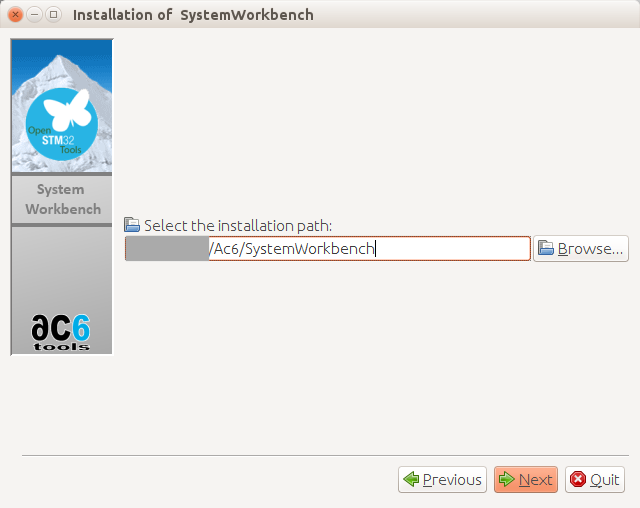

5\) Next, you can select which packs to install; leave as is. You will then be asked to confirm your installation path and packs to install. Pressing "Next" will start the installation \(see below\).

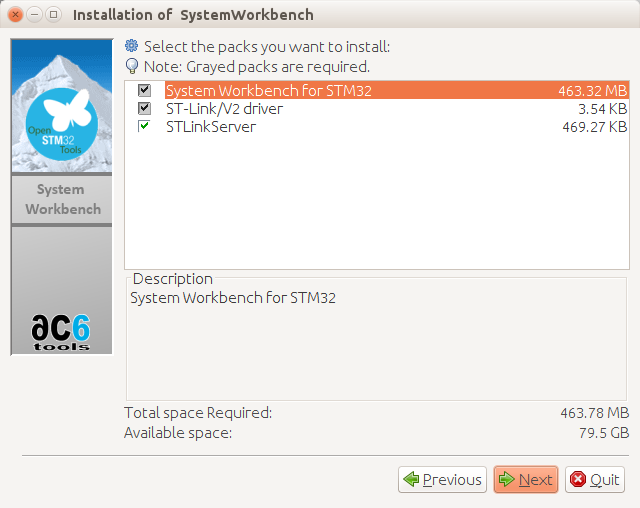

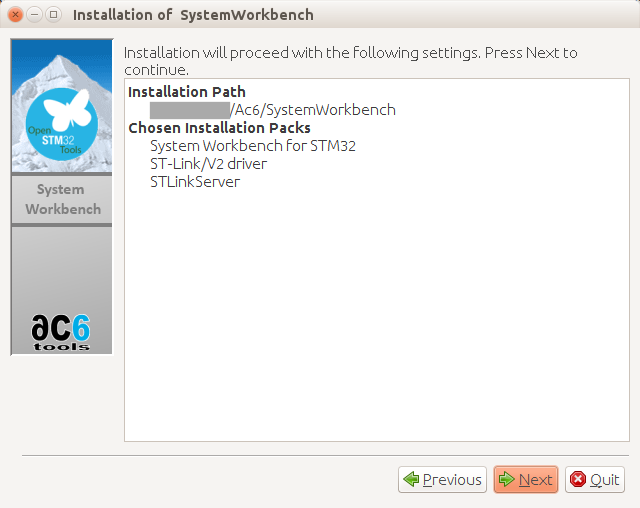

6\) When the installation is done, the progress bars will appear as below. Click "Next" to finish the installation procedure and to proceed to the final pane of the installation wizard. Press "Done" and the installation is complete!

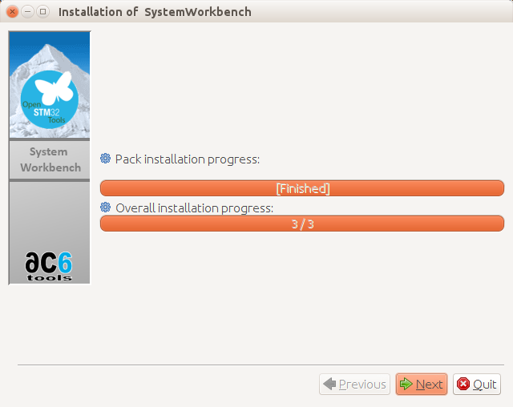

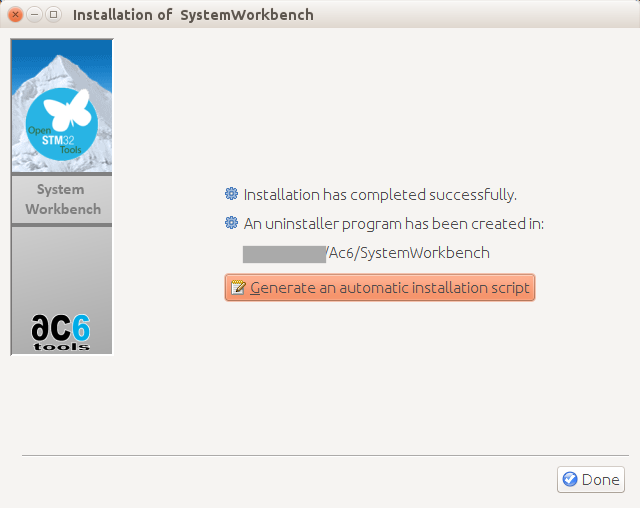

_Note: you may have to enter your computer password for certain "rules" to be added to_ `"/etc/udev/rules.d"` _during the installation \(see below\)._

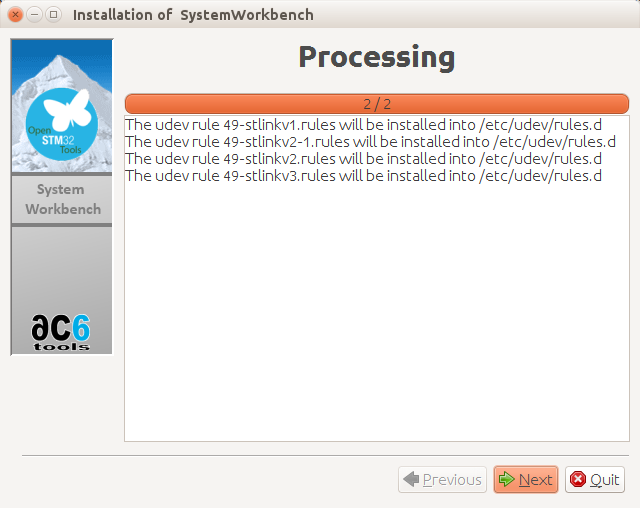

7\) You can run the software by navigating from a terminal to the directory where SW4STM32 was installed and running the following command \(or double-clicking from a file explorer\):

```bash
$ ./eclipse
```

The application is called `"eclipse"` since the software is based off of Eclipse.

8\) You will be prompted to select a workspace \(see below\); we recommend creating a workspace called "COM303-Workspace" for the exercises we will be doing.

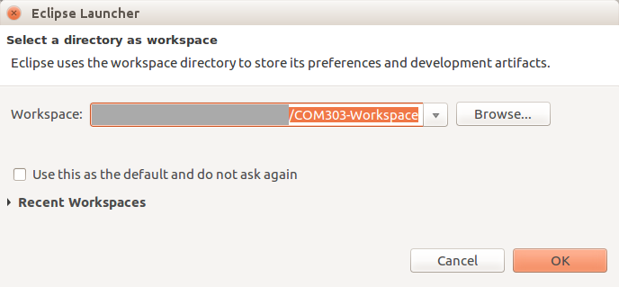

After setting the workspace, you should see a window pane similar to below.

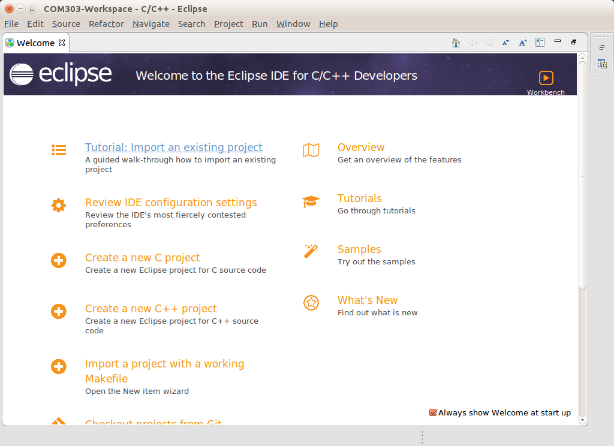

You can now proceed to creating [your first project](../instructions.md)!

## MacOS

_Note: the instructions were tested using MacOS Sierra, Version 10.12.6 on February 7, 2018. There is also a requirement for \(at least\) Xcode 7; we tested with Xcode 8.3.3._

If you face any complications, please refer to the [official instructions](http://www.openstm32.org/Installing%2BSystem%2BWorkbench%2Bfor%2BSTM32%2Bwith%2Binstaller) \(MacOS installation instructions are at the bottom\) and/or to the forums \(you need to be logged in to see the instructions\). Below we provide the instructions that worked for our system setup.

1\) From a terminal, navigate to the directory where the downloaded RUN and checksum files are located. Check the permissions with the following command:

```bash
$ ls -l
```

If you do not see an `x` in the permissions for the RUN file:

```bash
>> -rw-r--r--@ ... install_sw4stm32_macos_64bits-vX.X.run
```

You will have to give execution rights to the file as such:

```bash
$ chmod 755 install_sw4stm32_macos_64bits-vX.X.run
```

The `ls -l` command should then show something like:

```bash
>> -rwxr-xr-x@ ... install_sw4stm32_macos_64bits-vX.X.run
```

You can now run the installation file as so:

```bash
$ ./install_sw4stm32_macos_64bits-vX.X.run
```

The checksum file will be used to check the download integrity which may take some time. Eventually, a window pane similar to below should pop up.

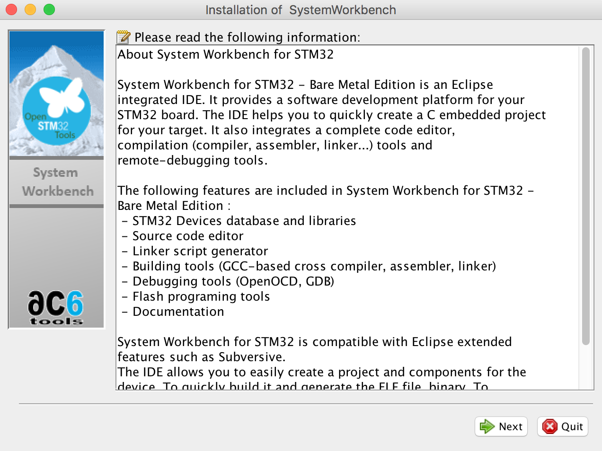

2\) You will have to accept two license agreements to proceed with the installation, after which you will be asked to specify the installation path \(see below\). If the path does not exist, you will be asked to create the directory.

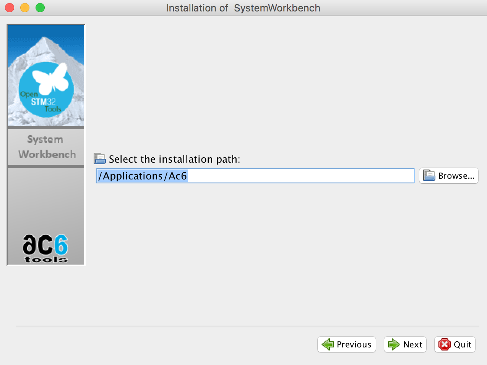

3\) Next, you can select which packs to install; leave as is. You will then be asked to confirm your installation path and packs to install. Pressing "Next" will start the installation \(see below\).


4\) When the installation is done, the progress bars will appear as below. Click "Next" to finish the installation procedure and to proceed to the final pane of the installation wizard \(see below\). Press "Done" and the installation is complete!

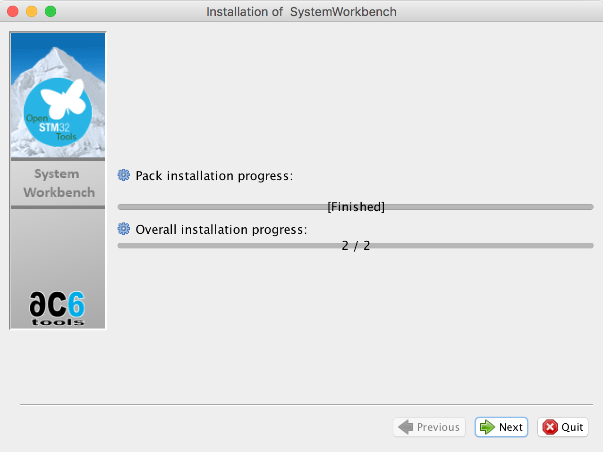

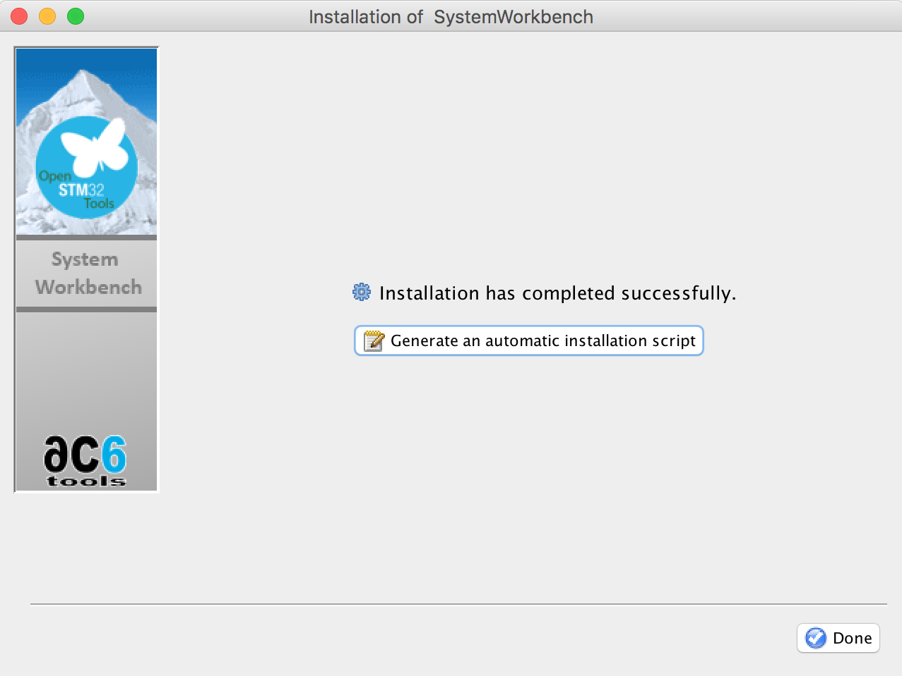

5\) You can run the software by navigating to the directory where SW4STM32 was installed and double-clicking the Application file called "SystemWorkbench" You will be prompted to select a workspace \(see below\); we recommend creating a workspace called "COM303-Workspace" for the exercises we will be doing.

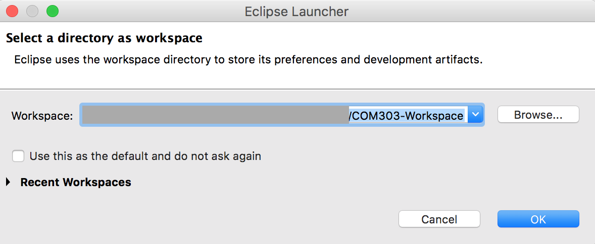  
After setting the workspace, you should see a window pane similar to below.

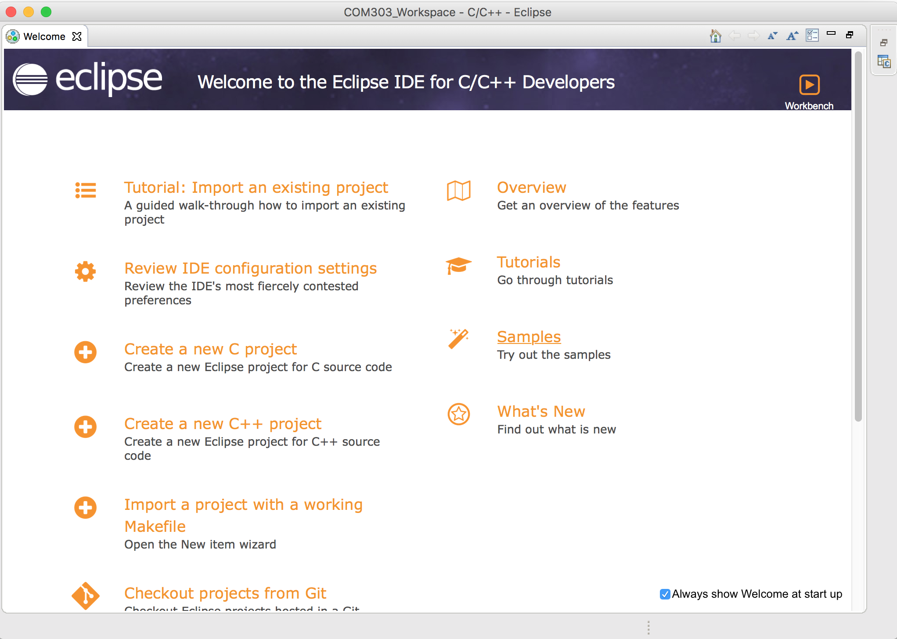

You can now proceed to creating [your first project](../instructions.md)!

