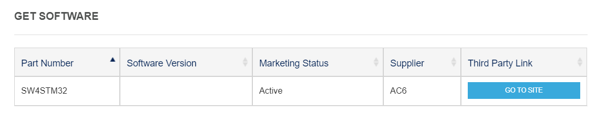
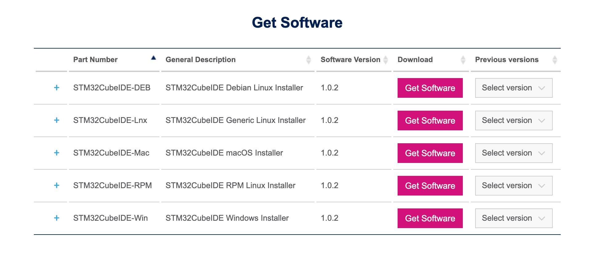
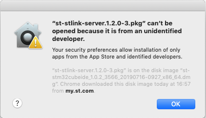

# 1.2.1 STM32CubeIDE

_Note: these instruction and images were produced on October 1, 2019._

The following steps are the same for Windows, Linux, and MacOS and they simply consist of downloading the installation files. For the actual installation, please refer to the corresponding subsection after the following five steps:

## Download instructions

The following steps are the same for Windows, Linux, and MacOS as they simply consist of downloading the installation files. Please refer to the distributor website for detailed installation instructions. Please refer to the corresponding subsection after the following instructions for our additional remarks.

2\) Select the download link according to your operating system.

4\) You will be asked to log-in in order to pursue with the download, please create an account and follow the instructions.

5\) When you will have completed the log-in, the download will normally start.

6\) Open the installer and follow the steps. You need to perform a standard installation. Some driver will also be installed during the process. Don't skip this.

[Here](eclipse_tips.md), we provide some useful shortcuts tips when working with Eclipse-based tools like SW4STM32.

## MacOS

_Note: the instructions were tested using MacOS Mojave, Version 10.14 on October 1, 2019._

You may encounter the following dialog on macOS, please follow the instructions below if it is your case.

1\) Open your _System Preferences_ and navigate to _Security & Privacy_

2\) _\_In the \_General_ tab, click _Open Anyway_

3\) After letting MacOS open the install package, you should be able to pursue the normal installation.

You can now proceed to creating [your first project](../instructions.md)!

