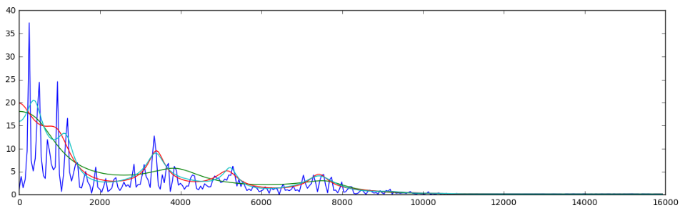

# 6.2 Implementation

Hereafter, we give you the functions to compute the autocorrelation and solve the system of equations

```python
def bac(x, p):
    # compute the biased autocorrelation for x up to lag p
    L = len(x)
    r = np.zeros(p+1)
    for m in xrange(0, p+1):
        for n in xrange(0, L-m):
            r[m] += x[n] * x[n+m]
        r[m] /= float(L)
    return r
```

```python
def ld(r, p):
    # solve the toeplitz system using the Levinson-Durbin algorithm
    g = r[1] / r[0]
    a = np.array([g])
    v = (1. - g * g) * r[0];
    for i in xrange(1, p):
        g = (r[i+1] - np.dot(a, r[1:i+1])) / v
        a = np.r_[ g,  a - g * a[i-1::-1] ]
        v *= 1. - g*g
    # return the coefficients of the A(z) filter
    return np.r_[1, -a[::-1]]
```

**Important : ** Be careful to the division by 0 !

```python
def lpc(x, p):
    # compute p LPC coefficients for a speech segment
    return ld(bac(x, p), p)
```
---
Now, your task is to modify your actual implementation of the `process()` function to include the LPC.



Hints :
- `energy_coefs = scipy.signal.lfilter(a_coefs, [1], GRAIN)`
- `x_hat_coefs = scipy.signal.lfilter([1], a_coefs, e_hat_coefs)`


**Important note : **
- It is possible to use no additional global variable (*eg* $$grain$$ or $$resampled\_grain$$) to implement this LPC feature. If you do it this way, you have to make sure to store the last raw samples of your input **before** filtering it with LPC
(remember that you need those raw samples for the next grain) 

## Modifying the process function

In fact, it is possible to use the exact same function for "vanilla" granular synthesis pitch-shifting and "LPC" granular
synthesis pitch-shifting.

So let's assume that you have a boolean `use_LPC` set to `True` in our case.


```python
def process(input_buffer, output_buffer, buffer_len):

    # need to specify those global variables changing in this function (state variables and intermediate values)
    global ...

    # append samples from previous buffer
    for n in range(GRAIN_LEN_SAMP):
        ...

    # save the last raw samples of the grain before modifying them
	...

    # obtain the LPC coefficients and reverse filter the grain
    if use_LPC :
	...

    # resample
    for n in range(GRAIN_LEN_SAMP):
        ...

    # forward filter the resampled version of the modified grain
    if use_LPC :
	...

    # apply window
    for n in range(GRAIN_LEN_SAMP):
        ...

    # write to output
    for n in range(GRAIN_LEN_SAMP):
        # overlapping part
        if n < OVERLAP_LEN:
            ...
        # non-overlapping part
        elif n < STRIDE:
            ...
        # update state variables
        else:
            ...

```

Once your implementation is done, the low-pitched output should sound much nicer !

The overall effect of LPC can be seen on this picture :



- in green you can see an energy envelope that does not correpond to the raw samples
- in blue and red you can see energy envelopes that fit tose raw samples much better

---