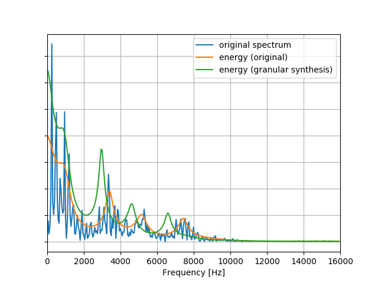
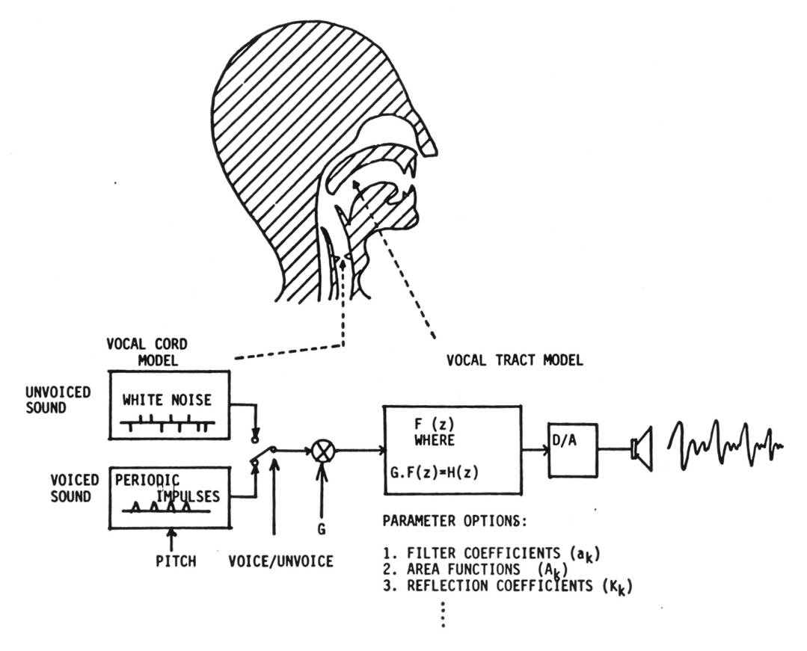
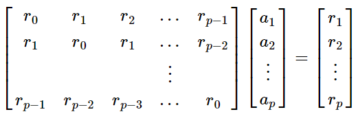
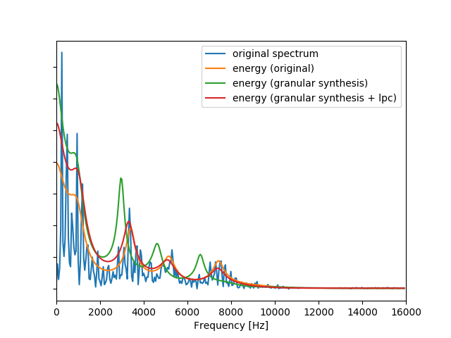

# 6.1 Theory behind LPC

If you have reached this point, your real-time granular synthesis pitch shifter must be working so congrats! Still, you may not be completely satisfied by the results. Indeed, the output may sound a bit _unnatural_, like the voice of someone talking with a hot potato in their mouth!

This unnatural sound is due to the fact that the pitch shifter we implemented earlier **does not** preserve the energy envelope of the signal.

In the figure above, generated with [this script](https://github.com/LCAV/dsp-labs/blob/master/scripts/linear_prediction/compare_spectrum.py), we can see the energy envelope of a $$40$$ ms voiced speech snippet \(orange\) and that of the speech processed with the granular synthesis effect \(green\). As can be clearly seen, the granular synthesis effect does not preserve the original energy envelope. We can certainly see the spectrum shifting down; however, such a shift does not maintain the structure of harmonic signals, _i.e._ harmonics that are multiples of a fundamental frequency. In this section, we present a concrete method to preserve this energy envelope while still performing the desired pitch shift.

## Modeling speech production

A common model for speech production is that of a **source** followed by a **resonator**. The _source_ can be a pitched sound produced by the vocal cords, or a noise-like excitation produced by a flow of air. The _resonator_ is the transfer function of the speech apparatus \(_e.g._ mouth and head\), which is independent of the source. Think of when you whisper: you are replacing the pitched excitation with air "noise" but you preserve the resonances of normal speech. A schematic view of the model is shown below.

Mathematically, we can express the speech production mechanism in the $$Z$$-domain by:

$$
X(z) = A(z)E(z),
$$

where

* $$A(z)$$ is the resonance transfer function,
* $$E(z)$$ is the excitation.

In the context of spoken speech, both $$E(z)$$ and $$A(z)$$ will certainly change over time. However, we will assume that for short segments in time that we are operating over a stationary signal.

Our goal is to estimate the coefficients of the filter $$A(z)$$, which are called the [**linear predictive coding**](https://en.wikipedia.org/wiki/Linear_predictive_coding) **\(LPC\)** coefficients.

## Time domain equations

In the time domain, we can express the produced speech as:

$$
x[n] = e[n] + \sum_{k=1}^{p} a_k x[n-k],
$$

where $$p$$ represents the _lag_, namely how many past samples are used to model the speech.

As both $$E(z)$$ and $$A(z)$$ are unknown, we attempt to minimize the energy of the following signal:

$$
e[n] = x[n] - \sum_{k=1}^{p} a_k x[n-k].
$$

_Note: The above equation is identical to the expression for the prediction error in the standard **AR linear prediction** problem._

In practice, we solve this system by first defining the \(symmetric\) autocorrelation matrix $$R$$ of the input signal, where:

$$
r_m = (\frac{1}{N})\sum_{k=0}^{N-m-1} x[k]x[k+m],
$$

where $$m$$ is the absolute difference between the row and column indices of $$R$$. This matrix $$R$$ has a Toeplitz structure, yielding the following system of equations \(known as [Yule-Walker](https://en.wikipedia.org/wiki/Autoregressive_model#Yule%E2%80%93Walker_equations)\) in order to minimize the energy of $$e[n]$$:

The above system of equations can be solved for the filter coefficients $$a_k$$ by using the [Levinson-Durbin](https://en.wikipedia.org/wiki/Levinson_recursion) algorithm.

## Combining with Granular Synthesis

In order to preserve the energy envelope with the granular synthesis effect, we need to perform the following operations on each grain/buffer:

1. Compute the LPC coefficients for the input speech $$x[n]$$ to obtain the filter coefficients $$a_k$$.
2. Inverse-filter the raw samples in order to estimate the excitation $$e[n]$$ from $$a_k$$ and $$x[n]$$.
3. Apply pitch-shifting on the excitation signal \(_i.e._ apply the resampling on $$e[n]$$\) to obtain $$\tilde{e}[n]$$.
4. Forward-filter the modified grain $$\tilde{e}[n]$$ with $$a_k$$ to obtain the pitched-shifted version of the input $$\tilde{x}[n]$$.

With this procedure, we can see below that the pitch-shifted $$\tilde{x}[n]$$ has a more similar energy envelope to that of the original input samples. The figure below is generated with [this script](https://github.com/LCAV/dsp-labs/blob/master/scripts/linear_prediction/compare_spectrum_lpc.py).

If you want to learn more about LPC coefficients, we recommended checking the [Wikipedia page](https://en.wikipedia.org/wiki/Linear_predictive_coding) and [this website](https://www.dsprelated.com/freebooks/pasp/Linear_Predictive_Coding_Speech.html).

**Now let's go to the** [**next section**](implementation.md) **to implement this feature!**

