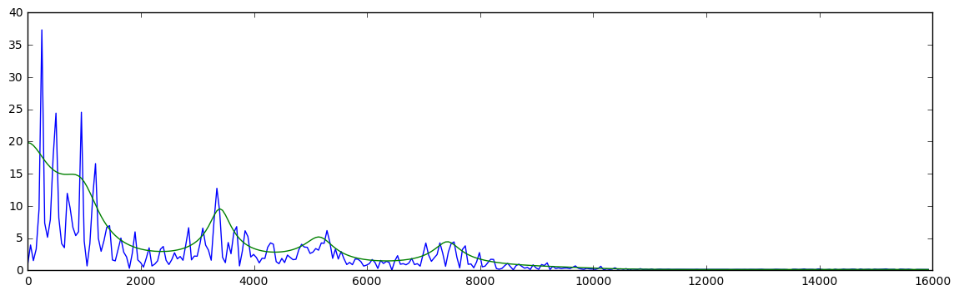
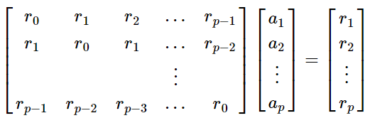

# 6.1 Theory behind LPC

If you reach this point, your real-time granular synthesis pitch-shifter must be working, congrats!

Still, you may not be completely satisfied by the results. Indeed, the output sounds a little bit *un-natural*,  like the voice of someone talking with a hot potatoe in his mouth!
 
The origin of the problem is that the pitch shifter that you implemented **does not** preserve the energy envelope of the signal.

On the picture above, you can see the energy envolope of the input speech. In this sub-chapter, we are going to derive a
concrete method to preserve this energy envelope throughout pitch shifting.

## A common model for speech production

The human speech is  a combination of the pitch sound produced by the vocal cords and a transfer function called the **resonator**. The latter models the impact of the physical structure of the human head on the speech.

Mathematically, we can thus express the speech production mechanism in the Z-domain by $${X(z) = A(z)E(z)}$$
- $$E(z)$$ is the excitation or the energy (*ie* the vocal coord components)
- $$A(z)$$ is the resonance transfer function

The coefficients of the filter $$A(z)$$ are called the **linear predictive coding ([LPC](https://en.wikipedia.org/wiki/Linear_predictive_coding))** coefficients.

## Time domain equations

In the time domain, we want to solve the following equation for the $$a_k$$ coefficients:

$$
e[n] = x[n] - \sum_{k=1}^{p} a_k x[n-k]
$$

In this equation, $$p$$ is the number of sample representing the *lag* used to solve the equation.

**Note**: The above equation is identical to the expression for the prediction error in a standard **AR linear prediction** problem.

In practice, we solve this system by first defining the autocorrelation matrix $$R$$ of the input signal, where:

$$
r_m = (\frac{1}{N})\sum_{k=0}^{N-m-1} x[k]x[k+m]
$$

This is very convenient since this matrix $$R$$ has a Toeplitz structure. Hence the following system

can be efficiently solved using the [Levinson-Durbin](https://en.wikipedia.org/wiki/Levinson_recursion) algorithm.

## Putting everything together

Back to the pitch shifting problem:

In order to do it properly, we need to perform the following operations on each grain :

1.  compute the LPC coefficients for the input speech $$x[n]$$

	$$\to$$ obtain the $$a[n]$$ component

2.  inverse-filter the grain and recover the excitation signal

	$$\to$$ deduce the $$e[n]$$ component from $$a[n]$$ and $$x[n]$$

3.  apply pitch-shifting on the excitation signal (*ie* apply the resampling on $$e[n]$$)

	$$\to$$ obtain $$\hat{e}[n]$$

4.  forward-filter this modified grain to obtain the modified version of the input

	$$\to$$ obtain $$\hat{x}[n]$$ with $$a[n]$$ and $$\hat{e}[n]$$

With this procedure, we can see that the output $$\hat{x}[n]$$ has the same energy envelope as the raw samples taken into account during the resampling step.

If you want to learn more about LPC coefficients, you can look at:
- [This notebook](http://nbviewer.jupyter.org/github/prandoni/COM303/blob/master/voice_transformer/voicetrans.ipynb)
- [This website](https://www.dsprelated.com/freebooks/pasp/Linear_Predictive_Coding_Speech.html)

### Now let's go to the [next chapter](implementation.md) to finally implement this feature!