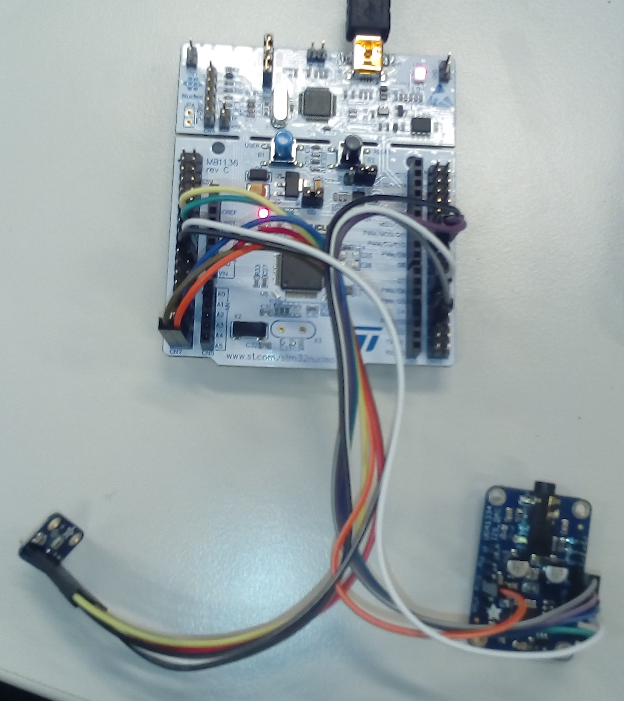

# 2. AUDIO PASSTHROUGH

A "passthrough" can be viewed as the audio equivalent of "hello world". In this chapter, we will build a passthrough with the hardware and software components previously introduced. Moreover, we will point out some key specifications from the microphone and the DAC \(Digital-to-Analog Converter\) components so that our STM32 board can successfully interface with them. This will be done in [Section 2.1](audio-io/).

Using the CubeMX software, we will update the configuration of the microcontroller in [Section 2.2](updating_stm32_peripherals.md). We will guide you through the wiring in [Section 2.3](wiring.md). Finally, we will program our passthrough in [Section 2.4](coding.md) using the SW4STM32 software.

Highlighted boxes, as shown below, specify a task for _**you**_ to determine the appropriate solution and implementation.


TASK: This is a task for you!


A passthrough is a great _sanity check_ when first beginning with an audio DSP system. Moreover, it serves as a useful starting point for new projects as we will see in the following chapters when we develop more complicated programs!

_Figure: Final wiring._

