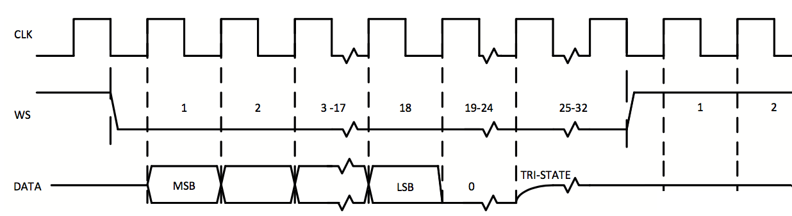

# 2.1 Audio I/O theory

Our digital microphone and DAC components rely on the **I2S** \(Inter-IC Sound\) bus specification for transferring digital audio samples to and from the microcontroller. Ultimately, the data that transits on the bus is simply a sequence of binary digits \(zeros and ones\) that are mapped to two distinct voltage levels, HIGH and LOW; each audio sample is encoded by a fixed number of bits \(usually 24 or 32\), that is, by a binary _word_. The bus will require some form of synchronization in order to determine when words begin and end. Finally, note that the audio data is usually _stereo_, that is, it consists of a time-multiplexed stream in which left and right channel data words are interleaved. 

The I2S bus is a 3-line serial bus consisting of:

1. A **clock \(CLK\)** line that indicates the timing for each binary digit
2. A **data** line for the actual sequence of binary digits.
3. A **word select \(WS\)** line to indicate the beginning of a binary word.

A typical word transfer over the I2S bus looks like so:

We will look at the details in the next section but, for now, notice the following:

1. the data signal is synchronized to the rising edge of the the clock signal and is kept constant for the duration of a clock cycle.
2. the beginning of a word is signaled by a state _transition_ in the word select signal   
3. words are sent starting from the most significant bit \(MSB\)
4. in this example words are 32-bit long; however only 18 bits are actually used for the data. Bits 19 to 24 are set to zero and from the 25th to the 32nd clock cycle the data signal is set to _tri-state_, which is a high impedance mode that essentially removes an output port from the circuit in order to avoid a _short circuit_. See [here](https://en.wikipedia.org/wiki/Three-state_logic) for more information on tri-state.

More information about the I2S bus specification can be read [here](https://www.sparkfun.com/datasheets/BreakoutBoards/I2SBUS.pdf).

We first discuss the I2S protocol with respect to the [microphone](microphone.md) and then for the [DAC](dac.md). We recommend reading in this order as the microphone section is easier to grasp and will introduce some common terminology used later on.

For the STM board that we are using, we will configure two I2S buses: one for the input and the other for the output. This configuration process will be covered in [Chapter 2.2](../updating_stm32_peripherals.md).

