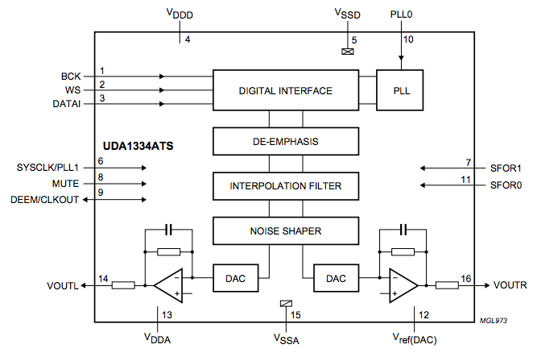
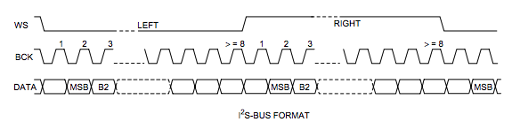

# 2.1.2 Stereo DAC

The microphone we are using measures an _analog_ signal and returns a _digital_ signal, which can be further processed by our microcontroller entirely in the digital domain. In order to playback or listen to this digital signal, it is necessary to convert it back to analog form; this can be done with a DAC \(Digital-to-Analog Converter\). We will be using Adafruit's [I2S Stereo Decoder Breakout](https://learn.adafruit.com/adafruit-i2s-stereo-decoder-uda1334a/overview), which contains a DAC, an audio jack for connecting headphones, and the necessary additional components. In the following subsections, we will explain the important inputs/outputs of the DAC we will be using, the I2S stereo output protocol our application will have to conform to, and a bit about the breakout board from Adafruit.

## DAC inputs/outputs

The DAC component in the Adafruit breakout is the [UDA1334ATS](https://www.nxp.com/docs/en/data-sheet/UDA1334ATS.pdf) by NXP, whose block diagram is shown below.

_Figure: UDA1334ATS block diagram,_ p. 5 of [datasheet](https://www.nxp.com/docs/en/data-sheet/UDA1334ATS.pdf).

A couple interesting things to take note of:

1. The "DIGITAL INTERFACE" block takes an I2S input, and therefore exposes the three lines **BCK**, **WS**, **DATA** that are used in the I2S protocol. _Note: I2S input is not a necessary feature of DACs; other input formats are also possible._
2. This component has two DACs; one for the left channel \(**VOUTL**\)and another for the right channel \(**VOUTR**\) for stereo output.

All input and output pins are briefly explained in the figure below.

_Figure: UDA1334ATS pinning,_ p. 6 of [datasheet](https://www.nxp.com/docs/en/data-sheet/UDA1334ATS.pdf).

Compared to the [microphone](microphone.md) which only had six pins, the above list of pins may seem overwhelming! But not to worry; we will explain the important settings for our application, referred to as "audio mode" in the [datasheet](https://www.nxp.com/docs/en/data-sheet/UDA1334ATS.pdf). Moreover, as we will see later on, the breakout board by Adafruit nicely abstracts the interfacing between our microcontroller and the UDA1334ATS component.

### Mode configuration \(p. 7 of [datasheet](https://www.nxp.com/docs/en/data-sheet/UDA1334ATS.pdf)\)

PLL stands for "Phase-locked loop"; you can find more information about PLLs on [Wikipedia](https://en.wikipedia.org/wiki/Phase-locked_loop). In the UDA1334ATS component, it is used to generate the internal system clock from the **WS** signal in "audio mode". In fact, in order to enable "audio mode", **PLL0** \(Pin 10\) must be set to LOW. Moreover, **SYSCLK/PLL1** \(Pin 6\) should also be set to LOW to select a sampling frequency typical for audio application, e.g. within $$f_s = 16 - 50$$ kHz.

### Input configuration \(p. 9 of [datasheet](https://www.nxp.com/docs/en/data-sheet/UDA1334ATS.pdf)\)

In addition to I2S input, the DAC also accepts other formats. Therefore, we must explicitly configure the chip for it to know to expect an I2S input. This is done by setting both **SFOR1** \(Pin 7\) and **SFOR0** \(Pin 11\) to LOW. **BCK** \(Pin 1\), **WS** \(Pin 2\), and **DATAI** \(Pin 3\) will serve as our I2S inputs.

De-emphasis is a low-pass filter to undo a high frequency boost \(aka pre-emphasis\) that may have been performed at the ADC \(Analog-to-Digital Converter\). We do not expect any pre-emphasis and this only applies for 44.1 kHz so we can set **DEEM/CLKOUT** \(Pin 9\) to LOW for de-emphasis off.

In our application, we may wish to toggle the mute control. For this reason, we will create a physical link \(wire\) between our microcontroller and **MUTE** \(Pin 8\).

### Powering the chip

As you may have noticed from the list of pins above, there are two power supplies:

1. Digital: **VDDD** \(Pin 4\) and **VSSD** \(Pin 5\).
2. Analog \(DAC\): **VDDA** \(Pin 13\) and **VSSA** \(Pin 15\).

The breakout board we are using will nicely abstract these signals into a "single" supply as we will see later on.

### Output pins

**VOUTL** \(Pin 14\) and **VOUTR** \(Pin 16\) are our output pins for left and right channel respectively. In order to output these to signals, they must be used with **Vref\(DAC\)** \(Pin 12\) as a reference voltage when supplying the output to an analog output device such as an audio jack. As our breakout board incorporates an audio jack and the necessary wiring, we will not have to worry about this! We will still have access to these pins though, which can be useful for debugging purposes, e.g. with an oscilloscope.

## I2S output timing

The UDA1334ATS chip supports word lengths up to 24 bits for the I2S bus. Moreover, as our microphone has a maximum bit precision of 18 bits, we do not need to go above this precision.

There are also some requirements on the **BCK** and **WS** signals \(p. 9 of [datasheet](https://www.nxp.com/docs/en/data-sheet/UDA1334ATS.pdf)\):

1. **BCK** frequency can be at most 64 times the **WS** frequency.
2. The **WS** signal must change at the negative edge of the **BCK** signal.

In the figure below, we have a timing diagram for an I2S input signal. We can see that the second requirement is met. Moreover, we can observe that the Most-Significant Bit \(MSB\) should be the first bit. This is always the case for the I2S bus; we can observe the same property in the microphone timing diagram as well.

Finally, the first requirement will be met as we have that the **BCK** frequency equals 64 times the **WS** frequency for the microphone.

_Figure: UDA1334ATS I2S timing,_ p. 10 of [datasheet](https://www.nxp.com/docs/en/data-sheet/UDA1334ATS.pdf).

## UDA1334ATS Wiring / Adafruit Breakout

As we are interested in using the UDA1334ATS component under "audio mode", this requires a wiring as shown in the figure below.

_Figure: UDA1334ATS audio mode wiring,_ p. 15 of [datasheet](https://www.nxp.com/docs/en/data-sheet/UDA1334ATS.pdf).

In addition to the capacitors and resistors needed for the UDA1334ATS component, we would also like to listen to the resulting audio output with heaphones. For this, an audio jack would be ideal.

Having to wire up all these components on a breadboard and connect them to our microcontroller would be a bit laborious. For this reason, we will be using Adafruit's [I2S Stereo Decoder Breakout](https://learn.adafruit.com/adafruit-i2s-stereo-decoder-uda1334a/overview) which contains the UDA1334ATS component, an audio jack, the necessary capacitors and resistors, and all the inter-connections.

Using this breakout board has a few other benefits when used in "audio mode", as Adafruit assumes most users will be using it in this mode:

1. **SFOR1**, **SFOR0**, **PLL0**, **SYSCLK/PLL1**, and **DEEM/CLKOUT** of UDA1334ATS are all pulled LOW by the breakout board; so the **SF1**, **SF0**, **PLL**, and **DEEM** pins of the breakout board do not need to be set for our application as we are interested in "audio mode".
2. We can provide a 3V to 5V power on the **VIN** and **GND** pins of the breakout board; a built-in regulator will take care of supplying the digital voltage supply \(**VDDD** and **VSSD**\) and the DAC supply voltage \(**VDDA** and **VSSA**\).
3. As an audio jack is already built into the breadboard, we do not need to worry about connecting the **VOUTR**, **VOUTL**, and **Vref\(DAC\)** pins of the UDA1334ATS component. However, we can easily debug these signals from **Lout**, **AGND**, and **Rout** of the breakout board.

Check Adafruit's [website](https://learn.adafruit.com/adafruit-i2s-stereo-decoder-uda1334a/pinouts) for more information on each pin.

