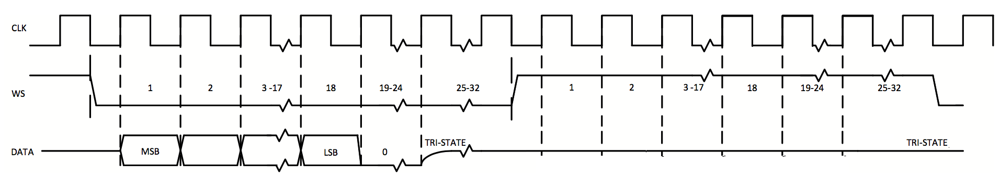
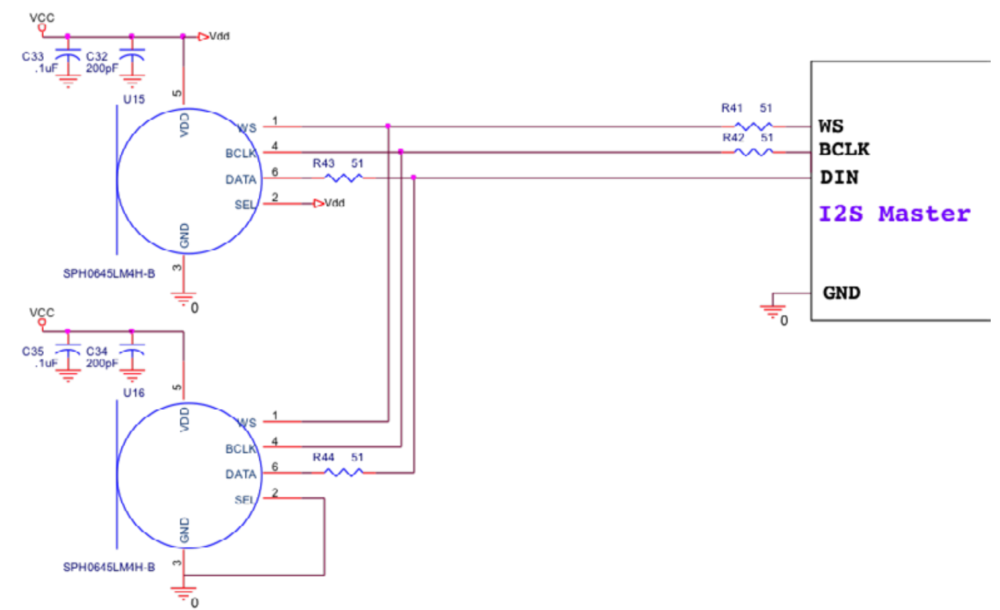

# 2.1.1 Digital Microphone

For the input we will use is the [I2S MEMS Microphone Breakout](https://learn.adafruit.com/adafruit-i2s-mems-microphone-breakout/overview) by Adafruit; in the following we will refer to this part simply as the _Adafruit mic_. In the following subsections, we will explain the key inputs and outputs of the circuit, the I2S input protocol for the data transfer, and what is meant by a "breakout board".

## Overview of the MEMS microphone pins

For portable devices, digital MEMS microphones are the popular choice for audio capture since they integrate both the analog microphone and the analog-to-digital converter that samples and quantizes the audio. MEMS is short for Microelectromechanical systems, a process technology used to create tiny integrated devices or systems that combine mechanical and electrical components; MEMS are small, cheap, and easy to integrate into one's desired application. 

The connectors on a MEMS microphone are the following:

The basic input pins are:

* **VDD**: \(usually\) 3.3V to power the device.
* **GND**: ground.
* **CLK**: an external "clock" signal that drives the sampler in the A/D circuit. The sampling frequency for the Adafruit mic is $$f_s = f_{CLK}/64$$, that is, the input clock should be 64 times the desired audio sampling frequency.
* **SEL**: a "select" signal used to specify whether the microphone captures the _left_ or the _right_ channel in a stereo signal. For this reason, **SEL** can also be called **LR** on datasheets. Typically, **SEL**=0 for the left channel and **SEL**=1 for the right channel.

A standard MEMS microphone typically returns a PDM \(Pulse-Density Modulation\) signal. This is essentially a 1-bit, 64-oversampled signal that requires downsampling and filtering in order to obtain a PCM \(Pulse-Code Modulation\) signal. PCM is the format typically used for storing and processing audio and it is indeed the format that we want to provide to the microcontroller. You can read more about PDM and PCM [here](http://users.ece.utexas.edu/~bevans/courses/rtdsp/lectures/10_Data_Conversion/AP_Understanding_PDM_Digital_Audio.pdf) and [here](https://en.wikipedia.org/wiki/Pulse-density_modulation) and you can play with one-bit, oversampled signals [here](https://github.com/prandoni/COM303/tree/master/OneBitMusic).

Luckily for us, the Adafruit mic already provides us with a PCM signal \(the circuit implements a decimator and a low-pass filter\), which it outputs in the [I2S format](https://www.sparkfun.com/datasheets/BreakoutBoards/I2SBUS.pdf) that we have seen in the previous section. Each sample is encoded over 32 nominal bits \(that is, the binary words is 32-bit long\) and word synchronization requires an additional input signal:

* **WS**: a "word select" signal whose level transitions mark the beginning of a binary word; since there will be a data word per audio sample, the frequency for the **WS** signal must be equal to the sampling frequency, that is, equal to the **CLK** frequency divided by 64. Since two Adafruit microphones can be connected in parallel to provide an interleaved stereo signal, the following convention is used: when **WS** goes _HIGH_, the Adafruit whose **SEL** signal is HIGH will start to transmit while the Adafruit whose **SEL** is LOW will remain in a tri-state output \(essentially disconnected\); conversely, when **WS** goes _LOW_, the Adafruit whose **SEL** is low will start to transmit. Note that, because of the interleaving, the sampling frequency will need to be twice the nominal value.

## I2S timing diagram example

Let's look at an example timing diagram from the single Adafruit microphone we will be using. We assume we have configured our microphone to be the the left channel \(that is, we set **SEL**=0\).

_Figure: I2S MEMS microphone output timing diagram. The output data format is I2S, 24 bit, 2's complement, MSB first._ p. 7 of [datasheet](https://cdn-shop.adafruit.com/product-files/3421/i2S+Datasheet.PDF).

From the figure above, we can make several observations:

1. After **WS** switches to LOW, we receive the first bit of information on the **DATA** line from the microphone, since **SEL**=0. When **WS** switches to HIGH \(meaning a word is expected from the right channel microphone\) the left channel microphone stays disconnected from the data bus.
2. Each new bit is received at a _rising_ edge and held for an _entire_ period of **CLK**.
3. The first 18 bits after a rising or falling edge of the **WS** signal corresponds to actual audio data, starting with the Most-Significant Bit \(MSB\) and finishing with the Least-Significant Bit \(LSB\).
4. Bits 19-24 are set to 0 so our data precision is essentially 18 bits. Nonetheless, this zero-padding is required as the output format chosen by the manufacturer is: I2S, 24 bit, 2's complement, MSB first \(p. 7 of [datasheet](https://cdn-shop.adafruit.com/product-files/3421/i2S+Datasheet.PDF)\).
5. Bits 25-32 are set to tri-state, effectively disconnecting the circuit from the data bus; it will stay disconnected until a new transition of **WS** to LOW is detected in order not to corrupt the signal from the microphone from the other channel. 

## I2S wiring example

In general, two MEMS microphones are usually connected in parallel according to the following diagram; the component called "IS2 Master" would be our microcontroller. The terms "master" and "slave" are quite common in electronics to describe the device which acts as the controller and the devices\(s\) that are being controlled. See [here](https://www.techopedia.com/definition/2235/masterslave) for more information on the terminology.

_Figure: I2S MEMS microphone wiring for stereo use. Note that in our exercises we will be using a mono, i.e. one channel, setup._ p. 7 of [datasheet](https://cdn-shop.adafruit.com/product-files/3421/i2S+Datasheet.PDF).

Some important observations that can be made:

* The **DATA** lines for the two microphones are connected to each other and are supplied as a single input to the I2S Master.
* The **SEL** input for each microphone is set differently: **SEL**=**VDD** for the right-channel microphone and **SEL**=**GND** for the left-channel microphone. This is absolutely essential if two microphones are to share the same **DATA** line, as we explained before. 
* The two microphones use the same **BCLK** \(aka **CLK**\) and **WS** signal. This is also necessary for microphones using the same **DATA** line for synchronization purposes.

In this module, we will only use a single microphone, but the wiring from the microcontroller to the MEMS is identical.

## Adafruit breakout

From the diagram above, we can observe that a MEMS microphone requires several additional components \(capacitors and resistors\) on top of the several inter-connecting wires. Instead of taking care of this part ourselves we can simply use a pre-made _breakout_ board. With a breakout board, all the necessary components are pre-installed and we simply provide the connections for the signals/ports that need to interact with our microcontroller. In the case of our microphone, all the components \(microphone, resistors, capacitors\) are soldered on a compact board and convenient access can be given to the following signals:

1. **VDD** and **GND**: provided by the microcontroller to power the microphone.
2. **WS** and **BCLK**: generated by the microcontroller for the I2S transfer.
3. **SEL**: wired by the user to either **VDD** or **GND** to configure the microphone appropriately.
4. **DIN**: input to the microcontroller from the microphone\(s\).

It is possible to design your own breakout boards using CAD tools for PCBs \(Printed Circuit Boards\). But for popular components like microphones, it is easy to find breakout boards that have already been designed. [Adafruit](https://www.adafruit.com/category/42) is a great place to find such boards and other cool electronics for personal projects, along with very well explained user guides and the [I2S MEMS Microphone Breakout](https://learn.adafruit.com/adafruit-i2s-mems-microphone-breakout/overview) is the component that perfectly fits our needs.

