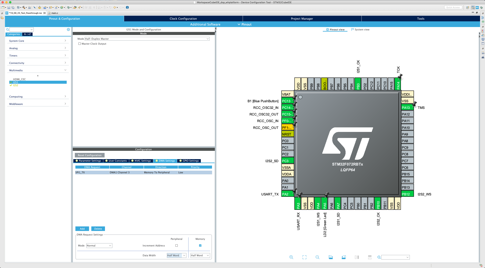
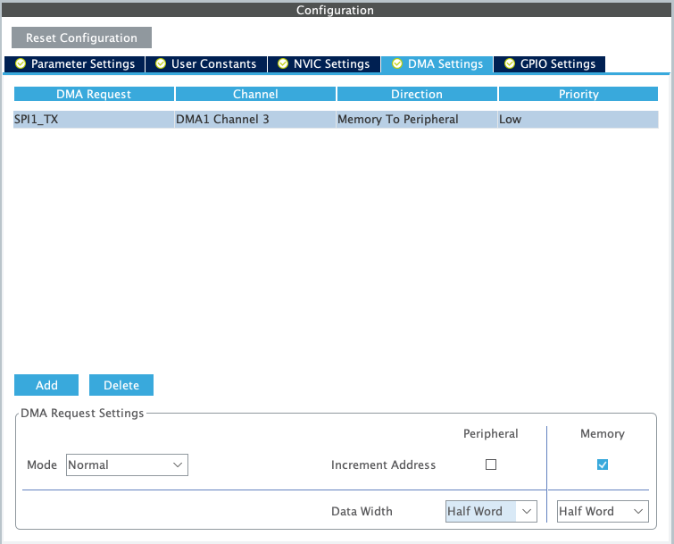
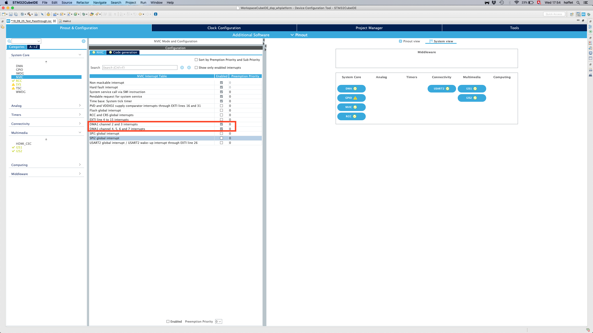

# 2.2 Updating the peripherals

The initialization code we generated in the [blinking LED example](../installation/instructions.md) will need to be updated as it does not perform the setup for the two I2S buses that we will need to communicate with the microphone and the DAC.

First_**,**_ let's make a copy of our working LED blinking project. We want to keep tracks of old projects in order to be able to go back to a known working configuration if something is not functioning anymore. To copy the project use the "Project Explorer" of the SW4STM32 software and a simple copy/paste operation. When you paste the project, a pop-up will ask you the rename the copied project: we recommend choosing a name that includes the current date and the word "passthrough" in it for bookkeeping purposes. To finish the copying process, make sure that the binary file of the original project is removed by deleting the `.elf` file in the `Binaries` folder of the new project.

Now we are ready to update the initialization code. From the CubeMX software, load the `IOC` file of the new project \(which should be in your **SW4STM32 workspace**\). This can be done by going to "File &gt; Load Project" on the toolbar, navigating to the appropriate project, and double-clicking the `IOC` file.

## Enable and configure I2S buses 

When the `IOC` file has successfully loaded, you should see something similar to the figure below. On the left-hand column, enable **I2S1** and **I2S2** by selecting the "Mode" to be "Half-Duplex Master".

You should see several pins highlighted in green: after enabling the two I2S buses \(for the microphone and the DAC\) the interface shows in green the electrical pins in the microcontroller that will be devoted to the signals used in the I2S protocol. Each I2S bus uses three pins according to the [I2S specification](https://www.sparkfun.com/datasheets/BreakoutBoards/I2SBUS.pdf):

1. Clock \(**CK**\).
2. Word select \(**WS**\).
3. Serial data \(**SD**\).

Click on the "Configuration" tab, where we will adjust the I2S and DMA settings. DMA \([direct memory access](https://en.wikipedia.org/wiki/Direct_memory_access)\) is a feature of microcontrollers that allows certain hardware subsystems to access the main system memory independently of the CPU. This avoids using CPU cycles to handle input/output operations and frees up resources for the actual data processing.

From the "Configuration" tab you should see a view similar to the one below.


TASK 1: We would like you to set up I2S1 for the DAC and I2S2 for the microphone. You will have to check the datasheets \([DAC](https://www.nxp.com/docs/en/data-sheet/UDA1334ATS.pdf) and [microphone](https://cdn-shop.adafruit.com/product-files/3421/i2S+Datasheet.PDF)\) in order to find the correct parameters \(sampling frequency, data and frame format\) to set.

Click on "I2S1" under "Multimedia" to adjust its settings. **Under the "Parameter Settings" tab, set the fields under "Generic Parameters" so that I2S1 can be used for the DAC.**

_\(Solutions to tasks are available at the end of the page\)_


Under the "DMA Settings" tab, press "Add". Adjust the settings so that they match the figure below, namely "DMA Request" set to "SPI1\_TX" for the DAC; "Mode" set to "Circular"; and "Data Width" set to "Half Word". Press "Apply" then "Ok" to confirm the changes.


TASK 2: Click on "I2S2" under "Multimedia" to adjust its settings. **Under the "Parameter Settings" tab, set the fields under "Generic Parameters" so that I2S2 can be used for the microphone.**

_Hint: make sure that the DAC and the microphone have the same "Selected Audio Frequency" while satisfying the specifications detailed on the datasheets! An audio frequency below the specified limits will most likely result in_ [_aliasing_](http://www.dspguide.com/ch3/2.htm)_._


Under the "DMA Settings" tab, press "Add". Adjust the settings so that they match the figure below, namely "DMA Request" set to "SPI2\_RX" for the microphone; "Mode" set to "Circular"; and "Data Width" set to "Half Word". Press "Apply" then "Ok" to confirm the changes.

Click on "NVIC" under "System" from the "Configuration" tab of CubeMX. Ensure that the interrupts are enabled for the selected DMA channels, as below.

## Configure GPIO pins 

The configuration we have done so far would be sufficient in order to create an audio passthrough. However, we will configure two more pins of the microcontroller so that we can programmatically:

1. Mute the DAC.
2. Set the microphone as _left_ or _right_ channel.

Go back to the "Pinout" tab, as seen below.

By clicking on any of the pins, you should be able to see the different functions that particular pin can assume, see below.

We are interested in using two pins as "GPIO\_Output" \(GPIO stands for "General-Purpose Input/Output"\) in order to output a _HIGH_ or _LOW_ value to the Adafruit breakout boards. Set the pins "PCO" and "PC1" to "GPIO\_Output" \(see below\). _You can reset a pin to having no function by selecting "Reset\_State"._

Just as in the case of variables in a program, we should give meaningful names to our GPIO pins. We will rename "PC0" and "PC1" as "MUTE" and "LR\_SEL" respectively. You can rename a pin by right-clicking it and selecting "Enter User Label" \(see below\).

## Update initialization code 

If you now save the `IOC` file \(or if you change perspective\) the source code will be updated:

If you have any of the source files open on SW4STM32, they should refresh automatically to reflect the settings you have changed in CubeMX. Remember that this is why you should not add or modify any section in the code outside of the `USER CODE BEGIN` and `USER CODE END` comments; outside of these tags, all code will usually replaced by a change in configuration.

With the peripherals and initialization code updated, we can proceed to [wiring the breakout boards](wiring.md)!

## Tasks solutions



Are you sure you are ready to see the solution? ;\)



The **transmission mode** is defined by the fact that the peripheral is a DAC, thus the I2S internal peripheral of the micro-controller will have to transmit data to the DAC. The mode to select is then "Master transmit".

The **communication standard** can be either "I2S" or "LSB-justified" as shown in section 1.2 of the [datasheet](https://www.nxp.com/docs/en/data-sheet/UDA1334ATS.pdf), we will then choose "I2S Phillips" as it is the default value selected when SF0 and SF1 of the breakout are not connected.

Second paragraph of section 3 of the datasheet sais: _The UDA1334ATS supports the I2S-bus data format with word lengths of up to 24 bits and the LSB-justified serial data format with word lengths of 16, 20 and 24 bits._ Here we would have the choice. However as it is much easier to work with 16 bits in term of processing load, we will chose this option for **Data and Frame format**. CubeMX let's us two 16 bits data possibilities: "16 Bits Data on 16 Bits Fram" or "16 Bits Data on 32 Bits Fram". It is not clear in the datasheet, however as it is _up to 24 bits_ we have to make an assumption that the frame is 32 bits; otherwise all data format could not be chosen. You could also test both parameter and control with a logic analyser what is the frame length. Such type of missing information is often encountered when reading a datasheet.

Lastly, the **Audio frequency** have to be defined. It is important to keep in mind that a faster sampling frequency implies less time for the micro-controller to process each buffer. A slower sampling frequency also impact the quality of the signal as it reduces the reproductible spectrum.  
The pin called "PLL0" is set to 0 by default \(according to the [schematic](https://cdn-learn.adafruit.com/downloads/pdf/adafruit-i2s-stereo-decoder-uda1334a.pdf?timestamp=1570708179)\), it means that the chip is in _audio mode._ Section 8.1.1, explains that in this mode the pin "PLL1" selects for audio frequency from 16 to 50 kHz \(PLL1 = LOW\) or from 50 to 100 kHz \(PLL1 = HIGH\). In this breakout, PLL1 is set to LOW according to the [schematic](https://cdn-learn.adafruit.com/downloads/pdf/adafruit-i2s-stereo-decoder-uda1334a.pdf?timestamp=1570708179). In order to make our final choice we will chose 32 kHz, this choice will be confirmed by task 2.



The **transmission mode** is defined by the fact that the peripheral is a microphone, thus the I2S internal peripheral of the micro-controller will have to transmit data form the microphone. The mode to select is then "Master Receive".

The **communication standard** is "I2S" or "LSB-justified" as shown in first paragraph of page 7 of the [datasheet](https://cdn-shop.adafruit.com/product-files/3421/i2S+Datasheet.PDF), we will then choose "I2S Phillips" like done for I2S1.

This datasheet gives more information about the **Data and Frame format**. We will chose the same parameter as for I2S1 but figure 7 of the datasheet shows us that the frame is 32bits and that the microphone will send 18 bits with the actual value, then 6 of 0 state and then 8 of tri-state. We will chose "16 Bits Data on 32 Bits Frame" in order to use 16Bits variable and have a faster processing.

The **Audio frequency** have to be defined. This device is a bit more restrictive that the DAC. Indeed in page 7 of the datasheet we can read the following: _Clock frequencies from 2.048Mhz to 4.096MHz are supported so sampling rates from 32KHz to 64KHz can be had by changing the clock frequency._ In this case we clearly see that a frequency slower than 32kHz will not work properly.



