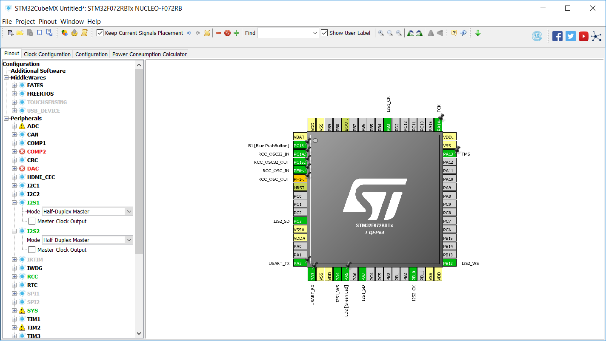
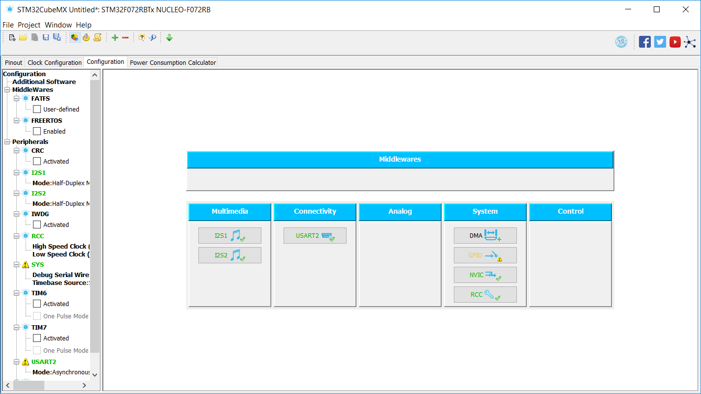
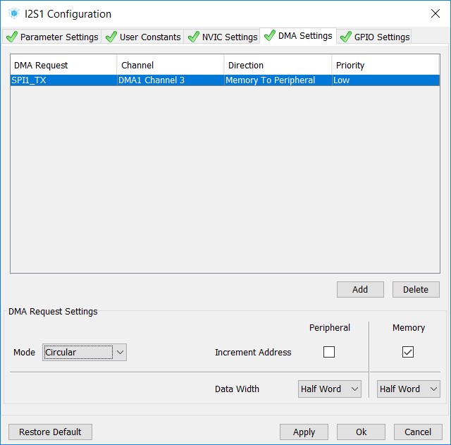
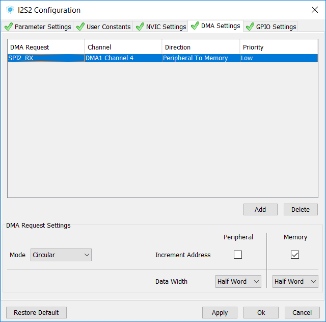
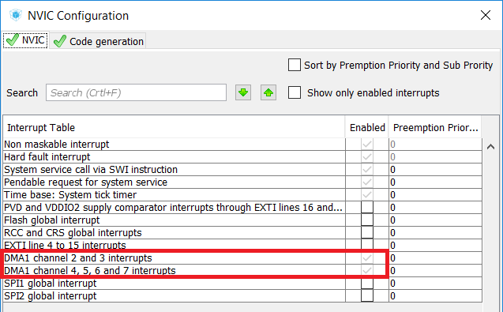
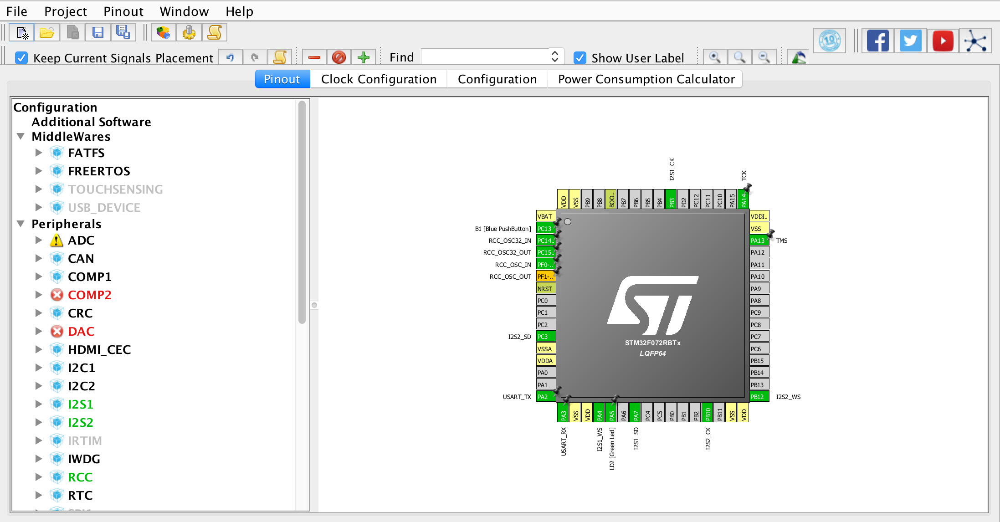
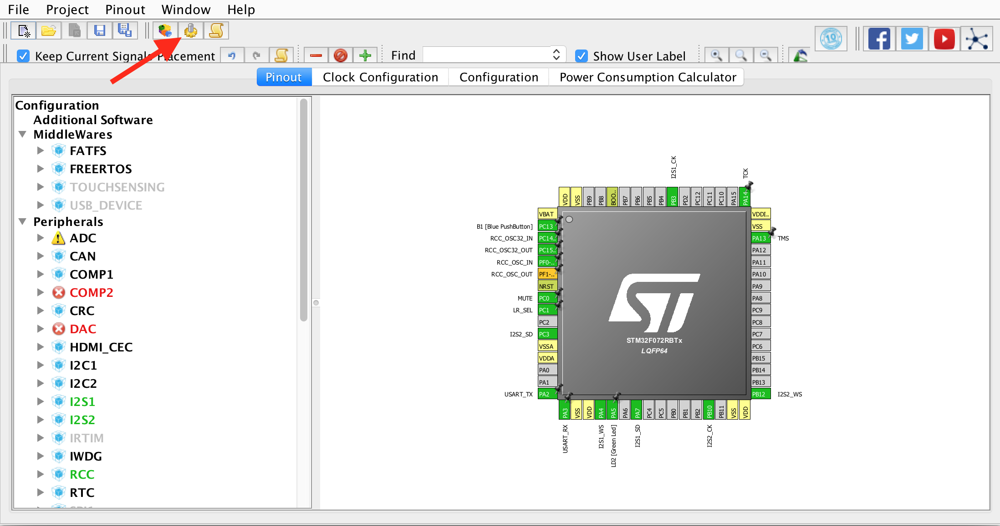

# 2.2 Updating peripherals

The initialization code we generated in the [blinking LED example](../installation/instructions.md) will need to be updated as it does not perform the setup for the two I2S buses we will need for the microphone and the DAC.

_**But first**_, we will make a copy of our stable project. We want to keep tracks of old projects in order to go back when something is not working anymore. In order to do this, from the "Project Explorer" of the SW4STM32 software, copy and paste the blinking LED project from the previous chapter. When you paste it, a pop-up will ask you the name of the copied project. We recommend choosing a name with the current date and "passthrough" in it. To finish the copying process, make sure that the binary file of the original project is removed by deleting the file: `"NewProjectName/Binaries/OldProjectName.elf"`.

Now we are ready to update the initialization code. From the CubeMX software, load the IOC file of the new copied project \(which should be in your **SW4STM32 workspace**\). This can be done by going to "File &gt; Load Project" on the toolbar, navigating to the appropriate project, and double-clicking the IOC file.

## Enable and configure I2S buses 

When the IOC file has successfully loaded, you should see something similar to the figure below. On the left-hand column, enable **I2S1** and **I2S2** by selecting the "Mode" to be "Half-Duplex Master".

You should see several pins highlighted green. What we have done is enable two I2S buses \(for the microphone and the DAC\), and the highlighted pins are those that will be used to transmit with the I2S protocol. Each bus uses three pins according to the [I2S specification](https://www.sparkfun.com/datasheets/BreakoutBoards/I2SBUS.pdf):

1. Clock \(CK\).
2. Word select \(WS\).
3. Serial data \(SD\).

Click on the "Configuration" tab where we will adjust the I2S and DMA settings. DMA \([direct memory access](https://en.wikipedia.org/wiki/Direct_memory_access)\) is a feature of microcontrollers that allows certain hardware subsystems to access the main system memory independent of the CPU. This allows the CPU to worry about other tasks \(such as processing the audio\) while transferring data in and out of the memory can be handled by other systems.

From the "Configuration" tab you should see a view similar to below.


TASK 1: We would like you to set up I2S1 for the DAC and I2S2 for the microphone. You will have to check the datasheets \([DAC](https://www.nxp.com/docs/en/data-sheet/UDA1334ATS.pdf) and [microphone](https://cdn-shop.adafruit.com/product-files/3421/i2S+Datasheet.PDF)\) in order to find the correct parameters \(sampling frequency, data and frame format\) to set.

Click on "I2S1" under "Multimedia" to adjust its settings. **Under the "Parameter Settings" tab, set the fields under "Generic Parameters" so that I2S1 can be used for the DAC.**


Under the "DMA Settings" tab, press "Add". Adjust the settings so that they match the figure below, namely "DMA Request" set to "SPI1\_TX" for the DAC; "Mode" set to "Circular"; and "Data Width" set to "Half Word". Press "Apply" then "Ok" to confirm the changes.


TASK 2: Click on "I2S2" under "Multimedia" to adjust its settings. **Under the "Parameter Settings" tab, set the fields under "Generic Parameters" so that I2S2 can be used for the microphone.**

_Hint: make sure that the DAC and the microphone have the same "Selected Audio Frequency" while satisfying the specifications detailed on the datasheets! An audio frequency below the specified limits will most likely result in_ [_aliasing_](http://www.dspguide.com/ch3/2.htm)_._


Under the "DMA Settings" tab, press "Add". Adjust the settings so that they match the figure below, namely "DMA Request" set to "SPI2\_RX" for the microphone; "Mode" set to "Circular"; and "Data Width" set to "Half Word". Press "Apply" then "Ok" to confirm the changes.

Click on "NVIC" under "System" from the "Configuration" tab of CubeMX. Ensure that the interrupts are enabled for the selected DMA channels, as below.

## Configure GPIO pins 

The configuration we have done so far would be sufficient in order to create an audio passthrough. However, we will configure two more pins of the microcontroller so that we can programmatically:

1. Mute the DAC.
2. Set the microphone as _left_ or _right_ channel.

Go back to the "Pinout" tab, as seen below.

By clicking on any of the pins, you should be able to see the different functions that particular pin can assume, see below.

We are interested in using two pins as "GPIO\_Output" \(GPIO stands for "General-Purpose Input/Output"\) in order to output a _HIGH_ or _LOW_ value to the Adafruit breakout boards. Set the pins "PCO" and "PC1" to "GPIO\_Output" \(see below\). _You can reset a pin to having no function by selecting "Reset\_State"._

Just like giving meaningful names to variables when programming, we would like to give meaningful names to our new GPIO pins. We will rename "PC0" and "PC1" as "MUTE" and "LR\_SEL" respectively. You can rename a pin by right-clicking it and selecting "Enter User Label" \(see below\).

## Update initialization code 

We can now update our source code by pressing the _gear_ button in the toolbar \(see below\). As before, do not open the project when prompted to do; select "Close".

If you have any of the source files open on SW4STM32, they should update automatically according to any settings you changed from CubeMX. This is why you should not enter any code outside of the `USER CODE BEGIN` and `USER CODE END` comments as it could be replaced by the new configuration code.

With the peripherals and initialization code updated, we can proceed to [wiring the breakout boards](wiring.md)!

