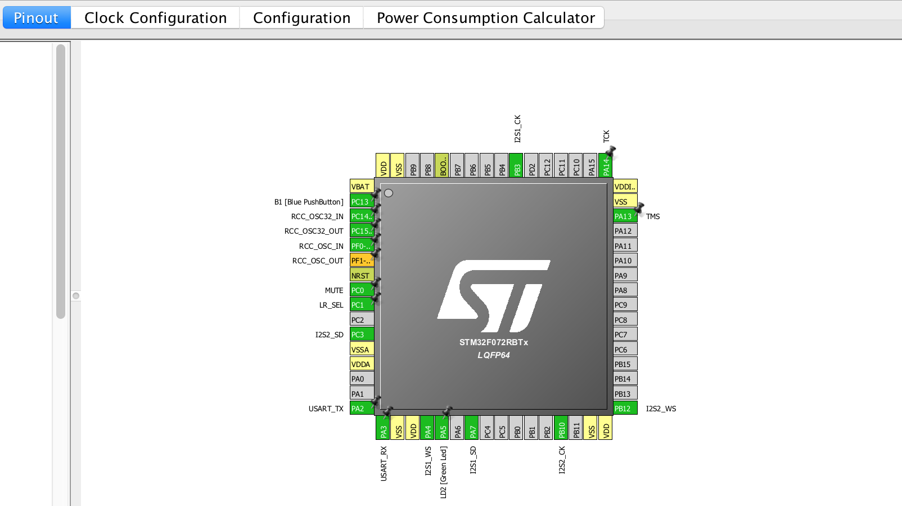

# 2.3 Wiring audio I/O

Now that we have initialized the different peripherals that we will use to interface with the microphone and DAC, we are ready to wire everything up! Make sure that the STM32 board is not powered, i.e. unplugged, while connecting the microphone and DAC breakout boards.

For this task, we will have to refer to the card provided with the STM32 board \(see below\) and the image of the chip on the "Pinout" tab of our CubeMX project \(further below\).

## Adafruit I2S MEMS Microphone Breakout 

_As previously mentioned, make sure that the STM32 board is powered off!_ We can then begin by connecting the microphone's ground pin. In electronics, it is common practice to first ground a component/circuit.


TASK 3: Connect the microphone's **GND** pin to one of the STM32 board's **GND** pins, e.g. slot 22 on the **CN7** \(left\) header.

_Tip: try to keep all the connector cables attached to each other to avoid messy wiring!_


We can now connect the supply voltage pin.


TASK 4: Connect the microphone's **3V** pin to the STM32 board's **3V3** pin.

_Note: the microphone component accepts voltage levels between 1.6V and 3.6V so **do not** use the STM32 board's **5V** pin!_


Previously, we configured I2S2 for the microphone so we will have to connect the following pins \(see image of chip from "Pinout" tab for the names on the left side of the arrow\) to the corresponding pins on the microphone breakout board \(right side of the arrow\):

* **I2S2\_SD** $$\leftarrow$$ **DOUT**
* **I2S2\_CK** $$\rightarrow$$ **BCLK**
* **I2S2\_WS** $$\rightarrow$$ **LRCL**


TASK 5: From the "Pinout" configuration on CubeMX, determine which pins of the STM32 board are used by I2S2. Using the card provided with the board \(see PDF figure above\), use the connector cables to wire the pins from the STM32 board to the appropriate pins on the microphone breakout board.

_Hint: for example, from the "Pinout" tab we can see that **I2S2\_SD** is outputted on pin **PC3**. From the card provided with the board, we see **PC3** is located in the bottom left corner of the board's pin header extensions. Therefore, we will use a wire to connect this pin to the **DOUT** pin of the microphone breakout board._


Finally, we configured an additional GPIO pin in order to select whether we would like the microphone to be assigned to the left or right channel.


TASK 6: Connect the microphone's **SEL** pin to the pin on the STM32 board corresponding to **LR\_SEL**.

BONUS: do we have to connect the microphone's **SEL** pin for the passthrough to work? What would happen if we didn't?


## Adafruit I2S Stereo Decoder 

_As previously mentioned, make sure that the STM32 board is powered off!_ We can then begin by connecting the DAC's power supply, starting with the ground pin.


TASK 7: Connect the DAC's **GND** and **VIN** pins to the STM32 board.

_Note: you can provide 5V to the **VIN** pin and the built-in regulator will produce a 3.3V supply, which is also available on the **3VO** pin._


Previously, we configured I2S1 for the DAC so we will have to connect the following pins to the appropriate pins on the DAC breakout board:

* **I2S1\_SD**
* **I2S1\_CK**
* **I2S1\_WS**

Moreover, we configured an additional GPIO pin in order to mute the output.

* **MUTE**


TASK 8: Connect the above four pins from the STM32 board to the appropriate pins on the DAC breakout board.

_Hint: see the_ [_DAC chip explanation_](audio-io/dac.md) _and_ [_Adafruit's site_](https://learn.adafruit.com/adafruit-i2s-stereo-decoder-uda1334a/pinouts) _for more information on wiring the DAC component._


With everything correctly wired up, we can proceed to [coding](coding.md) the passthrough on the SW4STM32 software!

